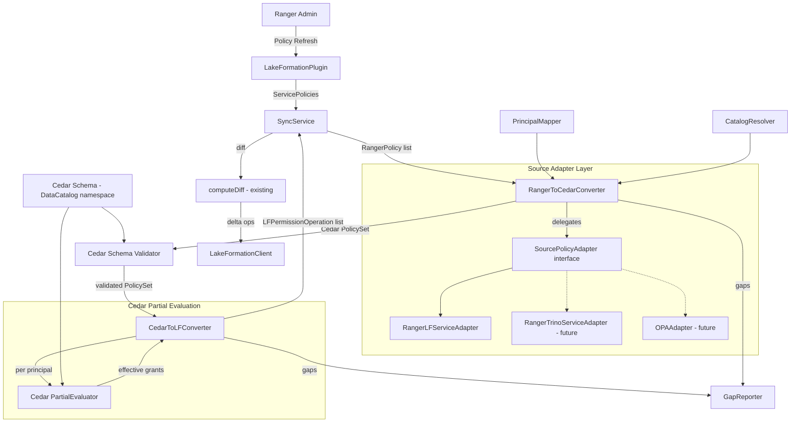

# Design Document: Cedar Policy Abstraction Layer

## Overview

This design introduces Cedar as an intermediate policy representation between Apache Ranger (source) and AWS Lake Formation (target). The current pipeline converts Ranger policies directly to `LFPermissionOperation` objects via `PolicyConverter`. The new pipeline inserts a Cedar policy layer:

```
Ranger Policies
    → SourcePolicyAdapter (service-type-specific mapping)
    → RangerToCedarConverter (produces Cedar PolicySet)
    → Cedar Schema Validation
    → CedarToLFConverter (partial evaluation → effective permissions)
    → LFPermissionOperation objects
    → SyncService (existing diff-based sync)
    → LakeFormationClient
```

The key motivations are:

1. **Deny semantics**: The current `PolicyConverter` records deny policies as gaps and drops them. Cedar's `forbid` statements and partial evaluation properly resolve permit/forbid interactions, materializing the correct effective grant set.
2. **Decoupled representation**: A generic `DataCatalog::` Cedar namespace decouples the intermediate representation from any specific target, enabling future multi-target support (OPA, Trino, etc.).
3. **Pluggable sources**: The `SourcePolicyAdapter` interface allows different Ranger service types (LakeFormation, Trino, Hive, Presto) and non-Ranger sources to map into the same Cedar schema without modifying core conversion logic.

The cedar-java SDK v4.2.3+ (JNI/Rust FFI, JDK 17+) provides policy parsing, schema validation, and partial evaluation.

## Architecture



### Design Decisions

1. **Cedar partial evaluation (Approach #3)** was chosen over alternatives (manual deny subtraction, Cedar authorization queries) because it leverages the Cedar engine's built-in permit/forbid resolution semantics, correctly handling deny-exception interactions without reimplementing Cedar's evaluation logic.

2. **Generic `DataCatalog::` namespace** rather than `LakeFormation::` ensures Cedar policies are target-agnostic. The `CedarToLFConverter` is responsible for mapping `DataCatalog::` entities to LF SDK objects.

3. **In-memory Cedar PolicySet** (no persistent store) — the Cedar policy set is rebuilt from Ranger policies on each sync cycle, consistent with the existing stateless conversion model. The `SyncService` diff mechanism operates on the output `LFPermissionOperation` list, not on Cedar policies.

4. **Adapter registration by service type string** — adapters are registered in a `Map<String, SourcePolicyAdapter>` keyed by the Ranger service definition's `name` field (e.g., `"lakeformation"`, `"trino"`). This avoids class-loading complexity and matches how `LakeFormationPlugin.SERVICE_TYPE` is already used.

5. **Data masking excluded from Cedar** — data masking (policyType=1) remains a gap. Tag-based policies are deferred to Phase 2. Both are reported via `GapReporter`.

## Components and Interfaces

### SourcePolicyAdapter Interface

```java
package com.amazonaws.policyconverters.cedar;

import org.apache.ranger.plugin.model.RangerPolicy;
import java.util.List;
import java.util.Map;
import java.util.Optional;
import java.util.Set;

/**
 * Maps a specific policy source's access types and resource hierarchy
 * into Cedar actions and DataCatalog:: entity types.
 */
public interface SourcePolicyAdapter {

    /** The service type this adapter handles (e.g., "lakeformation", "trino"). */
    String getServiceType();

    /**
     * Map a source access type to one or more Cedar action names.
     * Returns empty set if the access type is not mappable.
     */
    Set<String> mapAccessTypeToCedarActions(String sourceAccessType);

    /**
     * Build a Cedar entity identifier string for the given resource.
     * Returns the entity type (e.g., "DataCatalog::Database") and
     * the identifier string (e.g., an ARN or URN).
     */
    CedarEntityRef buildEntityRef(RangerPolicy policy, String resourceLevel);

    /**
     * Build a Cedar principal identifier from a resolved IAM ARN
     * or other identity string.
     */
    String buildPrincipalRef(String resolvedPrincipalId);

    /**
     * Return the AWS region and account ID for ARN construction,
     * or empty if not applicable (non-AWS sources).
     */
    Optional<AwsContext> getAwsContext();
}
```

### CedarEntityRef Value Object

```java
package com.amazonaws.policyconverters.cedar;

/** Pairs a Cedar entity type with its identifier string. */
public final class CedarEntityRef {
    private final String entityType;  // e.g., "DataCatalog::Database"
    private final String entityId;    // e.g., "arn:aws:glue:us-east-1:123456789012:database/analytics_db"

    public CedarEntityRef(String entityType, String entityId) {
        this.entityType = entityType;
        this.entityId = entityId;
    }

    public String getEntityType() { return entityType; }
    public String getEntityId() { return entityId; }
}
```

### AwsContext Value Object

```java
package com.amazonaws.policyconverters.lakeformation.cedar;

/** AWS region and account context for ARN construction. */
public final class AwsContext {
    private final String region;
    private final String accountId;
    private final String catalogId;

    public AwsContext(String region, String accountId, String catalogId) {
        this.region = region;
        this.accountId = accountId;
        this.catalogId = catalogId;
    }

    public String getRegion() { return region; }
    public String getAccountId() { return accountId; }
    public String getCatalogId() { return catalogId; }
}
```

### RangerLFServiceAdapter (Concrete Adapter)

```java
package com.amazonaws.policyconverters.ranger.cedar;

/**
 * SourcePolicyAdapter for the Ranger LakeFormation service definition.
 * Maps LF access types to Cedar actions using the same rules as AccessTypeMapper.
 * Produces AWS Glue ARN-formatted entity identifiers.
 */
public class RangerLFServiceAdapter implements SourcePolicyAdapter {
    // Service type: "lakeformation"
    // Access type mapping mirrors AccessTypeMapper:
    //   select → Action::"SELECT", update → Action::"UPDATE", etc.
    // Entity IDs use Glue ARN format:
    //   Database: arn:aws:glue:{region}:{account}:database/{dbName}
    //   Table:    arn:aws:glue:{region}:{account}:table/{dbName}/{tableName}
    //   Column:   arn:aws:glue:{region}:{account}:column/{dbName}/{tableName}/{colName}
    //   DataLocation: arn:aws:s3:::{bucket}/{path}
    // Principal IDs use IAM ARN format.
}
```

### RangerToCedarConverter

```java
package com.amazonaws.policyconverters.ranger.cedar;

import com.amazonaws.policyconverters.lakeformation.catalog.CatalogResolver;
import com.amazonaws.policyconverters.ranger.mapper.PrincipalMapper;
import com.amazonaws.policyconverters.lakeformation.reporter.GapReporter;
import org.apache.ranger.plugin.model.RangerPolicy;
import java.util.List;

/**
 * Converts Ranger policies into a Cedar PolicySet using a registered
 * SourcePolicyAdapter for service-type-specific mapping.
 */
public class RangerToCedarConverter {

    private final Map<String, SourcePolicyAdapter> adapterRegistry;
    private final PrincipalMapper principalMapper;
    private final CatalogResolver catalogResolver;
    private final GapReporter gapReporter;
    private final CedarSchemaProvider schemaProvider;

    /**
     * Convert a list of Ranger policies to a validated Cedar PolicySet.
     *
     * For each policy:
     * 1. Look up the SourcePolicyAdapter by service type
     * 2. Skip unsupported policy types (data masking, tag-based) → gap
     * 3. Expand wildcards via CatalogResolver
     * 4. For allow items (policyType=0): produce Cedar permit statements
     * 5. For deny items: produce Cedar forbid statements
     * 6. For deny exceptions: produce Cedar permit with deny-exception annotation
     * 7. For row filter items: produce Cedar permit with rowFilter attribute
     * 8. Record gaps for custom conditions, validity schedules
     * 9. Validate the full PolicySet against the Cedar schema
     * 10. Return the validated PolicySet
     */
    public CedarPolicySet convert(List<RangerPolicy> policies);
}
```

### CedarToLFConverter

```java
package com.amazonaws.policyconverters.lakeformation.cedar;

import com.amazonaws.policyconverters.lakeformation.model.LFPermissionOperation;
import com.amazonaws.policyconverters.lakeformation.reporter.GapReporter;
import java.util.List;

/**
 * Uses Cedar partial evaluation to materialize effective permissions
 * per principal, then converts to LFPermissionOperation objects.
 */
public class CedarToLFConverter {

    private final CedarSchemaProvider schemaProvider;
    private final GapReporter gapReporter;
    private final ArnParser arnParser;

    /**
     * Convert a validated Cedar PolicySet to LF permission operations.
     *
     * For each unique principal in the PolicySet:
     * 1. Run Cedar partial evaluation with the principal as the request context
     * 2. The engine resolves permit/forbid/deny-exception interactions
     * 3. Collect the effective (resource, action) grant set
     * 4. For each effective grant:
     *    a. Parse the entity identifier (ARN) to extract LF resource fields
     *    b. Map the Cedar action back to LFPermission
     *    c. Extract rowFilter attribute if present
     *    d. Create LFPermissionOperation with OperationType.GRANT
     * 5. Skip actions not supported by LF → gap with UNSUPPORTED_ACTION
     * 6. Skip non-ARN identifiers that can't be resolved → gap with UNMAPPED_RESOURCE
     */
    public List<LFPermissionOperation> convert(CedarPolicySet policySet);
}
```

### ArnParser Utility

```java
package com.amazonaws.policyconverters.lakeformation.cedar;

/**
 * Parses AWS ARN-formatted Cedar entity identifiers to extract
 * region, account, database, table, column, and S3 path components.
 */
public final class ArnParser {

    /** Parse a Glue database ARN → (region, account, databaseName) */
    public static GlueResourceRef parseDatabaseArn(String arn);

    /** Parse a Glue table ARN → (region, account, databaseName, tableName) */
    public static GlueResourceRef parseTableArn(String arn);

    /** Parse a Glue column ARN → (region, account, databaseName, tableName, columnName) */
    public static GlueResourceRef parseColumnArn(String arn);

    /** Parse an S3 ARN → (bucket, path) */
    public static S3ResourceRef parseS3Arn(String arn);

    /** Check if a string is a valid AWS ARN */
    public static boolean isArn(String identifier);
}
```

### CedarSchemaProvider

```java
package com.amazonaws.policyconverters.cedar;

/**
 * Loads and provides the DataCatalog Cedar schema for validation
 * and partial evaluation.
 */
public class CedarSchemaProvider {

    /** Load the Cedar schema from the classpath resource. */
    public CedarSchema loadSchema();

    /** Validate a PolicySet against the loaded schema. */
    public List<ValidationError> validate(CedarPolicySet policySet);
}
```

### CedarPolicySet Wrapper

```java
package com.amazonaws.policyconverters.cedar;

import java.util.List;
import java.util.Set;

/**
 * Wraps the cedar-java PolicySet with convenience methods
 * for the sync pipeline.
 */
public class CedarPolicySet {

    /** Get all unique principal identifiers in the policy set. */
    public Set<String> getPrincipals();

    /** Format the policy set to Cedar syntax string. */
    public String toCedarString();

    /** Parse a Cedar syntax string back into a CedarPolicySet. */
    public static CedarPolicySet fromCedarString(String cedarText, CedarSchema schema);

    /** Get the number of permit statements. */
    public int getPermitCount();

    /** Get the number of forbid statements. */
    public int getForbidCount();

    /** Get annotations (source policy IDs) for traceability. */
    public List<String> getSourcePolicyIds();
}
```


## Data Models

### Cedar Schema Definition (`datacatalog.cedarschema`)

The Cedar schema uses the `DataCatalog` namespace with a containment hierarchy:

```cedarschema
namespace DataCatalog {
    entity Principal;

    entity Catalog {
        // Top-level resource — represents a Glue Data Catalog (account-level or named catalog)
    };

    entity Database in [Catalog];

    entity Table in [Database];

    entity Column in [Table];

    entity DataLocation;

    action "SELECT"
        appliesTo { principal: [Principal], resource: [Table, Column] };

    action "INSERT"
        appliesTo { principal: [Principal], resource: [Table] };

    action "UPDATE"
        appliesTo { principal: [Principal], resource: [Table] };

    action "DELETE"
        appliesTo { principal: [Principal], resource: [Table] };

    action "DESCRIBE"
        appliesTo { principal: [Principal], resource: [Catalog, Database, Table] };

    action "ALTER"
        appliesTo { principal: [Principal], resource: [Database, Table] };

    action "DROP"
        appliesTo { principal: [Principal], resource: [Database, Table] };

    action "CREATE_DATABASE"
        appliesTo { principal: [Principal], resource: [Catalog] };

    action "CREATE_TABLE"
        appliesTo { principal: [Principal], resource: [Database] };

    action "DATA_LOCATION_ACCESS"
        appliesTo { principal: [Principal], resource: [DataLocation] };
}
```

**Extensibility**: Additional actions (e.g., `Action::"GRANT"`, `Action::"REVOKE"` from Trino) can be added to the schema without modifying existing target converters. The `CedarToLFConverter` simply skips actions it doesn't recognize and records a gap.

### Cedar Policy Statement Examples

**Allow policy (permit)**:
```cedar
// source-policy-id: 42
permit(
    principal == DataCatalog::Principal::"arn:aws:iam::123456789012:role/AnalystRole",
    action == DataCatalog::Action::"SELECT",
    resource == DataCatalog::Table::"arn:aws:glue:us-east-1:123456789012:table/analytics_db/orders"
);
```

**Deny policy (forbid)**:
```cedar
// source-policy-id: 43
forbid(
    principal == DataCatalog::Principal::"arn:aws:iam::123456789012:role/AnalystRole",
    action == DataCatalog::Action::"SELECT",
    resource == DataCatalog::Column::"arn:aws:glue:us-east-1:123456789012:column/analytics_db/orders/email"
);
```

**Row filter policy (permit with condition)**:
```cedar
// source-policy-id: 44
permit(
    principal == DataCatalog::Principal::"arn:aws:iam::123456789012:role/AnalystRole",
    action == DataCatalog::Action::"SELECT",
    resource == DataCatalog::Table::"arn:aws:glue:us-east-1:123456789012:table/analytics_db/orders"
) when { resource.rowFilter == "region = 'us-east-1'" };
```

### ARN Construction Patterns

| Entity Type | ARN Format | Example |
|---|---|---|
| Catalog | `arn:aws:glue:{region}:{account}:catalog` or `arn:aws:glue:{region}:{account}:catalog/{catalogName}` | `arn:aws:glue:us-east-1:123456789012:catalog` |
| Database | `arn:aws:glue:{region}:{account}:database/{db}` | `arn:aws:glue:us-east-1:123456789012:database/analytics_db` |
| Table | `arn:aws:glue:{region}:{account}:table/{db}/{table}` | `arn:aws:glue:us-east-1:123456789012:table/analytics_db/orders` |
| Column | `arn:aws:glue:{region}:{account}:column/{db}/{table}/{col}` | `arn:aws:glue:us-east-1:123456789012:column/analytics_db/orders/email` |
| DataLocation | `arn:aws:s3:::{bucket}/{path}` | `arn:aws:s3:::my-bucket/data/path` |
| Principal | `arn:aws:iam::{account}:role/{name}` or `arn:aws:iam::{account}:user/{name}` | `arn:aws:iam::123456789012:role/AnalystRole` |

For non-AWS sources (future), URN format: `urn:{system}:{subsystem}:{instance}:{path}`
Example: `urn:databricks:unity:workspace-123:catalog/my_catalog/schema/analytics`

### GapType Extensions

New `GapType` enum values to add to the existing `GapEntry.GapType`:

| GapType | Source | Description |
|---|---|---|
| `UNSUPPORTED_SERVICE_TYPE` | RangerToCedarConverter | No SourcePolicyAdapter registered for the policy's service type |
| `UNSUPPORTED_ACTION` | CedarToLFConverter | Cedar action not supported by the target system |
| `UNMAPPED_RESOURCE` | CedarToLFConverter | Non-ARN entity identifier with no configured resource mapping |
| `SCHEMA_VALIDATION_FAILURE` | RangerToCedarConverter | Cedar policy statement failed schema validation |

Existing gap types (`DATA_MASKING`, `TAG_BASED_POLICY`, `CUSTOM_CONDITION`, `VALIDITY_SCHEDULE`) continue to be reported by the `RangerToCedarConverter` with the same semantics as the current `PolicyConverter`.

### GlueResourceRef (ARN Parse Result)

```java
public final class GlueResourceRef {
    private final String region;
    private final String accountId;
    private final String databaseName;
    private final String tableName;   // null for database-level
    private final String columnName;  // null for table-level and above

    // Constructor, getters, equals, hashCode
}
```

### Pipeline Integration with SyncService

The `SyncService.onPoliciesUpdated()` method changes from:

```
PolicyConverter.convertBatch(policies) → LFPermissionOperation list → diff → apply
```

to:

```
RangerToCedarConverter.convert(policies) → CedarPolicySet
    → CedarToLFConverter.convert(policySet) → LFPermissionOperation list → diff → apply
```

The `SyncService` continues to own the diff computation (`computeDiff`) and batch application (`LakeFormationClient.applyBatch`). The `PrincipalMapper` and `CatalogResolver` are passed to `RangerToCedarConverter` just as they are currently passed to `PolicyConverter`. Gap entries from both converters flow into the same `GapReporter` instance.

### Dependency Configuration

The `pom.xml` requires:

```xml
<dependency>
    <groupId>com.cedarpolicy</groupId>
    <artifactId>cedar-java</artifactId>
    <version>4.2.3</version>
</dependency>
```

The Maven compiler plugin must be updated from Java 8 to Java 17:

```xml
<maven.compiler.source>17</maven.compiler.source>
<maven.compiler.target>17</maven.compiler.target>
```

At startup, the `SyncServiceMain` must attempt to load the cedar-java native library and fail fast with a descriptive error if JNI initialization fails, preventing the `SyncService` from starting.


## Correctness Properties

*A property is a characteristic or behavior that should hold true across all valid executions of a system — essentially, a formal statement about what the system should do. Properties serve as the bridge between human-readable specifications and machine-verifiable correctness guarantees.*

### Property 1: ARN Construction Round-Trip

*For any* valid combination of (region, accountId, resourceLevel, databaseName, tableName, columnName), constructing an ARN via `RangerLFServiceAdapter.buildEntityRef()` and then parsing it back via `ArnParser` should yield the original resource components.

**Validates: Requirements 2.1, 2.2, 2.3, 2.4, 2.5, 2.7**

### Property 2: Non-ARN Identifiers Produce UNMAPPED_RESOURCE Gap

*For any* Cedar entity identifier string that does not match the AWS ARN format and has no configured resource mapping, the `CedarToLFConverter` should skip the entity and record a gap entry with `GapType.UNMAPPED_RESOURCE` in the `GapReporter`.

**Validates: Requirements 2.8**

### Property 3: Unregistered Service Type Produces Gap

*For any* Ranger policy whose service type string is not registered in the `SourcePolicyAdapter` registry, the `RangerToCedarConverter` should produce zero Cedar statements for that policy and record a gap entry with `GapType.UNSUPPORTED_SERVICE_TYPE`.

**Validates: Requirements 3.4**

### Property 4: Allow Policy Permit Count

*For any* Ranger access policy (policyType=0) with P resolved principals, R expanded resources, and A mapped Cedar actions, the `RangerToCedarConverter` should produce exactly P × R × A Cedar `permit` statements.

**Validates: Requirements 4.1, 4.2**

### Property 5: Resource Level Determines Cedar Entity Type

*For any* Ranger policy, if the policy specifies only database resources then all generated Cedar statements reference `DataCatalog::Database` entities; if it specifies table resources then `DataCatalog::Table`; if it specifies column resources then `DataCatalog::Column`; if it specifies data location resources then `DataCatalog::DataLocation`.

**Validates: Requirements 4.3, 4.4, 4.5**

### Property 6: Wildcard Expansion Produces Only Concrete Names

*For any* Ranger policy containing wildcard patterns in resource names, after conversion by `RangerToCedarConverter`, all Cedar entity identifiers in the output should contain only concrete (non-wildcard) resource names — no `*` or `?` characters in the ARN path segments.

**Validates: Requirements 4.6**

### Property 7: Deny and Deny-Exception Statement Generation

*For any* Ranger policy with D deny items producing D_resolved (principal, resource, action) triples and E deny-exception items producing E_resolved triples, the `RangerToCedarConverter` should produce exactly D_resolved Cedar `forbid` statements and E_resolved Cedar `permit` statements annotated with a deny-exception marker.

**Validates: Requirements 5.1, 5.2, 5.3**

### Property 8: Policy ID Annotation Preservation

*For any* Ranger policy with a non-null policy ID, every Cedar statement generated from that policy by the `RangerToCedarConverter` should carry an annotation containing the original Ranger policy ID.

**Validates: Requirements 5.4**

### Property 9: Row Filter Attribute Round-Trip

*For any* Ranger row filter policy item with a non-empty filter expression, the `RangerToCedarConverter` should produce a Cedar `permit` statement with a `rowFilter` attribute matching the original expression, and the `CedarToLFConverter` should produce an `LFPermissionOperation` whose `LFResource.rowFilterExpression` equals that same expression.

**Validates: Requirements 6.1, 6.3**

### Property 10: Unsupported Features Produce Correct Gap Entries

*For any* Ranger policy containing one or more unsupported features (data masking policyType=1, tag-based service, custom conditions, validity schedules), the `RangerToCedarConverter` should record at least one gap entry per unsupported feature with the corresponding `GapType` (`DATA_MASKING`, `TAG_BASED_POLICY`, `CUSTOM_CONDITION`, `VALIDITY_SCHEDULE`), and should not produce Cedar statements for the unsupported portions.

**Validates: Requirements 7.1, 7.2, 7.3, 7.4**

### Property 11: Schema Validation Excludes Invalid Statements

*For any* set of Cedar policy statements where some statements reference entity types or actions not in the `DataCatalog` schema, the `RangerToCedarConverter` should exclude the invalid statements from the output `CedarPolicySet` and record a gap entry with `GapType.SCHEMA_VALIDATION_FAILURE` for each excluded statement.

**Validates: Requirements 1.5, 8.1, 8.2**

### Property 12: Forbid Removes Effective Grants

*For any* Cedar PolicySet containing a `permit(P, A, R)` and a `forbid(P, A, R)` for the same principal P, action A, and resource R, the `CedarToLFConverter` partial evaluation should produce zero `LFPermissionOperation` objects for that (P, A, R) triple.

**Validates: Requirements 9.2**

### Property 13: Deny-Exception Restores Grants

*For any* Cedar PolicySet containing a `permit(P, A, R)`, a `forbid(P, A, R)`, and a deny-exception `permit(P, A, R)` for the same principal P, action A, and resource R, the `CedarToLFConverter` partial evaluation should produce an `LFPermissionOperation` with `OperationType.GRANT` for that (P, A, R) triple.

**Validates: Requirements 9.3**

### Property 14: Effective Grants Produce GRANT Operations with Policy ID

*For any* effective (principal, resource, action) grant produced by Cedar partial evaluation, the `CedarToLFConverter` should produce an `LFPermissionOperation` with `OperationType.GRANT`, and the `sourcePolicyId` field should match the annotation from the originating Cedar statement.

**Validates: Requirements 9.4, 9.5**

### Property 15: Cedar PolicySet Format/Parse Round-Trip

*For any* valid `CedarPolicySet`, formatting it to a Cedar syntax string via `toCedarString()` and then parsing it back via `CedarPolicySet.fromCedarString()` should produce a semantically equivalent `CedarPolicySet` — same number of permit/forbid statements, same principals, same resources, same actions, and same annotations.

**Validates: Requirements 10.2, 10.3**

### Property 16: Unsupported Target Action Produces Gap

*For any* Cedar policy with an action that is not in the set of actions supported by the target system (LakeFormation), the `CedarToLFConverter` should skip that policy and record a gap entry with `GapType.UNSUPPORTED_ACTION`.

**Validates: Requirements 1.7**

### Property 17: Gap Aggregation from Both Converters

*For any* conversion pipeline execution where the `RangerToCedarConverter` produces N gap entries and the `CedarToLFConverter` produces M gap entries, the `GapReporter` should contain at least N + M total entries after the pipeline completes.

**Validates: Requirements 11.5**

## Error Handling

### Cedar SDK Initialization Failure

When the cedar-java native library fails to load (JNI initialization failure), the `SyncServiceMain` catches the `UnsatisfiedLinkError` or `ExceptionInInitializerError`, logs a descriptive error message including the platform and JDK version, and calls `System.exit(1)` to prevent the `SyncService` from starting in a broken state.

### Schema Validation Errors

When a generated Cedar statement fails schema validation, the `RangerToCedarConverter`:
1. Logs the validation error at WARN level with the policy ID and error details
2. Excludes the invalid statement from the output `CedarPolicySet`
3. Records a `GapEntry` with `GapType.SCHEMA_VALIDATION_FAILURE`
4. Continues processing remaining policies

This is a non-fatal error — one invalid statement does not abort the entire conversion batch.

### ARN Parse Failures

When `ArnParser` encounters a malformed ARN string in the `CedarToLFConverter`:
1. Logs the parse error at WARN level
2. Records a `GapEntry` with `GapType.UNMAPPED_RESOURCE`
3. Skips the affected permission (does not produce an `LFPermissionOperation`)

### Partial Evaluation Errors

If Cedar partial evaluation throws an exception for a specific principal:
1. Logs the error at ERROR level with the principal identifier
2. Skips that principal entirely (produces zero operations)
3. Records a gap entry
4. Continues with the next principal

### Adapter Registry Miss

When no `SourcePolicyAdapter` is registered for a policy's service type:
1. Logs at WARN level
2. Records `GapEntry` with `GapType.UNSUPPORTED_SERVICE_TYPE`
3. Skips the entire policy
4. Returns empty list for that policy

### Existing Error Handling Preserved

All existing error handling in `SyncService` (connectivity loss resilience, batch rollback, dead-letter logging) is preserved unchanged. The new Cedar layer sits between policy ingestion and the existing diff/apply mechanism.

## Testing Strategy

### Property-Based Testing

Property-based tests use **jqwik** (already in `pom.xml` as `net.jqwik:jqwik:1.7.4`). Each property test:
- Runs a minimum of 100 iterations
- References its design document property via a comment tag
- Uses jqwik's `@Property` annotation with `tries = 100` minimum

Tag format: `Feature: cedar-policy-abstraction, Property {N}: {title}`

Each correctness property (Properties 1–17) maps to exactly one `@Property` test method.

**Key generators needed**:
- `Arbitrary<GlueResourceComponents>` — random (region, accountId, databaseName, tableName, columnName) tuples with valid characters
- `Arbitrary<RangerPolicy>` — random Ranger policies with configurable policyType, resource levels, access types, principals, deny items, row filters, conditions, validity schedules
- `Arbitrary<CedarPolicySet>` — random valid Cedar policy sets for round-trip testing
- `Arbitrary<String>` — random non-ARN strings for UNMAPPED_RESOURCE testing
- `Arbitrary<String>` — random unregistered service type strings

### Unit Testing

Unit tests (JUnit 5) cover:
- **Specific examples**: Known Ranger policy → expected Cedar output, known Cedar PolicySet → expected LF operations
- **Edge cases**: Empty policy list, null filter expressions, empty principal mappings, all-deny policy sets, single-statement PolicySets
- **Integration points**: `SyncService` wiring (RangerToCedarConverter → CedarToLFConverter → diff → apply), Cedar SDK initialization failure
- **Schema structure**: Verify the `datacatalog.cedarschema` file defines the expected entity types and actions (Requirements 1.1, 1.2, 1.4, 1.6)
- **Build configuration**: Verify `pom.xml` contains cedar-java dependency and JDK 17 compiler settings (Requirements 12.1, 12.2)

### Test Organization

```
src/test/java/com/amazonaws/policyconverters/
├── cedar/                                        # Generic Cedar layer tests
│   ├── CedarSchemaProviderTest.java
│   ├── CedarPolicySetRoundTripPropertyTest.java  # Property 15
│   └── CedarSchemaValidationPropertyTest.java    # Property 11
├── ranger/cedar/                                 # Ranger source adapter tests
│   ├── RangerLFServiceAdapterTest.java           # Unit tests + Property 3, 5
│   ├── RangerToCedarConverterTest.java           # Unit tests + Properties 4, 6, 7, 8, 10, 11
│   └── RangerToCedarConverterPropertyTest.java   # Property tests for converter
├── lakeformation/cedar/                          # LF target converter tests
│   ├── ArnParserTest.java                        # Unit tests for ARN parsing
│   ├── ArnRoundTripPropertyTest.java             # Property 1
│   ├── CedarToLFConverterTest.java               # Unit tests + Properties 2, 12, 13, 14, 16
│   └── CedarToLFConverterPropertyTest.java       # Property tests for LF converter
└── PipelineGapAggregationPropertyTest.java       # Property 17
```

### Dual Testing Rationale

- **Property tests** verify universal invariants across randomized inputs (e.g., "ARN round-trip always works", "deny always removes grants")
- **Unit tests** verify specific known scenarios (e.g., "Ranger policy 42 with SELECT on analytics_db produces this exact Cedar statement") and edge cases (empty inputs, null fields)
- Together they provide comprehensive coverage: property tests catch unexpected input combinations, unit tests document expected behavior for known cases
