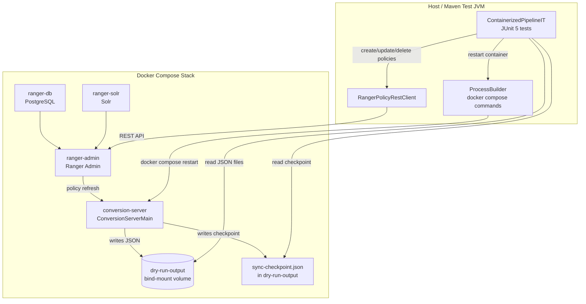
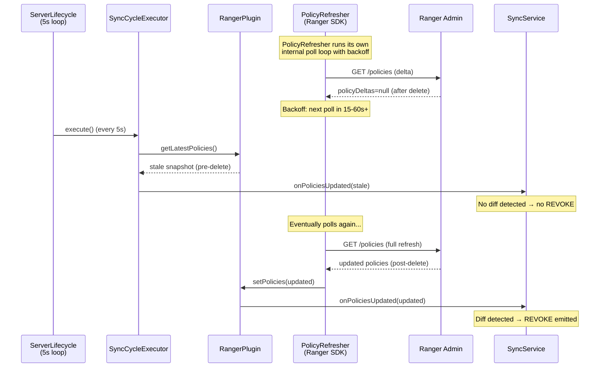
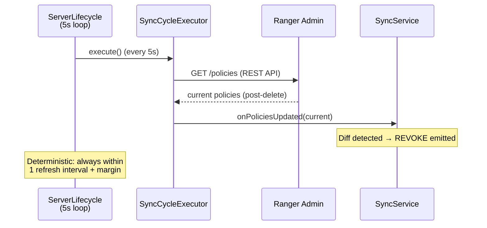

# Design Document: Complete Integration Tests

## Overview

This design addresses three high-impact gaps in the containerized integration test suite for the Ranger-to-Lake Formation policy conversion server:

1. **Data Location Deletion Timeout (Req 1)** — The `ContainerizedDataLocationIT.testDataLocationDeletionRevoke` test times out because the Ranger SDK `PolicyRefresher` thread exhibits unpredictable backoff when `policyDeltas=null`. The fix bypasses the `PolicyRefresher` push model by having the `ServerLifecycle` main loop actively fetch policies each cycle, making sync timing deterministic and bounded by the configured `policyRefreshIntervalMs`.

2. **Containerized Wildcard Tests (Reqs 2–4)** — New `ContainerizedWildcardIT.java` tests verify wildcard database and table grant policies through the containerized server. In the containerized environment, the `CatalogResolver` uses a real `GlueClient` — but in dry-run mode without AWS credentials, Glue calls fail gracefully (returning empty lists), so wildcards pass through without expansion. The wildcard refresh scheduler test (Req 4) enables `wildcardRefreshIntervalSeconds` in the IT config and verifies the scheduler triggers re-evaluation cycles.

3. **Checkpoint & Restart Resilience (Reqs 5–6)** — New tests verify that the `CheckpointStore` writes valid checkpoint files after sync cycles and that the server resumes correctly after a container restart, avoiding duplicate grants for already-applied permissions.

### Design Decisions Summary

| Decision | Choice | Rationale |
|---|---|---|
| PolicyRefresher bypass | `ServerLifecycle` fetches policies via `plugin.getLatestPolicies()` each cycle | Makes sync timing deterministic; avoids fighting the Ranger SDK's internal backoff |
| Wildcard expansion in IT | Passthrough (Glue calls fail gracefully, wildcards preserved as literals) | No AWS credentials in Docker; matches existing `WildcardPolicyIT` behavior |
| Wildcard refresh IT config | Enable `wildcardRefreshIntervalSeconds: 15` in IT config | Fast enough for testing, slow enough to avoid interference with normal sync |
| Checkpoint bind-mount | Reuse existing `dry-run-output` volume with `checkpointPath: /app/dry-run-output/sync-checkpoint.json` | Avoids adding a second bind-mount; checkpoint file is accessible from host |
| Container restart mechanism | `docker compose restart conversion-server` from test via `ProcessBuilder` | Simpler than stop+start; preserves volume mounts and checkpoint file |

## Architecture



### Sync Flow: Current vs. Fixed

The current single-plugin mode relies on the `PolicyRefresher` thread (inside `RangerBasePlugin`) to push policy updates to `SyncService` via `setPolicies()` → `onPoliciesUpdated()`. The `ServerLifecycle` main loop runs independently, calling `SyncCycleExecutor.execute()` at `policyRefreshIntervalMs` intervals — but the executor created by `createSyncCycleExecutor()` calls `plugin.getLatestPolicies()` which returns whatever the `PolicyRefresher` last delivered. When `PolicyRefresher` backs off (due to `policyDeltas=null`), the `ServerLifecycle` loop keeps running but sees stale data.



**Fix:** Modify the `SyncCycleExecutor` created by `createSyncCycleExecutor()` to fetch policies directly from Ranger Admin via the REST API (same approach as `DryRunPipelineIT.triggerSync()`), bypassing the `PolicyRefresher` entirely. The `ServerLifecycle` loop then drives sync timing deterministically.




## Components and Interfaces

### 1. PolicyRefresher Bypass — Modified SyncCycleExecutor (Req 1)

**File:** `ConversionServerMain.java` — `createSyncCycleExecutor()` method

The current `createSyncCycleExecutor()` calls `plugin.getLatestPolicies()` which returns the last snapshot delivered by the `PolicyRefresher` thread. The fix changes this to fetch policies directly from Ranger Admin via the REST API, making the `ServerLifecycle` loop the sole sync driver.

**Approach: Direct REST Fetch in SyncCycleExecutor**

Instead of relying on `plugin.getLatestPolicies()` (which depends on `PolicyRefresher`), the executor fetches policies from Ranger Admin's REST API directly:

```java
static SyncCycleExecutor createSyncCycleExecutor(
        RangerPlugin plugin, SyncService syncService,
        ReverseSyncService reverseSyncService,
        ReverseSyncConfig reverseSyncConfig,
        String rangerAdminUrl, String username, String password) {
    return () -> {
        long startMs = System.currentTimeMillis();
        try {
            // Fetch policies directly from Ranger Admin REST API
            // (bypasses PolicyRefresher backoff)
            ServicePolicies servicePolicies = fetchPoliciesFromRangerAdmin(
                    rangerAdminUrl, username, password);
            
            int policyCount = 0;
            if (servicePolicies != null) {
                policyCount = servicePolicies.getPolicies() != null
                        ? servicePolicies.getPolicies().size() : 0;
                syncService.onPoliciesUpdated(servicePolicies);
            }
            // ... reverse-sync logic unchanged ...
            long durationMs = System.currentTimeMillis() - startMs;
            return SyncCycleResult.success(durationMs, policyCount, 0, 0, 0);
        } catch (Exception e) {
            long durationMs = System.currentTimeMillis() - startMs;
            return SyncCycleResult.failure(durationMs, e);
        }
    };
}
```

The `fetchPoliciesFromRangerAdmin()` method uses the same REST endpoint as `DryRunPipelineIT.triggerSync()`:
- `GET /service/public/v2/api/service/{serviceName}/policy`
- Wraps the response in a `ServicePolicies` envelope with `policyVersion = System.currentTimeMillis()`

**Why this works:** The `ServerLifecycle` loop runs every `policyRefreshIntervalMs` (5s). Each cycle now fetches the current state directly from Ranger Admin, so policy deletions are detected within one refresh interval. The `PolicyRefresher` thread still runs (it's internal to `RangerBasePlugin`) but its output is no longer consumed — the `setPolicies()` callback on `RangerPlugin` still fires but the `SyncCycleExecutor` doesn't depend on it.

**Why not disable PolicyRefresher entirely:** The `PolicyRefresher` is deeply embedded in `RangerBasePlugin.init()`. Disabling it would require subclassing or reflection hacks. Ignoring its output is simpler and safer.

**Impact on existing tests:** None. The `ServerLifecycle` loop timing is unchanged (5s). The only difference is the data source: REST API instead of `PolicyRefresher` cache. All existing containerized tests that rely on `waitForDryRunOutput()` continue to work because the sync timing is the same or faster.

### 2. ContainerizedWildcardIT — Wildcard Test Class (Reqs 2–4)

**File:** `src/integration-test/java/.../it/ContainerizedWildcardIT.java`

Extends `ContainerizedPipelineIT` with three test methods:

1. `testWildcardDatabaseGrant()` (Req 2) — Creates a policy granting ALTER on database `*` to `data_admin`, waits for dry-run output, asserts GRANT with ALTER permission and correct principal ARN.

2. `testWildcardTableGrant()` (Req 3) — Creates a policy granting SELECT on table `*` in database `analytics` to `analyst`, waits for dry-run output, asserts GRANT with SELECT permission, correct database name, and correct principal ARN.

3. `testWildcardRefreshScheduler()` (Req 4) — Creates a wildcard table policy, waits for initial sync, clears output, then waits for the `WildcardRefreshScheduler` to trigger a refresh cycle. Asserts that the refresh produces output (either with operations if re-expansion found changes, or an empty operations list if no changes).

**Wildcard Behavior in Containerized Environment:**

In the containerized server, `CatalogResolver` is constructed with a real `GlueClient`. However, in dry-run mode the AWS credentials are placeholder values (`arn:aws:iam::123456789012:role/DryRunPlaceholder`). When `CatalogResolver.expandDatabases("*")` or `expandTables(db, "*")` is called, the Glue API call fails with an authentication error. The `CatalogResolver` catches this exception and returns an empty list (graceful failure per its design).

When the `RangerToCedarConverter` receives an empty expansion result for a wildcard pattern, the behavior depends on the converter's handling:
- If the converter treats empty expansion as "no matching resources" → no GRANT operations for that policy
- If the converter falls back to passing the wildcard through → GRANT with `*` as the resource name

Based on the existing `WildcardPolicyIT` (which uses a passthrough `CatalogResolver` that returns the pattern as-is), the expected behavior is that wildcards pass through as literal values. However, in the containerized environment with a real `CatalogResolver` that returns empty lists on Glue failure, the behavior may differ.

**Design Decision:** The test assertions should be flexible:
- Assert that the pipeline does not crash (no exceptions in server logs)
- Assert that if GRANT operations are produced, they have the correct principal ARN and permission type
- If the Glue failure causes empty expansion (no GRANTs), the test should document this as expected behavior for the dry-run environment

**Alternative considered:** Injecting a passthrough `CatalogResolver` into the containerized server via configuration. This was rejected because it would require a config flag and code path that only exists for testing, violating the principle that the containerized tests should exercise the real production code path.

### 3. IT Config Updates (Reqs 4, 5)

**File:** `integration-test/docker/server-config-it.yaml`

Two additions:

```yaml
# Enable wildcard refresh for Req 4 tests
wildcardRefreshIntervalSeconds: 15

# Enable checkpoint persistence for Reqs 5-6 tests
checkpointPath: /app/dry-run-output/sync-checkpoint.json
```

**Design Decision: Checkpoint in dry-run-output volume.** The checkpoint file is placed in the same bind-mounted directory as dry-run output (`/app/dry-run-output/`). This avoids adding a second bind-mount to the Docker Compose config. The host-side path is `integration-test/docker/dry-run-output/sync-checkpoint.json`. The `clearDryRunOutputs()` method in `ContainerizedPipelineIT` filters by `dry-run-*.json` pattern, so it won't delete the checkpoint file.

**Design Decision: wildcardRefreshIntervalSeconds: 15.** This is fast enough for the test to complete within a reasonable timeout (30s wait) while being slow enough to avoid interfering with normal sync cycles. The `WildcardRefreshScheduler` acquires the shared `cycleLock`, so it won't run concurrently with a normal sync cycle.

### 4. ContainerizedCheckpointIT — Checkpoint Tests (Reqs 5–6)

**File:** `src/integration-test/java/.../it/ContainerizedCheckpointIT.java`

Extends `ContainerizedPipelineIT` with two test methods:

1. `testCheckpointPersistence()` (Req 5) — Creates a policy, waits for sync, then reads the checkpoint file from the host filesystem. Asserts:
   - Checkpoint file exists and is valid JSON
   - `cedarPolicyText` is non-empty
   - `policyVersion` > 0
   - `timestamp` is a valid ISO-8601 string

2. `testRestartResilience()` (Req 6) — Creates a policy, waits for initial sync (GRANT), verifies checkpoint exists, then restarts the conversion-server container via `docker compose restart`. After restart, waits for the server to become healthy, clears dry-run output, waits for the next sync cycle. Asserts:
   - No duplicate GRANT operations for the already-applied policy
   - Creates a second policy after restart, asserts GRANT only for the new policy

**Container Restart Mechanism:**

```java
private void restartConversionServer() throws Exception {
    ProcessBuilder pb = new ProcessBuilder(
            "docker", "compose", "-f", COMPOSE_FILE_PATH, "restart", "conversion-server");
    pb.inheritIO();
    Process process = pb.start();
    int exitCode = process.waitFor();
    if (exitCode != 0) {
        throw new RuntimeException("docker compose restart failed with exit code " + exitCode);
    }
    // Wait for container to become healthy
    waitForContainerHealth();
}
```

**Design Decision: `docker compose restart` vs. stop+start.** `restart` is simpler and preserves the container's volume mounts. The checkpoint file persists across restarts because it's on the bind-mounted volume. The `restart` command stops the container gracefully (SIGTERM → shutdown hook → checkpoint save) and starts it again.

**Checkpoint file cleanup:** The `@AfterEach` in `ContainerizedCheckpointIT` should NOT delete the checkpoint file between tests within the same class (the restart test depends on it). The `@AfterAll` or a dedicated cleanup method should handle checkpoint deletion.

### 5. ContainerizedPipelineIT Base Class Updates

**File:** `src/integration-test/java/.../it/ContainerizedPipelineIT.java`

Minor additions to support checkpoint and restart tests:

- `readCheckpointFile()` — Reads and parses the checkpoint JSON file from the host filesystem
- `waitForContainerHealth(long timeoutMs)` — Polls the conversion-server container health via `docker compose ps`
- `getComposeFilePath()` — Returns the Docker Compose file path for subprocess commands

The `clearDryRunOutputs()` method is updated to only delete `dry-run-*.json` files, preserving the checkpoint file.

## Data Models

### SyncCheckpoint (existing, unchanged)

```json
{
  "policyVersion": 42,
  "serviceVersions": {
    "lakeformation": 42
  },
  "timestamp": "2024-01-15T10:30:00Z",
  "cedarPolicyText": "permit(principal == ...) when { ... };"
}
```

### Dry-Run Output (existing, unchanged)

```json
{
  "timestamp": "2024-01-15T10:30:00Z",
  "sequenceNumber": 1,
  "operations": [
    {
      "operationType": "GRANT",
      "principalArn": "arn:aws:iam::123456789012:role/analyst",
      "resource": { ... },
      "permissions": ["SELECT"],
      "grantable": false,
      "sourcePolicyId": "42"
    }
  ]
}
```

### Docker Compose Volume Mapping (updated)

```
Host path:      integration-test/docker/dry-run-output/
Container path: /app/dry-run-output/

Files:
  dry-run-001.json          (dry-run output)
  dry-run-002.json          (dry-run output)
  sync-checkpoint.json      (checkpoint file)
```


## Correctness Properties

Property-based testing does not apply to this feature. All requirements describe integration test scenarios that exercise external services (Ranger Admin, Docker containers), file I/O (shared volumes, checkpoint files), and container lifecycle management (restart via Docker Compose). None of the acceptance criteria involve pure functions with universal properties that vary meaningfully with random inputs.

Specifically:
- **Reqs 1.1–1.6** test timing behavior of the containerized server's sync loop after a policy deletion — this is infrastructure behavior, not a function with inputs/outputs.
- **Reqs 2–3** test specific wildcard policy scenarios through the containerized pipeline — concrete integration scenarios with fixed policies.
- **Req 4** tests the `WildcardRefreshScheduler` triggering through the containerized server — infrastructure timing behavior.
- **Reqs 5–6** test checkpoint file persistence and container restart resilience — file I/O and container lifecycle, not pure functions.
- **Req 7** is documentation-only.

All testing is covered by integration tests (specific scenarios with concrete assertions) and smoke tests (configuration verification).

## Error Handling

### PolicyRefresher Bypass Errors

| Failure | Detection | Response |
|---|---|---|
| REST API fetch fails (Ranger Admin unreachable) | `IOException` or non-200 HTTP status in `fetchPoliciesFromRangerAdmin()` | Log error, return `SyncCycleResult.failure()`. `ServerLifecycle` retries on next cycle. |
| REST API returns empty policy list | Empty `policies` array in response | Treated as "all policies deleted" — diff produces REVOKEs for all previous grants. This is correct behavior. |
| REST API returns malformed JSON | `JsonProcessingException` during deserialization | Log error, return `SyncCycleResult.failure()`. Previous state preserved. |

### Wildcard Test Errors

| Failure | Detection | Response |
|---|---|---|
| Glue API call fails (no credentials) | `CatalogResolver` catches exception, returns empty list | Expected in dry-run mode. Wildcard policies may produce no GRANTs or pass through as literals depending on converter behavior. Test assertions are flexible. |
| Wildcard refresh produces no output within timeout | `waitForDryRunOutput()` times out | Test fails with diagnostic message. May indicate `wildcardRefreshIntervalSeconds` is too long or the scheduler didn't start. |

### Checkpoint Test Errors

| Failure | Detection | Response |
|---|---|---|
| Checkpoint file not written | File doesn't exist at expected host path after sync | Test fails. May indicate `checkpointPath` config is wrong or `CheckpointStore` has a bug. |
| Checkpoint file is invalid JSON | `ObjectMapper.readValue()` throws `JsonProcessingException` | Test fails with parse error details. |
| Container restart fails | `docker compose restart` returns non-zero exit code | Test fails with exit code. May indicate Docker daemon issues. |
| Container doesn't become healthy after restart | Health poll timeout exceeded | Test fails with diagnostic message. Dump container logs for debugging. |
| Duplicate GRANTs after restart | Dry-run output contains GRANT operations for pre-restart policy | Test fails — indicates checkpoint was not loaded or `previousOperations` was not restored correctly. |

### clearDryRunOutputs Safety

The `clearDryRunOutputs()` method must be updated to only delete `dry-run-*.json` files, not the checkpoint file. Current implementation deletes all files in the directory, which would break checkpoint persistence tests.

```java
protected void clearDryRunOutputs() {
    File outputDir = dryRunOutputPath.toFile();
    if (!outputDir.exists()) return;
    File[] files = outputDir.listFiles((dir, name) ->
            name.startsWith("dry-run-") && name.endsWith(".json"));
    if (files != null) {
        for (File f : files) {
            if (!f.delete()) {
                LOG.warn("Failed to delete dry-run output file: {}", f);
            }
        }
    }
}
```

## Testing Strategy

### Why Property-Based Testing Does Not Apply

This feature is integration test infrastructure. Every requirement describes a scenario that:
- Requires a running Docker Compose stack (external services)
- Creates specific Ranger policies via REST API (fixed inputs)
- Waits for containerized server processing (timing/I/O)
- Asserts on file system output (file I/O)
- Manages container lifecycle (Docker commands)

None of these have universal properties that vary meaningfully with random inputs. Running 100 iterations with random policies would test the conversion logic itself, which is already covered by existing unit tests and property-based tests for the converter components.

### Integration Test Strategy

All tests in this feature are integration tests that run under the `integration-test` Maven profile with the `IT.java` suffix.

#### Test Classes and Coverage

| Test Class | Requirements | Key Scenarios |
|---|---|---|
| `ContainerizedDataLocationIT` (modified) | Req 1 | Data location deletion REVOKE within bounded time |
| `ContainerizedWildcardIT` (new) | Reqs 2, 3, 4 | Wildcard database grant, wildcard table grant, wildcard refresh scheduler |
| `ContainerizedCheckpointIT` (new) | Reqs 5, 6 | Checkpoint persistence, restart resilience, corrupted checkpoint recovery |

#### Test Execution Flow

**Data Location Deletion (Req 1):**
1. Create data location policy → wait for GRANT
2. Clear output → delete policy
3. Wait for REVOKE within `3 * policyRefreshIntervalMs + 10s` = 25s
4. Assert REVOKE contains DATA_LOCATION_ACCESS

**Wildcard Database Grant (Req 2):**
1. Create wildcard database ALTER policy for `data_admin`
2. Wait for dry-run output
3. Assert GRANT with ALTER permission and correct principal ARN (if output produced)
4. Verify no exceptions in container logs

**Wildcard Table Grant (Req 3):**
1. Create wildcard table SELECT policy for `analyst` in `analytics`
2. Wait for dry-run output
3. Assert GRANT with SELECT permission, `analytics` database, correct principal ARN

**Wildcard Refresh Scheduler (Req 4):**
1. Create wildcard table policy → wait for initial sync
2. Clear output
3. Wait for `WildcardRefreshScheduler` to trigger (up to `wildcardRefreshIntervalSeconds + margin`)
4. Assert output produced (empty operations or re-expanded grants)

**Checkpoint Persistence (Req 5):**
1. Create a policy → wait for sync
2. Read checkpoint file from host filesystem
3. Assert valid JSON with non-empty `cedarPolicyText`, `policyVersion > 0`, valid ISO-8601 `timestamp`

**Restart Resilience (Req 6):**
1. Create policy A → wait for GRANT → verify checkpoint exists
2. Restart conversion-server container via `docker compose restart`
3. Wait for container health
4. Clear dry-run output → wait for next sync cycle
5. Assert no duplicate GRANT for policy A
6. Create policy B → wait for GRANT → assert GRANT only for policy B

**Corrupted Checkpoint (Req 6.4):**
1. Create policy → wait for sync → verify checkpoint
2. Stop container → corrupt/delete checkpoint file
3. Start container → wait for health
4. Assert full bulk sync produces GRANTs for all existing policies

#### Test Ordering

Tests within `ContainerizedCheckpointIT` must run in a specific order because the restart test depends on the checkpoint written by the persistence test. Use `@TestMethodOrder(MethodOrderer.OrderAnnotation.class)` with `@Order` annotations.

#### Timeout Configuration

| Test | Timeout | Rationale |
|---|---|---|
| Data location deletion REVOKE | 25s (3 × 5s + 10s margin) | Bounded by fix: REST fetch every 5s |
| Wildcard grant tests | 60s (default) | Standard sync timeout |
| Wildcard refresh scheduler | 45s (15s interval + 30s margin) | Wait for scheduler to fire |
| Checkpoint persistence | 60s (default) | Standard sync timeout |
| Restart resilience | 180s total | Includes container restart time (~30-60s) + sync timeout |
