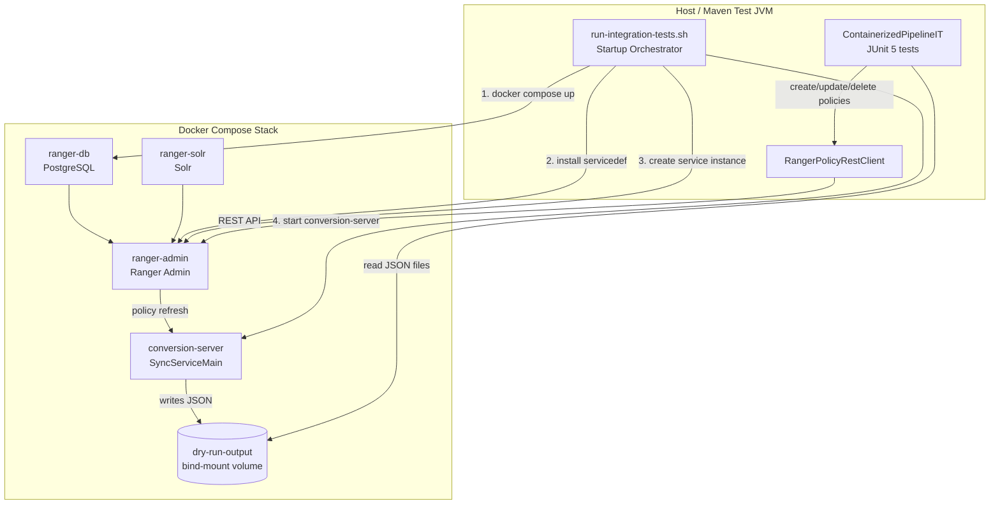
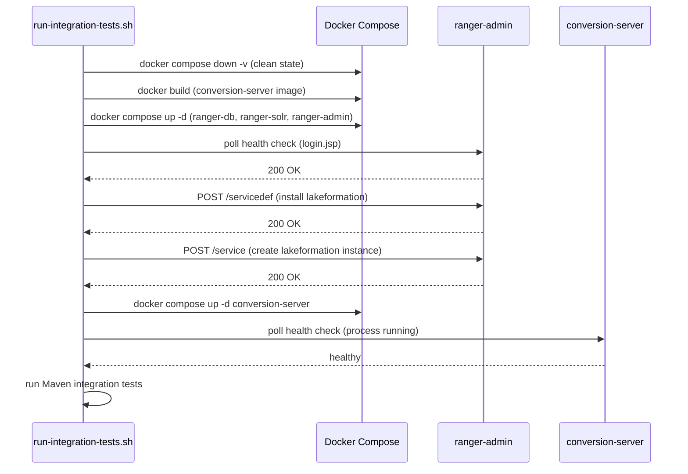
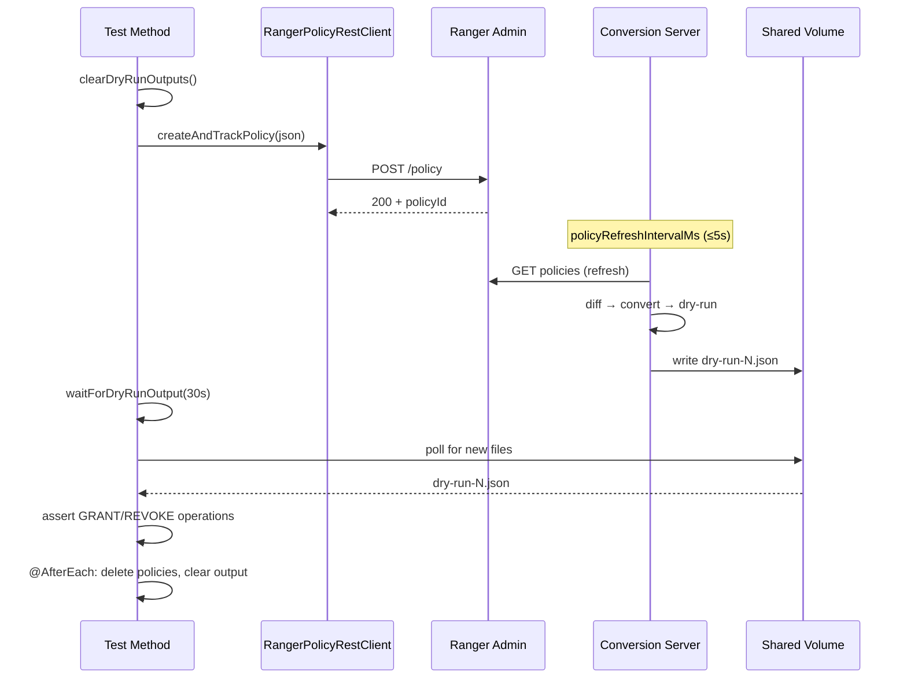

# Design Document: Containerized Integration Tests

## Overview

This feature adds the conversion server as a Docker container to the existing Ranger integration test stack, replacing the in-process pipeline wiring used by `DryRunPipelineIT`. Instead of manually constructing the converter chain and calling `syncService.onPoliciesUpdated()` directly, the conversion server runs as a real Docker service that:

1. Registers with Ranger Admin via the `LakeFormationPlugin` (extends `RangerBasePlugin`)
2. Receives policy updates through the Ranger policy refresh mechanism
3. Writes dry-run JSON output to a shared Docker volume

Integration tests create/update/delete policies via the Ranger REST API, wait for the containerized server to pick up changes, and validate the dry-run JSON files from the host filesystem. This provides true end-to-end coverage of plugin registration, policy refresh, and the full Ranger → Cedar → LF conversion pipeline running as a deployed service.

### Key Differences from Existing `DryRunPipelineIT`

| Aspect | `DryRunPipelineIT` (current) | `ContainerizedPipelineIT` (new) |
|---|---|---|
| Pipeline wiring | In-process: manually constructs `SyncService`, `RangerToCedarConverter`, etc. | Container: server runs as Docker service with real plugin registration |
| Sync trigger | Direct call to `syncService.onPoliciesUpdated()` | Automatic: `LakeFormationPlugin` polls Ranger Admin on `policyRefreshIntervalMs` |
| Dry-run output location | `Files.createTempDirectory("dryrun-it-")` (in-process) | Shared Docker volume bind-mounted to host path |
| Waiting for sync | Immediate (synchronous call) | Poll-based: wait for new/updated files in shared volume |
| CatalogResolver | Passthrough mock (returns input as-is) | Real passthrough (no Glue client in dry-run mode) |
| Principal mapping | Hardcoded in `setUp()` | Loaded from `server-config-it.yaml` |

## Architecture



### Startup Sequence



The startup is split into two phases because the `LakeFormationPlugin` constructor calls `super(SERVICE_TYPE, APP_ID)` and `plugin.init()` registers with Ranger Admin — both require the service definition and service instance to already exist. Starting the conversion-server container before these exist causes a registration failure.

## Components and Interfaces

### 1. Docker Compose Service Definition

**File:** `integration-test/docker/docker-compose.yml`

Add a `conversion-server` service:

```yaml
conversion-server:
  build:
    context: ../..
    dockerfile: Dockerfile
  depends_on:
    ranger-admin:
      condition: service_healthy
  environment:
    DRY_RUN_ENABLED: "true"
    DRY_RUN_OUTPUT_DIR: /app/dry-run-output
  volumes:
    - ./dry-run-output:/app/dry-run-output
  networks:
    - rangernw
  healthcheck:
    test: ["CMD-SHELL", "pgrep -f 'java.*app.jar' || exit 1"]
    interval: 10s
    timeout: 5s
    retries: 12
    start_period: 15s
  entrypoint: ["java", "-jar", "app.jar", "/app/config-it.yaml"]
```

The `depends_on: ranger-admin: condition: service_healthy` ensures Docker won't start the container until Ranger Admin is healthy. However, the service definition and service instance must be installed separately by the startup script before starting this service — Docker Compose `depends_on` only checks health, not application-level readiness.

**Design Decision:** Use a bind-mount (`./dry-run-output:/app/dry-run-output`) rather than a named Docker volume. This allows the host-side JUnit tests to read files directly from a known path without needing `docker cp` or volume inspection.

**Design Decision: Single Dockerfile, Multiple Configurations.** The existing `Dockerfile` in the project root is the canonical image definition for both integration testing and future production/development deployment. The integration test Docker Compose service reuses this same image — the only differences are the config file (bind-mounted `server-config-it.yaml` vs. the baked-in `server-config.yaml`) and environment variables (`DRY_RUN_ENABLED=true`). This avoids duplicating the Dockerfile or image build logic. A future production deployment feature should add a Maven target (e.g., `mvn docker:build`) that builds the same image, and production Docker Compose / ECS / K8s definitions that mount the production config and omit the dry-run env vars. No separate Dockerfile should be created for integration tests.

### 2. Integration Test Configuration

**File:** `integration-test/docker/server-config-it.yaml`

A dedicated config file copied into the conversion-server container image (or bind-mounted). Key settings:

```yaml
rangerConfig:
  rangerAdminUrl: "http://ranger-admin:6080"
  username: "admin"
  password: "rangerR0cks!"

awsConfig:
  region: "us-east-1"
  catalogId: "123456789012"

principalMapping:
  userMappings:
    analyst: "arn:aws:iam::123456789012:role/analyst"
    etl_user: "arn:aws:iam::123456789012:role/etl_user"
    data_admin: "arn:aws:iam::123456789012:role/data_admin"
    viewer: "arn:aws:iam::123456789012:role/viewer"
  groupMappings:
    data_engineers: "arn:aws:iam::123456789012:role/DataEngineersRole"
  roleMappings:
    admin_role: "arn:aws:iam::123456789012:role/LFAdminRole"

policyRefreshIntervalMs: 5000
maxLfRetries: 3
lfRetryBackoffMs: 500
```

**Design Decision:** `policyRefreshIntervalMs: 5000` (5 seconds) balances test speed with avoiding excessive polling. Tests use a poll-based wait with a timeout of 30 seconds (6 refresh cycles), which is sufficient for the server to pick up changes.

**Design Decision:** The config file is bind-mounted into the container rather than baked into the image. This keeps the production Dockerfile unchanged and allows test config to be modified without rebuilding.

### 3. Startup Orchestrator

**File:** `integration-test/scripts/run-integration-tests.sh` (modified)

The existing script is extended to:

1. Run `docker compose down -v` before starting (ensures clean state)
2. Build the conversion-server Docker image
3. Start only the Ranger stack services first (`ranger-db`, `ranger-solr`, `ranger-admin`)
4. Wait for Ranger Admin health check
5. Install the service definition via `install-servicedef.sh`
6. Create the `lakeformation` service instance via REST API
7. Start the `conversion-server` service
8. Wait for conversion-server health check
9. Run Maven integration tests
10. Tear down with `docker compose down -v`

A new helper script `integration-test/scripts/create-service-instance.sh` handles step 6.

### 4. `ContainerizedPipelineIT` Base Class

**File:** `src/integration-test/java/com/amazonaws/policyconverters/ranger/it/ContainerizedPipelineIT.java`

```java
public abstract class ContainerizedPipelineIT {
    // Configuration
    protected static final String TEST_ACCOUNT_ID = "123456789012";
    protected static final String DEFAULT_DRY_RUN_PATH = "integration-test/docker/dry-run-output";
    protected static final long DEFAULT_SYNC_TIMEOUT_MS = 30_000;
    protected static final long POLL_INTERVAL_MS = 1_000;

    // Instance state
    protected RangerPolicyRestClient policyClient;
    protected Path dryRunOutputPath;
    protected List<Integer> createdPolicyIds;
    protected ObjectMapper objectMapper;

    @BeforeAll
    static void ensureServiceInstance() { /* verify service def + instance exist */ }

    @BeforeEach
    void setUp() { /* init policyClient, clear dry-run output, init tracking list */ }

    @AfterEach
    void tearDown() { /* delete tracked policies, clear dry-run output */ }

    // Key methods:
    protected int createAndTrackPolicy(String policyJson);
    protected void updatePolicy(int policyId, String policyJson);
    protected void deletePolicyAndUntrack(int policyId);
    protected List<DryRunOutput> waitForDryRunOutput(long timeoutMs);
    protected List<DryRunOutput> readDryRunOutputs();
    protected void clearDryRunOutputs();
}
```

**Key difference from `DryRunPipelineIT`:** The `waitForDryRunOutput(timeoutMs)` method replaces `triggerSync()`. It polls the shared volume directory for new or updated JSON files, returning when new output appears or throwing after timeout. This accounts for the asynchronous nature of the containerized server's policy refresh cycle.

**Polling strategy:**
1. Record the set of existing files and their last-modified timestamps before the policy change
2. Poll every 1 second for new files or files with updated timestamps
3. Return the new/updated `DryRunOutput` objects
4. Throw `AssertionError` if timeout is exceeded

### 5. Concrete Integration Test Classes

Each test class extends `ContainerizedPipelineIT` and mirrors the existing `DryRunPipelineIT`-based tests but uses `waitForDryRunOutput()` instead of `triggerSync()`:

| Test Class | Validates | Key Scenario |
|---|---|---|
| `ContainerizedDatabaseGrantIT` | Req 7 | Database ALTER grant → correct GRANT op |
| `ContainerizedTableGrantIT` | Req 8 | Table SELECT+DROP grant → multi-permission GRANT ops |
| `ContainerizedColumnGrantIT` | Req 9 | Column SELECT grant → column-scoped GRANT op |
| `ContainerizedDataLocationIT` | Req 10 | Data location grant + deletion revoke |
| `ContainerizedPolicyUpdateDiffIT` | Req 11 | Add permission → GRANT diff; remove user → REVOKE diff |
| `ContainerizedPolicyDeletionIT` | Req 12 | Delete policy → REVOKE for all previously granted perms |
| `ContainerizedMultiPrincipalIT` | Req 13 | User/group/role mapping + unmapped principal skipping |
| `ContainerizedDisabledPolicyIT` | Req 14 | Disabled policy → no GRANT; disable active → REVOKE |
| `ContainerizedOverlappingColumnIT` | Req 15 | Two overlapping column policies; disable one → partial REVOKE |
| `ContainerizedMultiPolicyIT` | Req 16 | Two independent policies; delete one → selective REVOKE |

### 6. Service Instance Creation Script

**File:** `integration-test/scripts/create-service-instance.sh`

Creates the `lakeformation` service instance in Ranger Admin via REST API. Idempotent — if the instance already exists (HTTP 409 or name lookup succeeds), it succeeds silently.

```bash
curl -sf -X POST "${RANGER_URL}/service/public/v2/api/service" \
  -H "Content-Type: application/json" \
  -u "${AUTH}" \
  -d '{"name":"lakeformation","type":"lakeformation","configs":{"aws.region":"us-east-1","aws.catalog.id":"123456789012"}}'
```

## Data Models

### Dry-Run Output File (existing, unchanged)

Written by `DryRunLakeFormationClient` to the shared volume:

```json
{
  "timestamp": "2024-01-15T10:30:00Z",
  "sequenceNumber": 1,
  "operations": [
    {
      "operationType": "GRANT",
      "principalArn": "arn:aws:iam::123456789012:role/analyst",
      "resource": {
        "catalogId": "123456789012",
        "databaseName": "test_db",
        "tableName": "events",
        "columnNames": ["user_id"]
      },
      "permissions": ["SELECT"],
      "grantable": false,
      "sourcePolicyId": "42"
    }
  ]
}
```

### Docker Compose Volume Mapping

```
Host path:      integration-test/docker/dry-run-output/
Container path: /app/dry-run-output/
```

Files are named `dry-run-<sequenceNumber>.json` by `DryRunLakeFormationClient`.

### Test Configuration System Properties

| Property | Default | Description |
|---|---|---|
| `ranger.admin.url` | `http://localhost:6080` | Ranger Admin URL for test REST client |
| `dry.run.output.path` | `integration-test/docker/dry-run-output` | Host path to shared volume |
| `sync.timeout.ms` | `30000` | Max wait time for server to pick up changes |

## Error Handling

### Startup Failures

| Failure | Detection | Response |
|---|---|---|
| Docker image build fails | Non-zero exit from `docker build` | Print build output, exit 1 |
| Ranger Admin doesn't become healthy | Health poll timeout (120s) | Dump container logs, exit 1 |
| Service definition install fails | Non-200 HTTP from install script | Print error response, exit 1 |
| Service instance creation fails | Non-200/409 HTTP from create script | Print error response, exit 1 |
| Conversion server doesn't become healthy | Health poll timeout (120s) | Dump conversion-server logs, exit 1 |

### Test-Level Failures

| Failure | Detection | Response |
|---|---|---|
| Dry-run output not produced within timeout | `waitForDryRunOutput()` exceeds `sync.timeout.ms` | `AssertionError` with diagnostic message |
| Policy creation/update/deletion fails | `RangerPolicyRestClient` throws `RuntimeException` | Test fails with HTTP status and response body |
| Policy cleanup fails in `@AfterEach` | Exception during `deletePolicy()` | Log warning, don't fail the test (matches existing behavior) |

### Teardown Failures

| Failure | Detection | Response |
|---|---|---|
| `docker compose down -v` fails | Non-zero exit code | Log warning, exit 0 (matches existing `stop-ranger.sh` behavior) |
| Dry-run output directory cleanup fails | File deletion exception | Log warning, continue |

## Testing Strategy

### Why Property-Based Testing Does Not Apply

This feature is infrastructure and integration test scaffolding. The tests exercise external services (Ranger Admin, Docker containers) via REST APIs and file I/O. The behavior being tested is:

- Docker Compose service orchestration (configuration, not code logic)
- Shell script startup sequencing (imperative orchestration)
- File polling from a shared volume (I/O, not pure functions)
- End-to-end policy conversion through a deployed container (integration, not unit logic)

None of these have universal properties that vary meaningfully with random inputs. Each test verifies a specific scenario (create policy X → expect GRANT Y). Running 100 iterations with random policies would test the conversion logic itself, which is already covered by the existing unit tests and property-based tests for the converter components.

### Integration Test Strategy

All tests in this feature are integration tests that:

1. Require a running Docker Compose stack (Ranger + conversion server)
2. Create specific Ranger policies via REST API
3. Wait for the containerized server to process changes (poll-based)
4. Assert on the dry-run JSON output files

Tests run under the `integration-test` Maven profile and are suffixed `IT.java`.

### Test Execution Flow



### Test Coverage Matrix

| Requirement | Test Class | Scenarios |
|---|---|---|
| Req 1-5 | (verified by startup script) | Docker Compose config, image build, startup sequence |
| Req 6 | `ContainerizedPipelineIT` base class | Volume reading, polling, cleanup, teardown |
| Req 7 | `ContainerizedDatabaseGrantIT` | Database ALTER grant |
| Req 8 | `ContainerizedTableGrantIT` | Table SELECT+DROP multi-permission grant |
| Req 9 | `ContainerizedColumnGrantIT` | Column SELECT grant |
| Req 10 | `ContainerizedDataLocationIT` | Data location grant + deletion revoke |
| Req 11 | `ContainerizedPolicyUpdateDiffIT` | Add permission diff, remove user diff |
| Req 12 | `ContainerizedPolicyDeletionIT` | Delete policy → revoke all |
| Req 13 | `ContainerizedMultiPrincipalIT` | User/group/role mapping, unmapped principal |
| Req 14 | `ContainerizedDisabledPolicyIT` | Disabled policy no-op, disable active → revoke |
| Req 15 | `ContainerizedOverlappingColumnIT` | Overlapping columns, partial revoke on disable |
| Req 16 | `ContainerizedMultiPolicyIT` | Independent policies, selective deletion |
| Req 17 | (verified by startup/teardown scripts) | `docker compose down -v`, output cleanup |
| Req 18 | (deferred) | Reverse-sync integration tests — future phase |
