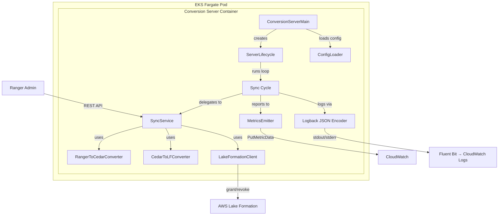
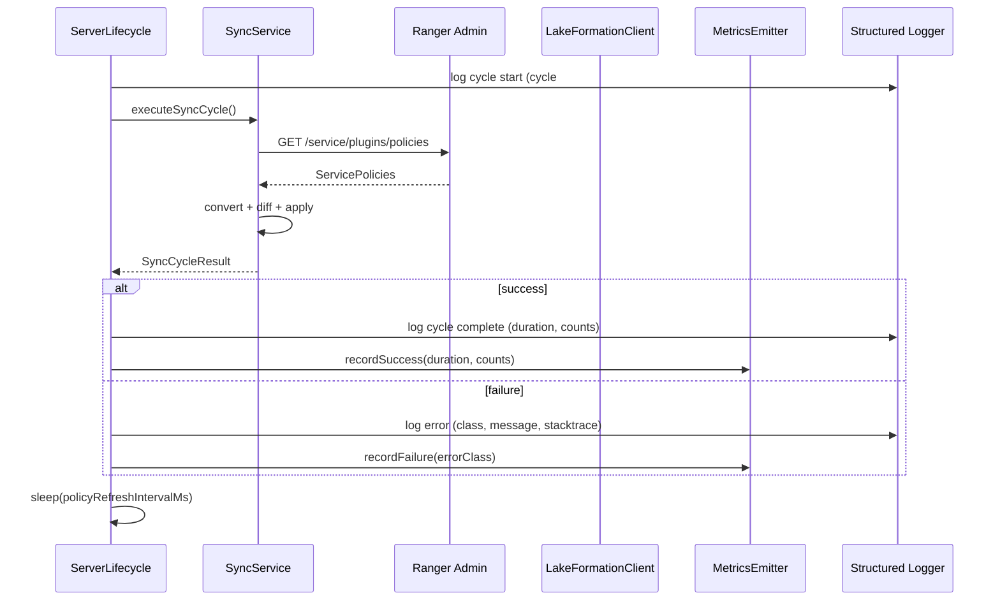
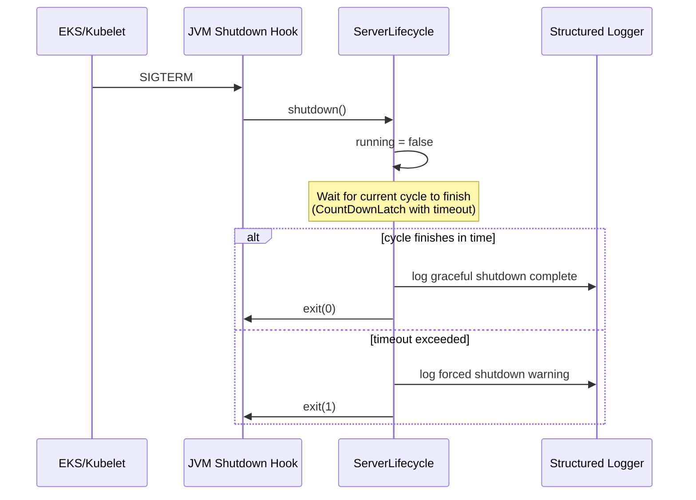

# Design Document: Conversion Server

## Overview

The conversion server wraps the existing Ranger-to-Lake Formation sync pipeline in a long-running container process suitable for deployment on EKS Fargate. Today, `SyncServiceMain` initializes the pipeline and relies on the Ranger plugin's internal polling mechanism. The conversion server replaces this with an explicit run-loop that:

1. Loads and validates configuration (existing `SyncConfig` + new `ServerConfig` section)
2. Runs sync cycles in a `while(running)` loop with configurable sleep intervals
3. Emits structured JSON logs to stdout/stderr via a Logback JSON encoder
4. Publishes CloudWatch metrics after each cycle (success/failure counts, durations, operation counts)
5. Handles SIGTERM gracefully by finishing the current sync cycle before exiting

The server delegates all policy conversion logic to the existing `RangerToCedarConverter`, `CedarToLFConverter`, `SyncService`, and `LakeFormationClient` classes. No conversion code is duplicated.

## Architecture



### Key Design Decisions

1. **No HTTP server**: The container runs a simple loop, not a web server. Health is checked via `pgrep` in the Docker HEALTHCHECK. This keeps the attack surface minimal and avoids port management on Fargate.

2. **Explicit run-loop vs. plugin polling**: The existing `LakeFormationPlugin` extends `RangerBasePlugin` which has its own internal polling thread. The conversion server bypasses this by directly calling Ranger Admin's REST API each cycle and feeding the result through the conversion pipeline. This gives the server full control over timing, error handling, and metrics emission per cycle.

3. **Logback JSON layout**: Rather than building a custom JSON logger, we use `logback-contrib`'s `JsonLayout` (or `logstash-logback-encoder`) to produce structured JSON on stdout. This is a well-tested approach that integrates with the existing SLF4J/Logback stack. A separate stderr appender with an ERROR threshold filter handles requirement 4.2.

4. **CloudWatch metrics via AWS SDK**: The `MetricsEmitter` uses the AWS SDK v2 `CloudWatchClient` to call `PutMetricData`. Metrics are buffered per cycle and flushed in a single API call to minimize CloudWatch costs.

5. **ServerConfig extends SyncConfig**: The new `server` YAML section is parsed alongside the existing config. `ServerConfig` composes `SyncConfig` with additional fields (`shutdownTimeoutSeconds`, `logLevel`, `metricsNamespace`). Environment variable overrides use the `SERVER_` prefix.

## Components and Interfaces

### New Classes (in `com.amazonaws.policyconverters.server`)

| Class | Responsibility |
|-------|---------------|
| `ConversionServerMain` | Entry point. Parses CLI args, loads config, validates, creates `ServerLifecycle`, registers SIGTERM hook, starts the run-loop. |
| `ServerLifecycle` | Owns the run-loop: `while(running) { executeCycle(); sleep(interval); }`. Manages the `volatile boolean running` flag and shutdown coordination via `CountDownLatch`. |
| `ServerConfig` | POJO for the `server` YAML section: `shutdownTimeoutSeconds`, `logLevel`, `metricsNamespace`. Parsed by Jackson alongside `SyncConfig`. |
| `ServerConfigLoader` | Extends `ConfigLoader` to parse the additional `server` section and apply `SERVER_*` environment variable overrides. |
| `MetricsEmitter` | Publishes CloudWatch metrics. Exposes `recordSuccess(durationMs, policiesProcessed, grantsApplied, revocationsApplied)`, `recordFailure(errorClassName)`, and `flush()`. |
| `SyncCycleResult` | Value object returned by each cycle: `success`, `durationMs`, `policiesProcessed`, `grantsApplied`, `revocationsApplied`, `errorClass`, `errorMessage`. |

### Existing Classes (reused, not modified)

| Class | Role in Server |
|-------|---------------|
| `ConfigLoader` | Base config loading (YAML/properties + env overrides) |
| `ConfigValidator` | Validates `SyncConfig` fields |
| `SyncService` | Computes diff and applies batch operations |
| `RangerToCedarConverter` | Ranger → Cedar conversion |
| `CedarToLFConverter` | Cedar → LF operations conversion |
| `LakeFormationClient` | Grant/revoke with retry logic |
| `DeadLetterLogger` | Failed operation logging |
| `GapReporter` | Unsupported feature reporting |

### Interaction Flow (Single Sync Cycle)



### Graceful Shutdown Flow



## Data Models

### ServerConfig (new YAML section)

```yaml
server:
  shutdownTimeoutSeconds: 30    # default: 30
  logLevel: INFO                # TRACE | DEBUG | INFO | WARN | ERROR, default: INFO
  metricsNamespace: RangerLFSync # default: RangerLFSync
```

Java class:

```java
public class ServerConfig {
    private final int shutdownTimeoutSeconds;  // default 30
    private final String logLevel;             // default "INFO"
    private final String metricsNamespace;     // default "RangerLFSync"
}
```

### Extended SyncConfig

The top-level config file becomes:

```yaml
rangerConfig:
  rangerAdminUrl: "http://ranger-admin:6080"
  username: "admin"
  password: "CHANGE_ME"
  # ... existing fields ...

awsConfig:
  region: "us-east-1"
  catalogId: "123456789012"
  roleArn: "arn:aws:iam::123456789012:role/RangerLFSyncRole"

principalMapping:
  # ... existing fields ...

policyRefreshIntervalMs: 30000
maxLfRetries: 5
lfRetryBackoffMs: 2000
deadLetterLogPath: "/var/log/ranger/lakeformation/dead-letter.jsonl"

server:
  shutdownTimeoutSeconds: 30
  logLevel: INFO
  metricsNamespace: RangerLFSync
```

### Environment Variable Overrides (server section)

| Environment Variable | Config Field | Default |
|---------------------|-------------|---------|
| `SERVER_SHUTDOWN_TIMEOUT_SECONDS` | `server.shutdownTimeoutSeconds` | 30 |
| `SERVER_LOG_LEVEL` | `server.logLevel` | INFO |
| `SERVER_METRICS_NAMESPACE` | `server.metricsNamespace` | RangerLFSync |

### SyncCycleResult

```java
public class SyncCycleResult {
    private final boolean success;
    private final long durationMs;
    private final int policiesProcessed;
    private final int grantsApplied;
    private final int revocationsApplied;
    private final int policiesSkipped;
    private final String errorClass;    // null on success
    private final String errorMessage;  // null on success
    private final Throwable error;      // null on success
}
```

### CloudWatch Metrics Schema

All metrics include dimension `ServiceName=conversion-server`.

| Metric Name | Unit | When Published | Dimensions |
|------------|------|----------------|------------|
| `SyncCycleSuccess` | Count (1) | Cycle succeeds | ServiceName |
| `SyncCycleFailure` | Count (1) | Cycle fails | ServiceName |
| `SyncCycleDuration` | Milliseconds | Cycle succeeds | ServiceName |
| `PoliciesProcessed` | Count | Every cycle | ServiceName |
| `GrantsApplied` | Count | Every cycle | ServiceName |
| `RevocationsApplied` | Count | Every cycle | ServiceName |
| `ErrorCount` | Count (1) | On error | ServiceName, ErrorType |

### Structured JSON Log Format

Each log line is a single JSON object:

```json
{
  "timestamp": "2025-01-15T10:30:00.123+0000",
  "level": "INFO",
  "logger": "com.amazonaws.policyconverters.server.ServerLifecycle",
  "message": "Sync cycle completed",
  "thread": "main"
}
```

Error entries additionally go to stderr via a filtered appender.

### Dockerfile

```dockerfile
# Stage 1: Build
FROM maven:3.9-eclipse-temurin-17 AS build
WORKDIR /app
COPY pom.xml .
COPY src ./src
COPY conf ./conf
RUN mvn clean package -DskipTests

# Stage 2: Runtime
FROM eclipse-temurin:17-jre-alpine
WORKDIR /app
COPY --from=build /app/target/ranger-lakeformation-plugin-*-jar-with-dependencies.jar app.jar
COPY conf/server-config.yaml /app/config.yaml

STOPSIGNAL SIGTERM
HEALTHCHECK --interval=30s --timeout=5s --retries=3 \
  CMD pgrep -f "java.*app.jar" || exit 1

ENTRYPOINT ["java", "-jar", "app.jar", "/app/config.yaml"]
```


## Correctness Properties

*A property is a characteristic or behavior that should hold true across all valid executions of a system — essentially, a formal statement about what the system should do. Properties serve as the bridge between human-readable specifications and machine-verifiable correctness guarantees.*

### Property 1: Invalid configuration produces error exit

*For any* configuration input that is either a non-existent file path or a file containing invalid/incomplete values (missing required fields like `rangerConfig.rangerAdminUrl`, `awsConfig.region`, etc.), the server startup should fail with a non-zero exit code and log at least one descriptive error message.

**Validates: Requirements 1.2, 1.3**

### Property 2: ServerConfig round-trip parsing

*For any* valid `ServerConfig` object with `shutdownTimeoutSeconds` > 0, `logLevel` in {TRACE, DEBUG, INFO, WARN, ERROR}, and a non-empty `metricsNamespace`, serializing it to YAML and then deserializing should produce an equivalent `ServerConfig` with the same field values. When fields are omitted, defaults should be applied (30, INFO, RangerLFSync).

**Validates: Requirements 3.1**

### Property 3: Environment variable override precedence

*For any* server configuration field (`shutdownTimeoutSeconds`, `logLevel`, `metricsNamespace`) and any valid value, when the corresponding `SERVER_*` environment variable is set, the loaded configuration should use the environment variable value regardless of what the configuration file contains.

**Validates: Requirements 3.2, 3.3**

### Property 4: Structured JSON log format

*For any* log message produced by the conversion server, the output line on stdout should be valid JSON containing at minimum the fields: `timestamp` (ISO-8601 format), `level`, `logger`, `message`, and `thread`.

**Validates: Requirements 4.1**

### Property 5: Error log routing to stderr

*For any* log message at ERROR level, the message should appear on both stdout and stderr. For any log message at a level below ERROR (WARN, INFO, DEBUG, TRACE), the message should appear only on stdout and not on stderr.

**Validates: Requirements 4.2**

### Property 6: Cycle result log completeness

*For any* `SyncCycleResult`, when the cycle succeeds the INFO log message should contain the cycle sequence number, duration in milliseconds, policies fetched count, grants applied count, revocations applied count, and policies skipped count. When the cycle fails, the ERROR log message should contain the cycle sequence number, error class name, error message, and stack trace.

**Validates: Requirements 5.2, 5.3**

### Property 7: Metrics correctness per cycle result

*For any* `SyncCycleResult`, the `MetricsEmitter` should publish the correct set of metrics: on success, `SyncCycleSuccess=1`, `SyncCycleDuration=durationMs`, `PoliciesProcessed=count`, `GrantsApplied=count`, `RevocationsApplied=count`; on failure, `SyncCycleFailure=1`, `ErrorCount=1` with `ErrorType` dimension set to the error class name. `PoliciesProcessed`, `GrantsApplied`, and `RevocationsApplied` should be published on every completed cycle regardless of success/failure.

**Validates: Requirements 6.2, 6.3, 6.4, 6.5, 6.6**

### Property 8: ServiceName dimension invariant

*For any* metric datum published by the `MetricsEmitter`, the datum should include a `ServiceName` dimension with value `conversion-server`.

**Validates: Requirements 6.7**

### Property 9: Metrics namespace configurability

*For any* non-empty namespace string configured in `ServerConfig.metricsNamespace`, all `PutMetricData` calls from the `MetricsEmitter` should use that namespace. When no namespace is configured, the default `RangerLFSync` should be used.

**Validates: Requirements 6.1**

### Property 10: Graceful shutdown waits for current cycle

*For any* sync cycle that is in progress when shutdown is requested, if the cycle completes within the configured `shutdownTimeoutSeconds`, the server should wait for the cycle to finish before exiting. The cycle result should be fully logged and metrics emitted before termination.

**Validates: Requirements 2.4**

### Property 11: Sleep interval matches configuration

*For any* configured `policyRefreshIntervalMs` value, the actual sleep duration between consecutive sync cycles should equal the configured interval (within a reasonable tolerance of ±50ms for scheduling jitter).

**Validates: Requirements 2.2**

## Error Handling

| Scenario | Behavior |
|----------|----------|
| Configuration file not found | Log error to stderr, exit with code 1 |
| Configuration file unreadable (permissions) | Log error to stderr, exit with code 1 |
| Configuration validation fails | Log each validation error to stderr, exit with code 1 |
| Invalid `server.logLevel` value | Log warning, fall back to INFO |
| Ranger Admin unreachable during cycle | Log ERROR with connection details, publish `SyncCycleFailure` and `ErrorCount` metrics, continue to next cycle |
| Lake Formation API error during cycle | Handled by existing `LakeFormationClient` retry logic; if exhausted, logged to dead-letter, cycle marked as partial failure |
| CloudWatch `PutMetricData` fails | Log WARN, do not fail the cycle (metrics are best-effort) |
| SIGTERM during cycle | Set `running=false`, wait for cycle to complete up to `shutdownTimeoutSeconds` |
| SIGTERM timeout exceeded | Log WARN about forced shutdown, exit with code 1 |
| Unexpected exception in run-loop | Log ERROR with full stack trace, publish `SyncCycleFailure` metric, continue to next cycle (do not crash) |
| Cedar native library load failure | Log ERROR with platform info, exit with code 1 (fail-fast at startup) |

## Testing Strategy

### Unit Tests

Unit tests verify specific examples, edge cases, and integration points:

- `ConversionServerMain`: test CLI arg parsing (no args → exit 1, valid path → proceeds)
- `ServerConfig`: test default values, test YAML deserialization with all fields, test partial config with defaults
- `ServerConfigLoader`: test env var overrides for each `SERVER_*` variable, test file-not-found error
- `ServerLifecycle`: test that `shutdown()` sets running to false, test that run-loop executes expected number of cycles with a mock SyncService
- `MetricsEmitter`: test that `recordSuccess` produces correct metric data, test that `recordFailure` includes ErrorType dimension
- `SyncCycleResult`: test builder/constructor with success and failure cases
- Dockerfile: verify STOPSIGNAL, HEALTHCHECK, ENTRYPOINT, multi-stage FROM directives exist

### Property-Based Tests

Property-based tests use **jqwik** (already in the project at version 1.7.4) with a minimum of 100 iterations per property. Each test references its design document property.

| Property | Test Class | Generator Strategy |
|----------|-----------|-------------------|
| Property 1: Invalid config → error | `InvalidConfigPropertyTest` | Generate random SyncConfig with randomly nulled-out required fields |
| Property 2: ServerConfig round-trip | `ServerConfigRoundTripPropertyTest` | Generate random valid ServerConfig (random int > 0, random log level from enum, random alphanumeric namespace) |
| Property 3: Env var override | `ServerConfigEnvOverridePropertyTest` | Generate random config file values and random env var values, verify env wins |
| Property 4: JSON log format | `StructuredLogFormatPropertyTest` | Generate random log messages with random levels, parse output as JSON, verify required fields |
| Property 5: Error log stderr routing | `ErrorLogRoutingPropertyTest` | Generate random log messages at random levels, verify ERROR goes to stderr, others don't |
| Property 6: Cycle result log completeness | `CycleLogCompletenessPropertyTest` | Generate random SyncCycleResult (success/failure), verify log contains all required fields |
| Property 7: Metrics correctness | `MetricsCorrectnessPropertyTest` | Generate random SyncCycleResult, call recordSuccess/recordFailure, verify captured PutMetricData requests |
| Property 8: ServiceName dimension | `ServiceNameDimensionPropertyTest` | Generate random SyncCycleResult, verify all metric data include ServiceName=conversion-server |
| Property 9: Metrics namespace | `MetricsNamespacePropertyTest` | Generate random namespace strings, verify PutMetricData uses the configured namespace |
| Property 10: Graceful shutdown | `GracefulShutdownPropertyTest` | Generate random cycle durations < timeout, verify cycle completes before exit |
| Property 11: Sleep interval | `SleepIntervalPropertyTest` | Generate random interval values, verify actual sleep matches within tolerance |

Each property test must be tagged with a comment:
```java
// Feature: conversion-server, Property N: <property title>
```

### Test Configuration

- jqwik minimum iterations: 100 per property
- Mocking: Mockito for AWS SDK clients (CloudWatchClient, LakeFormationClient)
- MetricsEmitter tests use a capturing mock CloudWatchClient to inspect PutMetricData requests
- Log format tests capture stdout/stderr via `ByteArrayOutputStream` redirects
- ServerLifecycle tests use a `CountDownLatch` and short timeouts to verify shutdown behavior
