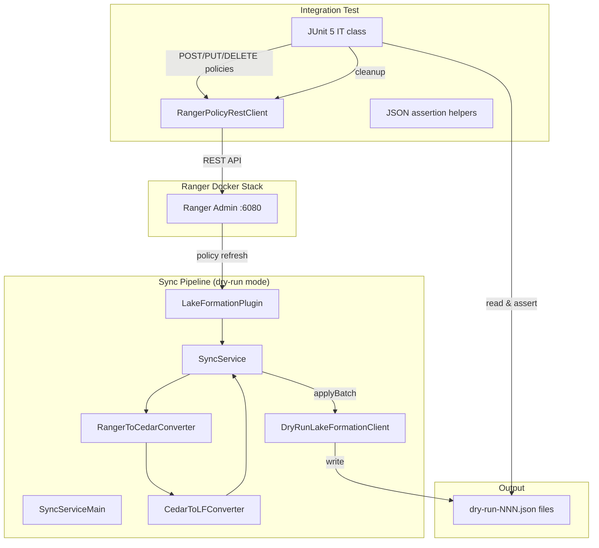

# Design Document: Dry-Run Integration Tests

## Overview

This design introduces a dry-run mode for the Ranger–Lake Formation sync pipeline and a suite of integration tests that exercise the full conversion chain (Ranger → Cedar → LF) against a live Docker Ranger instance. Instead of calling the real AWS Lake Formation API, a `DryRunLakeFormationClient` serializes the computed `LFPermissionOperation` list to JSON files. Integration tests create/update/delete policies in Ranger via its REST API, trigger the pipeline in dry-run mode, and assert on the JSON output.

The key interception point is `LakeFormationClient.applyBatch()`. The `DryRunLakeFormationClient` replaces it, writing operations to disk. `SyncServiceMain` is extended to conditionally wire the dry-run client when `DRY_RUN_ENABLED=true`.

A `RangerPolicyRestClient` test helper manages policies via the Ranger Admin REST API, and a base integration test class handles service instance setup and per-test cleanup.

## Architecture



The integration test lifecycle per test method:

1. Create Ranger policy via `RangerPolicyRestClient`
2. Trigger a sync cycle (invoke `SyncService.onPoliciesUpdated` with policies fetched from Ranger)
3. Read the dry-run JSON output file
4. Assert on operation types, resources, permissions, and principals
5. Cleanup: delete created policies and output files

## Components and Interfaces

### DryRunLakeFormationClient

New class in `com.amazonaws.policyconverters.lakeformation.client`.

```java
public class DryRunLakeFormationClient extends LakeFormationClient {

    public DryRunLakeFormationClient(Path outputDirectory, ObjectMapper objectMapper);

    @Override
    public BatchResult applyBatch(List<LFPermissionOperation> operations,
                                  DeadLetterLogger deadLetterLogger);
}
```

- Extends `LakeFormationClient` (requires a constructor that bypasses the real AWS SDK client — we'll use a protected/package-private constructor or pass `null` for the SDK client since `applyBatch` is fully overridden).
- Maintains an `AtomicInteger` sequence counter for filenames (`dry-run-001.json`, `dry-run-002.json`, …).
- Creates `outputDirectory` if it doesn't exist.
- Uses Jackson `ObjectMapper` for serialization (consistent with existing `@JsonProperty` annotations on `LFPermissionOperation`, `LFResource`, `LFPermission`).
- Returns `BatchResult` with all operations succeeded, zero failures, zero rollbacks.

**Design decision**: Extend `LakeFormationClient` rather than extract an interface. The existing codebase uses the concrete class everywhere. Extending and overriding `applyBatch` is the minimal-change approach. The parent constructor receives `null` for the SDK client and a dummy `RetryConfig`; since `applyBatch` is fully overridden, the parent's SDK client is never invoked.

### DryRunOutput (JSON envelope)

A simple POJO for the JSON file structure:

```java
public class DryRunOutput {
    private String timestamp;          // ISO-8601
    private int sequenceNumber;
    private List<LFPermissionOperation> operations;
}
```

Jackson-annotated for serialization/deserialization. Reuses existing `LFPermissionOperation` and `LFResource` Jackson annotations.

### SyncServiceMain changes

Add dry-run wiring in `startSyncService()`:

```java
boolean dryRunEnabled = "true".equalsIgnoreCase(System.getenv("DRY_RUN_ENABLED"));
if (dryRunEnabled) {
    String outputDir = System.getenv("DRY_RUN_OUTPUT_DIR");
    if (outputDir == null || outputDir.isBlank()) {
        outputDir = "./dry-run-output";
    }
    LOG.info("Dry-run mode enabled. Output directory: {}", outputDir);
    lakeFormationClient = new DryRunLakeFormationClient(
            Path.of(outputDir), new ObjectMapper());
}
```

This replaces the real `LakeFormationClient` before it's passed to `SyncService`.

### RangerPolicyRestClient

Test helper in `src/integration-test/java/.../it/RangerPolicyRestClient.java`.

```java
public class RangerPolicyRestClient {

    public RangerPolicyRestClient(String rangerAdminUrl, String username, String password);

    /** POST /service/public/v2/api/policy → returns created policy ID */
    public int createPolicy(String policyJson);

    /** PUT /service/public/v2/api/policy/{id} */
    public void updatePolicy(int policyId, String policyJson);

    /** DELETE /service/public/v2/api/policy/{id} */
    public void deletePolicy(int policyId);
}
```

Uses `java.net.HttpURLConnection` with Basic auth (consistent with existing `ServiceDefInstallIT`). Throws `RuntimeException` with HTTP status code and response body on non-2xx responses.

### DryRunPipelineIT (base class)

Abstract base class for integration tests:

```java
@TestMethodOrder(MethodOrderer.OrderAnnotation.class)
public abstract class DryRunPipelineIT {

    protected RangerPolicyRestClient policyClient;
    protected Path outputDirectory;
    protected List<Integer> createdPolicyIds;  // for cleanup

    @BeforeAll  // ensure service instance exists
    @BeforeEach // create temp output dir, reset tracking
    @AfterEach  // delete policies, delete output files
}
```

## Data Models

### DryRunOutput JSON schema

```json
{
  "timestamp": "2025-01-15T10:30:00Z",
  "sequenceNumber": 1,
  "operations": [
    {
      "operationType": "GRANT",
      "sourcePolicyId": "42",
      "principalArn": "arn:aws:iam::123456789012:role/analyst",
      "resource": {
        "catalogId": "123456789012",
        "databaseName": "test_db",
        "tableName": null,
        "columnNames": null,
        "rowFilterExpression": null
      },
      "permissions": ["SELECT"],
      "grantable": false
    }
  ]
}
```

The `resource` object uses `@JsonInclude(NON_NULL)` (already on `LFResource`), so null fields are omitted in output. The `permissions` set serializes as a JSON array of strings via `LFPermission.@JsonValue`.

### Existing models reused as-is

- `LFPermissionOperation` — already Jackson-annotated with `@JsonCreator`/`@JsonProperty`
- `LFResource` — already Jackson-annotated with `@JsonInclude(NON_NULL)`
- `LFPermission` — already has `@JsonValue`/`@JsonCreator`
- `BatchResult` — returned by `applyBatch`, no changes needed

## Correctness Properties

*A property is a characteristic or behavior that should hold true across all valid executions of a system — essentially, a formal statement about what the system should do. Properties serve as the bridge between human-readable specifications and machine-verifiable correctness guarantees.*

### Property 1: Dry-run output round-trip serialization

*For any* valid list of `LFPermissionOperation` objects (with arbitrary operation types, principal ARNs, resources at database/table/column/data-location levels, permission sets, and grantable flags), serializing the list through `DryRunLakeFormationClient.applyBatch()` and then deserializing the resulting JSON file back into a `DryRunOutput` object SHALL produce an operations list that is equal to the original input list.

**Validates: Requirements 1.2, 2.1, 2.2, 2.3, 2.4**

### Property 2: Dry-run BatchResult always-success invariant

*For any* valid list of `LFPermissionOperation` objects passed to `DryRunLakeFormationClient.applyBatch()`, the returned `BatchResult` SHALL have zero failed policy IDs, zero rolled-back operations, and applied operations count equal to the input list size.

**Validates: Requirements 1.4**

### Property 3: Monotonic sequence numbering

*For any* sequence of N calls to `DryRunLakeFormationClient.applyBatch()` (where N ≥ 1), the output directory SHALL contain exactly N files, and the sequence numbers extracted from the filenames SHALL form the consecutive sequence 1, 2, …, N.

**Validates: Requirements 1.3**

### Property 4: Deletion-revocation symmetry

*For any* set of `LFPermissionOperation` GRANT operations that were previously applied (as the "previous" snapshot), when the current snapshot is empty (simulating policy deletion), the diff computed by `SyncService.computeDiff()` SHALL produce REVOKE operations whose principal ARNs and resources exactly match the original GRANT operations.

**Validates: Requirements 9.3**

## Error Handling

| Scenario | Behavior |
|---|---|
| `DryRunLakeFormationClient` cannot create output directory | Throw `IOException` — fail fast, since dry-run output is the entire purpose |
| `DryRunLakeFormationClient` cannot write JSON file | Throw `IOException` — propagated to `SyncService`, logged as batch failure |
| `RangerPolicyRestClient` receives non-2xx HTTP response | Throw `RuntimeException` with HTTP status code and response body in message |
| `RangerPolicyRestClient` connection timeout | Throw `RuntimeException` wrapping the `IOException` |
| Integration test cleanup fails to delete a policy | Log warning, continue — do not fail the test |
| Integration test cleanup fails to delete output files | Log warning, continue — do not fail the test |
| `DRY_RUN_ENABLED` set to non-"true" value (e.g., "yes", "1") | Treated as disabled — only exact case-insensitive "true" enables dry-run |

## Testing Strategy

### Unit Tests

Unit tests cover the `DryRunLakeFormationClient` and `DryRunOutput` in isolation (no Docker, no Ranger):

- **DryRunLakeFormationClientTest**: Verify file creation, directory auto-creation, filename format, BatchResult values, and JSON structure using a temp directory.
- **DryRunOutputSerializationTest**: Verify Jackson serialization/deserialization of `DryRunOutput` with various `LFPermissionOperation` configurations.
- **SyncServiceMain dry-run wiring test**: Verify that when `DRY_RUN_ENABLED=true`, the constructed client is a `DryRunLakeFormationClient` with the correct output directory.

### Property-Based Tests (jqwik)

The project already uses jqwik 1.7.4 for property-based testing. Each correctness property maps to a single jqwik `@Property` test with minimum 100 tries.

| Property | Test Class | Tag |
|---|---|---|
| Property 1: Round-trip | `DryRunOutputRoundTripPropertyTest` | Feature: dry-run-integration-tests, Property 1: Dry-run output round-trip serialization |
| Property 2: Always-success | `DryRunBatchResultPropertyTest` | Feature: dry-run-integration-tests, Property 2: Dry-run BatchResult always-success invariant |
| Property 3: Monotonic seq | `DryRunSequencePropertyTest` | Feature: dry-run-integration-tests, Property 3: Monotonic sequence numbering |
| Property 4: Deletion symmetry | `DeletionRevocationSymmetryPropertyTest` | Feature: dry-run-integration-tests, Property 4: Deletion-revocation symmetry |

Each property test generates random `LFPermissionOperation` lists using jqwik `Arbitrary` combinators over:
- `OperationType` (GRANT/REVOKE)
- Random policy IDs, principal ARNs, database/table/column names
- Random subsets of `LFPermission` enum values
- Random boolean for `grantable`
- `LFResource` at various levels (database-only, table, column, data-location)

### Integration Tests (JUnit 5, `integration-test` Maven profile)

Integration tests run against the Docker Ranger stack and require `mvn verify -Pintegration-test`. They use the `*IT.java` naming convention and are executed by `maven-failsafe-plugin`.

| Test Class | Validates |
|---|---|
| `DatabaseGrantPolicyIT` | Req 6: database-level grant produces correct dry-run output |
| `TableGrantPolicyIT` | Req 7: table-level grant with multiple permissions |
| `PolicyUpdateDiffIT` | Req 8: policy update produces incremental diff (new grants + revocations) |
| `PolicyDeletionRevokeIT` | Req 9: policy deletion produces revoke operations |

Each IT class extends `DryRunPipelineIT` which handles:
- `@BeforeAll`: Ensure `lakeformation` service instance exists (Req 5)
- `@BeforeEach`: Create temp output directory, initialize `RangerPolicyRestClient`
- `@AfterEach`: Delete created policies, delete output files (Req 10)

