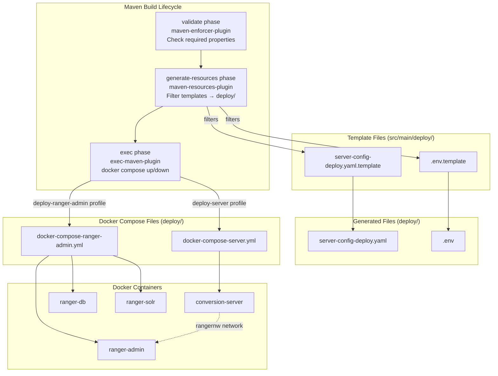
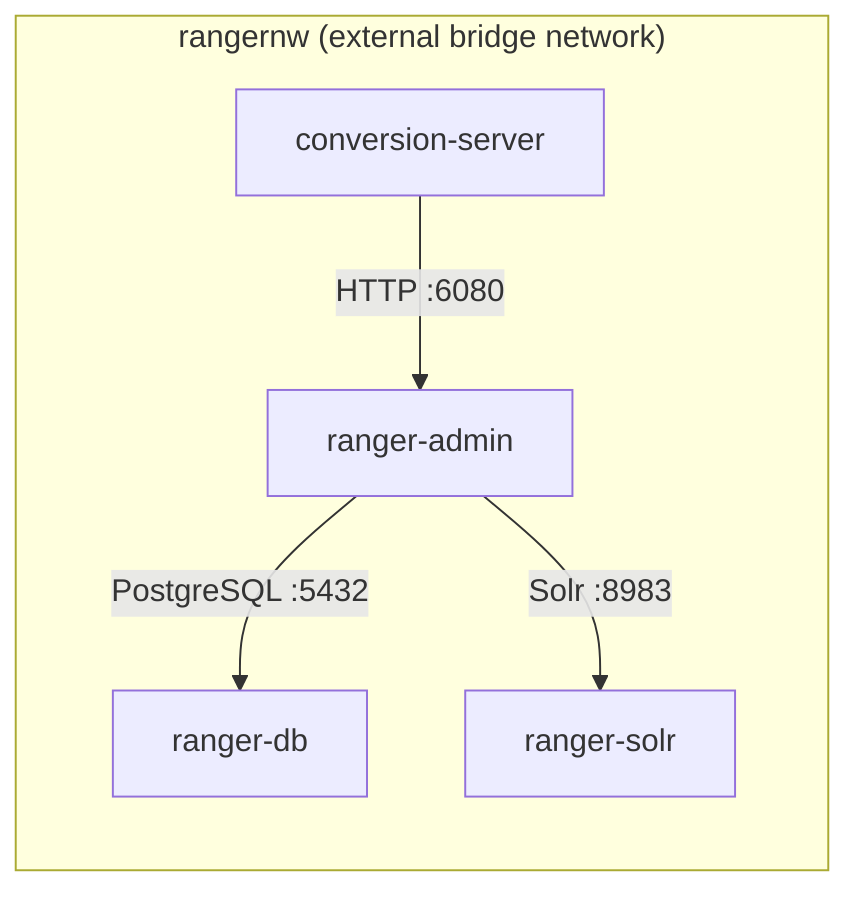

# Design Document: Maven Deploy Profiles

## Overview

This design adds two Maven profiles (`deploy-server` and `deploy-ranger-admin`) that automate the Docker Compose deployment workflow currently requiring manual file editing and CLI commands. The profiles use `exec-maven-plugin` to invoke `docker compose` commands, and `maven-resources-plugin` with filtering to generate `server-config-deploy.yaml` and `.env` from Maven `-D` properties before Docker Compose starts.

The existing monolithic `deploy/docker-compose.yml` (4 services) is split into two independent compose files:
- `deploy/docker-compose-server.yml` — conversion-server only
- `deploy/docker-compose-ranger-admin.yml` — ranger-db, ranger-solr, ranger-admin

Both files declare the same `rangernw` external network, allowing the two stacks to interoperate when both are running.

## Architecture



### Design Decisions

1. **`exec-maven-plugin` over `docker-maven-plugin`**: The `exec-maven-plugin` is a standard Maven plugin that simply shells out to `docker compose`. This avoids adding a third-party Docker-specific Maven plugin dependency and keeps the compose files as the single source of truth for container definitions. The developer's local `docker compose` CLI handles image builds, networking, and health checks natively.

2. **`maven-resources-plugin` with filtering for config generation**: Maven resource filtering is a built-in mechanism that replaces `${property.name}` tokens in template files with Maven property values. This is simpler than writing a custom Groovy/Antrun script and integrates naturally with the Maven lifecycle. Template files live in `src/main/deploy/` and are filtered into `deploy/` during `generate-resources`.

3. **Principal mapping as comma-separated pairs**: The YAML `principalMapping` section requires structured key-value maps. Since Maven properties are flat strings, we accept comma-separated `name=arn` pairs (e.g., `-Dprincipal.user.mappings=alice=arn:aws:iam::123:user/Alice,bob=arn:aws:iam::123:user/Bob`). A small Groovy script in `gmaven-plus-plugin` parses these into YAML map syntax during the `generate-resources` phase, writing the result to a Maven property that the resource filter can substitute.

4. **External Docker network for profile interop**: Both compose files reference `rangernw` as an external network. The `deploy-ranger-admin` profile creates the network (via `docker network create rangernw` in a pre-exec step), and `deploy-server` joins it. This allows the two profiles to be activated independently or together.

5. **Split compose files instead of `--profile` flag**: Docker Compose profiles (the `profiles:` key in YAML) would keep a single file but require the developer to remember profile names. Separate files make each profile's scope explicit and avoid accidental service starts. Each Maven profile points to exactly one compose file via `-f`.

## Components and Interfaces

### 1. Template Files

Located in `src/main/deploy/`, these are the source-of-truth templates that Maven resource filtering processes.

**`src/main/deploy/server-config-deploy.yaml`** — Template with `${...}` placeholders:
```yaml
rangerConfig:
  rangerAdminUrl: "${ranger.admin.url}"
  username: "admin"
  password: "${ranger.admin.password}"

awsConfig:
  region: "${aws.region}"
  catalogId: "${aws.account.id}"
  roleArn: "${aws.role.arn}"

principalMapping:
  userMappings:
${principal.user.mappings.yaml}
  groupMappings:
${principal.group.mappings.yaml}
  roleMappings:
${principal.role.mappings.yaml}

policyRefreshIntervalMs: ${sync.interval.ms}
maxLfRetries: ${lf.max.retries}
lfRetryBackoffMs: ${lf.retry.backoff.ms}

server:
  logLevel: ${server.log.level}
  shutdownTimeoutSeconds: ${server.shutdown.timeout}
```

**`src/main/deploy/.env`** — Template:
```dotenv
AWS_REGION=${aws.region}
AWS_ACCESS_KEY_ID=${aws.access.key.id}
AWS_SECRET_ACCESS_KEY=${aws.secret.access.key}
RANGER_ADMIN_PASSWORD=${ranger.admin.password}
```

### 2. Docker Compose Files

**`deploy/docker-compose-server.yml`**:
```yaml
version: "3.8"
services:
  conversion-server:
    build:
      context: ..
      dockerfile: Dockerfile
    env_file: .env
    environment:
      DRY_RUN_ENABLED: "false"
      AWS_ACCESS_KEY_ID: ${AWS_ACCESS_KEY_ID}
      AWS_SECRET_ACCESS_KEY: ${AWS_SECRET_ACCESS_KEY}
      AWS_REGION: ${AWS_REGION}
    volumes:
      - ./server-config-deploy.yaml:/app/config-deploy.yaml:ro
    networks:
      - rangernw
    healthcheck:
      test: ["CMD-SHELL", "pgrep -f 'java.*app.jar' || exit 1"]
      interval: 10s
      timeout: 5s
      retries: 12
      start_period: 15s
    entrypoint: ["java", "-cp", "/app/app.jar:/app",
      "com.amazonaws.policyconverters.server.ConversionServerMain",
      "/app/config-deploy.yaml"]

networks:
  rangernw:
    external: true
```

**`deploy/docker-compose-ranger-admin.yml`**:
```yaml
version: "3.8"
services:
  ranger-db:
    image: apache/ranger-db:${RANGER_VERSION:-2.4.0}
    environment:
      POSTGRES_PASSWORD: "rangerR0cks!"
      RANGER_DB_USER: rangeradmin
      RANGER_DB_PASSWORD: "rangerR0cks!"
    networks:
      - rangernw
    healthcheck:
      test: ["CMD-SHELL", "pg_isready -U rangeradmin"]
      interval: 10s
      timeout: 5s
      retries: 10
      start_period: 10s

  ranger-solr:
    image: apache/ranger-solr:${RANGER_VERSION:-2.4.0}
    ports:
      - "8983:8983"
    networks:
      - rangernw
    healthcheck:
      test: ["CMD-SHELL", "curl -sf http://localhost:8983/solr/admin/cores?action=STATUS || exit 1"]
      interval: 10s
      timeout: 5s
      retries: 10
      start_period: 15s

  ranger-admin:
    image: apache/ranger:${RANGER_VERSION:-2.4.0}
    ports:
      - "6080:6080"
    depends_on:
      ranger-db:
        condition: service_healthy
      ranger-solr:
        condition: service_healthy
    networks:
      - rangernw
    healthcheck:
      test: ["CMD-SHELL", "curl -sf http://localhost:6080/login.jsp || exit 1"]
      interval: 10s
      timeout: 5s
      retries: 30
      start_period: 30s

networks:
  rangernw:
    external: true
```

### 3. Maven Profile Definitions (pom.xml additions)


#### deploy-server profile

```xml
<profile>
    <id>deploy-server</id>
    <properties>
        <!-- Defaults for optional properties -->
        <ranger.admin.url>http://ranger-admin:6080</ranger.admin.url>
        <ranger.admin.password>rangerR0cks!</ranger.admin.password>
        <aws.region>us-east-1</aws.region>
        <ranger.version>2.4.0</ranger.version>
        <sync.interval.ms>30000</sync.interval.ms>
        <lf.max.retries>5</lf.max.retries>
        <lf.retry.backoff.ms>2000</lf.retry.backoff.ms>
        <server.log.level>INFO</server.log.level>
        <server.shutdown.timeout>30</server.shutdown.timeout>
        <principal.user.mappings></principal.user.mappings>
        <principal.group.mappings></principal.group.mappings>
        <principal.role.mappings></principal.role.mappings>
    </properties>
    <build>
        <plugins>
            <!-- Step 1: Validate required properties -->
            <plugin>
                <groupId>org.apache.maven.plugins</groupId>
                <artifactId>maven-enforcer-plugin</artifactId>
                <version>3.4.1</version>
                <executions>
                    <execution>
                        <id>enforce-deploy-server-properties</id>
                        <phase>validate</phase>
                        <goals><goal>enforce</goal></goals>
                        <configuration>
                            <rules>
                                <requireProperty>
                                    <property>aws.account.id</property>
                                    <message>-Daws.account.id is required</message>
                                </requireProperty>
                                <requireProperty>
                                    <property>aws.role.arn</property>
                                    <message>-Daws.role.arn is required</message>
                                </requireProperty>
                                <requireProperty>
                                    <property>aws.access.key.id</property>
                                    <message>-Daws.access.key.id is required</message>
                                </requireProperty>
                                <requireProperty>
                                    <property>aws.secret.access.key</property>
                                    <message>-Daws.secret.access.key is required</message>
                                </requireProperty>
                            </rules>
                        </configuration>
                    </execution>
                </executions>
            </plugin>

            <!-- Step 2: Parse principal mappings into YAML syntax -->
            <plugin>
                <groupId>org.codehaus.gmavenplus</groupId>
                <artifactId>gmavenplus-plugin</artifactId>
                <version>3.0.2</version>
                <executions>
                    <execution>
                        <id>parse-principal-mappings</id>
                        <phase>initialize</phase>
                        <goals><goal>execute</goal></goals>
                        <configuration>
                            <scripts>
                                <script><![CDATA[
def toYaml(String csv) {
    if (!csv?.trim()) return '    {}'
    csv.split(',').collect { pair ->
        def parts = pair.trim().split('=', 2)
        "    \"${parts[0].trim()}\": \"${parts[1].trim()}\""
    }.join('\n')
}
project.properties['principal.user.mappings.yaml'] =
    toYaml(project.properties['principal.user.mappings'] ?: '')
project.properties['principal.group.mappings.yaml'] =
    toYaml(project.properties['principal.group.mappings'] ?: '')
project.properties['principal.role.mappings.yaml'] =
    toYaml(project.properties['principal.role.mappings'] ?: '')
                                ]]></script>
                            </scripts>
                        </configuration>
                    </execution>
                </executions>
                <dependencies>
                    <dependency>
                        <groupId>org.apache.groovy</groupId>
                        <artifactId>groovy</artifactId>
                        <version>4.0.15</version>
                    </dependency>
                </dependencies>
            </plugin>

            <!-- Step 3: Filter templates into deploy/ -->
            <plugin>
                <groupId>org.apache.maven.plugins</groupId>
                <artifactId>maven-resources-plugin</artifactId>
                <version>3.3.1</version>
                <executions>
                    <execution>
                        <id>generate-deploy-config</id>
                        <phase>generate-resources</phase>
                        <goals><goal>copy-resources</goal></goals>
                        <configuration>
                            <outputDirectory>${project.basedir}/deploy</outputDirectory>
                            <resources>
                                <resource>
                                    <directory>src/main/deploy</directory>
                                    <filtering>true</filtering>
                                    <includes>
                                        <include>server-config-deploy.yaml</include>
                                        <include>.env</include>
                                    </includes>
                                </resource>
                            </resources>
                            <overwrite>true</overwrite>
                        </configuration>
                    </execution>
                </executions>
            </plugin>

            <!-- Step 4: Ensure Docker network exists, then docker compose up -->
            <plugin>
                <groupId>org.codehaus.mojo</groupId>
                <artifactId>exec-maven-plugin</artifactId>
                <version>3.1.1</version>
                <executions>
                    <execution>
                        <id>ensure-network</id>
                        <phase>pre-integration-test</phase>
                        <goals><goal>exec</goal></goals>
                        <configuration>
                            <executable>docker</executable>
                            <arguments>
                                <argument>network</argument>
                                <argument>create</argument>
                                <argument>rangernw</argument>
                                <argument>--driver</argument>
                                <argument>bridge</argument>
                            </arguments>
                            <successCodes>
                                <successCode>0</successCode>
                                <successCode>1</successCode> <!-- already exists -->
                            </successCodes>
                        </configuration>
                    </execution>
                    <execution>
                        <id>docker-compose-up</id>
                        <phase>pre-integration-test</phase>
                        <goals><goal>exec</goal></goals>
                        <configuration>
                            <executable>docker</executable>
                            <workingDirectory>${project.basedir}/deploy</workingDirectory>
                            <arguments>
                                <argument>compose</argument>
                                <argument>-f</argument>
                                <argument>docker-compose-server.yml</argument>
                                <argument>up</argument>
                                <argument>--build</argument>
                                <argument>-d</argument>
                            </arguments>
                        </configuration>
                    </execution>
                </executions>
            </plugin>
        </plugins>
    </build>
</profile>
```

#### deploy-ranger-admin profile

```xml
<profile>
    <id>deploy-ranger-admin</id>
    <properties>
        <ranger.admin.password>rangerR0cks!</ranger.admin.password>
        <ranger.version>2.4.0</ranger.version>
    </properties>
    <build>
        <plugins>
            <plugin>
                <groupId>org.codehaus.mojo</groupId>
                <artifactId>exec-maven-plugin</artifactId>
                <version>3.1.1</version>
                <executions>
                    <execution>
                        <id>ensure-network</id>
                        <phase>pre-integration-test</phase>
                        <goals><goal>exec</goal></goals>
                        <configuration>
                            <executable>docker</executable>
                            <arguments>
                                <argument>network</argument>
                                <argument>create</argument>
                                <argument>rangernw</argument>
                                <argument>--driver</argument>
                                <argument>bridge</argument>
                            </arguments>
                            <successCodes>
                                <successCode>0</successCode>
                                <successCode>1</successCode>
                            </successCodes>
                        </configuration>
                    </execution>
                    <execution>
                        <id>docker-compose-up-ranger</id>
                        <phase>pre-integration-test</phase>
                        <goals><goal>exec</goal></goals>
                        <configuration>
                            <executable>docker</executable>
                            <workingDirectory>${project.basedir}/deploy</workingDirectory>
                            <environmentVariables>
                                <RANGER_VERSION>${ranger.version}</RANGER_VERSION>
                            </environmentVariables>
                            <arguments>
                                <argument>compose</argument>
                                <argument>-f</argument>
                                <argument>docker-compose-ranger-admin.yml</argument>
                                <argument>up</argument>
                                <argument>-d</argument>
                            </arguments>
                        </configuration>
                    </execution>
                </executions>
            </plugin>
        </plugins>
    </build>
</profile>
```

### 4. Maven Goal Mapping

The requirements reference `mvn docker-compose:up` and `mvn docker-compose:down` as the developer-facing commands. Since `exec-maven-plugin` doesn't expose custom goal names like `docker-compose:up`, we define two approaches:

**Option A — Phase-bound (recommended):** Bind `docker compose up` to `pre-integration-test` and `docker compose down` to `post-integration-test`. Developers run:
```bash
# Start
mvn pre-integration-test -Pdeploy-server -Daws.account.id=... -Daws.role.arn=... ...

# Stop
mvn exec:exec@docker-compose-down -Pdeploy-server
```

**Option B — Named executions with `exec:exec@id`:** Define named executions for `up` and `down`, invoked directly:
```bash
# Start
mvn generate-resources exec:exec@docker-compose-up -Pdeploy-server -Daws.account.id=...

# Stop
mvn exec:exec@docker-compose-down -Pdeploy-server
```

The design uses **Option B** for clarity. Each profile defines two named executions: `docker-compose-up` and `docker-compose-down`. The `generate-resources` phase is invoked explicitly before `exec:exec@docker-compose-up` to ensure config files are generated first.

Teardown executions (added to each profile):

```xml
<!-- In deploy-server profile -->
<execution>
    <id>docker-compose-down</id>
    <goals><goal>exec</goal></goals>
    <configuration>
        <executable>docker</executable>
        <workingDirectory>${project.basedir}/deploy</workingDirectory>
        <arguments>
            <argument>compose</argument>
            <argument>-f</argument>
            <argument>docker-compose-server.yml</argument>
            <argument>down</argument>
        </arguments>
    </configuration>
</execution>

<!-- In deploy-ranger-admin profile -->
<execution>
    <id>docker-compose-down</id>
    <goals><goal>exec</goal></goals>
    <configuration>
        <executable>docker</executable>
        <workingDirectory>${project.basedir}/deploy</workingDirectory>
        <arguments>
            <argument>compose</argument>
            <argument>-f</argument>
            <argument>docker-compose-ranger-admin.yml</argument>
            <argument>down</argument>
        </arguments>
    </configuration>
</execution>
```

## Data Models

### Maven Properties

| Property | Required | Default | Used By |
|----------|----------|---------|---------|
| `aws.account.id` | Yes (deploy-server) | — | Config YAML `awsConfig.catalogId` |
| `aws.role.arn` | Yes (deploy-server) | — | Config YAML `awsConfig.roleArn` |
| `aws.access.key.id` | Yes (deploy-server) | — | `.env` `AWS_ACCESS_KEY_ID` |
| `aws.secret.access.key` | Yes (deploy-server) | — | `.env` `AWS_SECRET_ACCESS_KEY` |
| `aws.region` | No | `us-east-1` | Config YAML + `.env` |
| `ranger.admin.url` | No | `http://ranger-admin:6080` | Config YAML `rangerConfig.rangerAdminUrl` |
| `ranger.admin.password` | No | `rangerR0cks!` | Config YAML + `.env` |
| `ranger.version` | No | `2.4.0` | Compose `RANGER_VERSION` |
| `principal.user.mappings` | No | (empty) | Config YAML `principalMapping.userMappings` |
| `principal.group.mappings` | No | (empty) | Config YAML `principalMapping.groupMappings` |
| `principal.role.mappings` | No | (empty) | Config YAML `principalMapping.roleMappings` |
| `sync.interval.ms` | No | `30000` | Config YAML `policyRefreshIntervalMs` |
| `lf.max.retries` | No | `5` | Config YAML `maxLfRetries` |
| `lf.retry.backoff.ms` | No | `2000` | Config YAML `lfRetryBackoffMs` |
| `server.log.level` | No | `INFO` | Config YAML `server.logLevel` |
| `server.shutdown.timeout` | No | `30` | Config YAML `server.shutdownTimeoutSeconds` |

### Generated File Formats

**`deploy/server-config-deploy.yaml`** — Valid YAML consumed by `ConfigLoader.loadFromYaml()` which deserializes it via Jackson `ObjectMapper(new YAMLFactory()).readValue(file, SyncConfig.class)`. All placeholder tokens are fully resolved before the file is written.

**`deploy/.env`** — Standard Docker Compose env file with `KEY=VALUE` lines. Loaded by Docker Compose `env_file:` directive and interpolated into `environment:` variables.

### Docker Network Model



When only `deploy-server` is active and the developer has an external Ranger Admin, the conversion-server uses `ranger.admin.url` (e.g., `http://host.docker.internal:6080` or an IP) to reach it. When both profiles are active, the conversion-server reaches `ranger-admin` by Docker DNS on the shared `rangernw` network.


## Correctness Properties

*A property is a characteristic or behavior that should hold true across all valid executions of a system — essentially, a formal statement about what the system should do. Properties serve as the bridge between human-readable specifications and machine-verifiable correctness guarantees.*

### Property 1: Config YAML generation round-trip

*For any* set of valid Maven property values (aws.region, aws.account.id, aws.role.arn, ranger.admin.url, ranger.admin.password, principal mappings, and optional sync/server settings), filtering the `server-config-deploy.yaml` template and then deserializing the result with Jackson `ObjectMapper(YAMLFactory)` into a `SyncConfig` object SHALL produce field values that match the original input properties.

**Validates: Requirements 1.7, 4.1, 4.2, 4.3, 4.4, 4.6**

### Property 2: Env file generation round-trip

*For any* set of valid Maven property values (aws.region, aws.access.key.id, aws.secret.access.key, ranger.admin.password), filtering the `.env` template and then parsing the result as `KEY=VALUE` lines SHALL produce a map where each key's value matches the corresponding input property.

**Validates: Requirements 1.8, 5.1, 5.2**

### Property 3: Principal mapping parsing preserves all entries

*For any* list of `name=arn` pairs (where names are non-empty alphanumeric strings and ARNs are valid IAM ARN strings), converting the comma-separated string through the Groovy parsing function and then parsing the resulting YAML fragment SHALL produce a map with exactly the same keys and values as the input pairs, in any order.

**Validates: Requirements 1.5, 4.4**

## Error Handling

### Property Validation Failures

The `maven-enforcer-plugin` handles required property validation at the `validate` phase. When a required property (`aws.account.id`, `aws.role.arn`, `aws.access.key.id`, `aws.secret.access.key`) is missing, the build fails immediately with a message like:

```
[ERROR] Rule 0: org.apache.maven.enforcer.rules.property.RequireProperty failed with message:
-Daws.account.id is required
```

No config files are generated and no Docker commands are executed.

### Template Filtering Errors

If a Maven property referenced in a template is undefined and has no default, `maven-resources-plugin` leaves the `${...}` token as-is in the output. This would produce invalid YAML that `ConfigLoader` cannot deserialize. The enforcer rules prevent this for required properties. Optional properties all have defaults defined in the profile `<properties>` block.

### Principal Mapping Parse Errors

The Groovy script handles edge cases:
- Empty/blank input → produces `{}` (empty YAML map)
- Missing `=` separator → the script should fail the build with a clear error. The Groovy script validates that each pair contains exactly one `=` and throws an exception otherwise.
- Whitespace around names/ARNs → trimmed automatically

### Docker Compose Failures

- `docker network create rangernw` returns exit code 1 if the network already exists. The `<successCodes>` configuration accepts both 0 and 1, making this idempotent.
- `docker compose up` failures (e.g., port conflicts, image build errors) propagate as non-zero exit codes, failing the Maven build.
- `docker compose down` is safe to run even if containers are not running.

### Generated File Conflicts

The `maven-resources-plugin` is configured with `<overwrite>true</overwrite>`, so existing `deploy/server-config-deploy.yaml` and `deploy/.env` files are always replaced with freshly generated versions. The original hand-edited files in `deploy/` are superseded by the template-based approach. The originals should be removed or renamed (e.g., `server-config-deploy.yaml.example`) to avoid confusion.

## Testing Strategy

### Unit Tests (jqwik property-based)

The project already uses jqwik for property-based testing. The three correctness properties above are testable as unit tests:

1. **Config YAML round-trip test**: Use jqwik `@Property` with `@ForAll` generators for AWS region strings, account IDs (12-digit numeric), ARN strings, URLs, passwords, and optional numeric settings. Apply the template filtering logic (implemented as a Java utility method that mirrors what `maven-resources-plugin` does: simple string replacement of `${key}` tokens). Deserialize the result with `ObjectMapper(YAMLFactory).readValue(result, SyncConfig.class)`. Assert all fields match inputs. Minimum 100 iterations.

2. **Env file round-trip test**: Use jqwik `@Property` with `@ForAll` generators for region, access key, secret key, and password strings. Apply template filtering. Parse the result line-by-line as `KEY=VALUE`. Assert each value matches the input. Minimum 100 iterations.

3. **Principal mapping parsing test**: Use jqwik `@Property` with `@ForAll` generators for lists of `(name, arn)` pairs. Convert to comma-separated string, run through the parsing function (extracted as a static Java method mirroring the Groovy logic), parse the YAML output. Assert the resulting map equals the input map. Minimum 100 iterations.

Each property test is tagged with:
- `Feature: maven-deploy-profiles, Property 1: Config YAML generation round-trip`
- `Feature: maven-deploy-profiles, Property 2: Env file generation round-trip`
- `Feature: maven-deploy-profiles, Property 3: Principal mapping parsing preserves all entries`

### Example-Based Unit Tests

- Default values: Generate config with no optional overrides, verify `policyRefreshIntervalMs=30000`, `maxLfRetries=5`, etc.
- Empty principal mappings: Verify empty input produces valid YAML with empty maps.
- Single principal mapping: Verify `alice=arn:aws:iam::123:user/Alice` produces correct YAML.

### Integration Tests (manual / CI)

These verify the end-to-end Maven + Docker Compose workflow:

- `mvn generate-resources exec:exec@docker-compose-up -Pdeploy-server -Daws.account.id=123456789012 ...` → verify conversion-server container starts
- `mvn exec:exec@docker-compose-down -Pdeploy-server` → verify container stops
- `mvn generate-resources exec:exec@docker-compose-up -Pdeploy-ranger-admin` → verify ranger-db, ranger-solr, ranger-admin start
- `mvn exec:exec@docker-compose-down -Pdeploy-ranger-admin` → verify all three stop
- Both profiles together → verify conversion-server can reach ranger-admin on rangernw
- Missing required property → verify build fails with enforcer error

### Smoke Tests

- Parse `docker-compose-server.yml` → only `conversion-server` service defined
- Parse `docker-compose-ranger-admin.yml` → only `ranger-db`, `ranger-solr`, `ranger-admin` defined
- Both compose files declare `rangernw` as external network
- Profile XML in pom.xml contains expected property defaults
