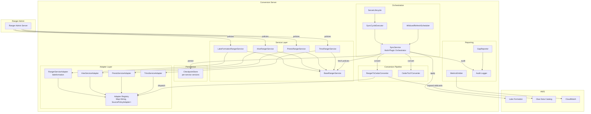
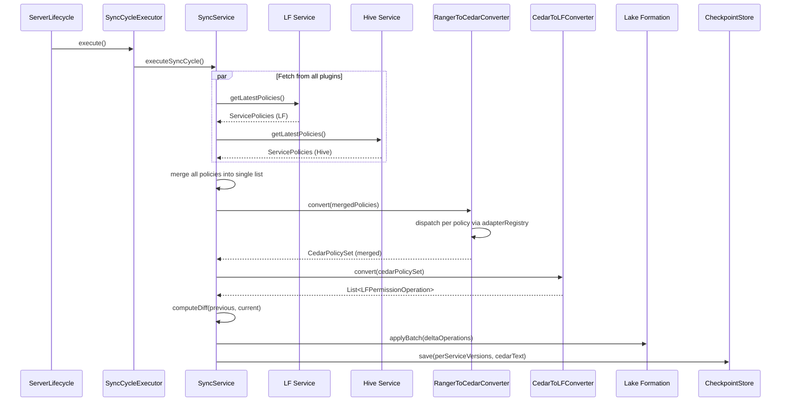

# Design Document: Multi-Ranger Plugin Support

## Overview

This design extends the Conversion Server to support multiple Apache Ranger service types (LakeFormation, Hive, Presto, Trino) simultaneously. Today the system is hardcoded to a single `RangerPlugin` with service type "lakeformation". The multi-service design introduces:

1. An abstract `BaseRangerService` class that encapsulates plugin lifecycle, configuration, and adapter registration.
2. Concrete service implementations for LakeFormation (refactored), Hive, Presto, and Trino.
3. A YAML-driven configuration model (`rangerServices` list) that controls which services are active.
4. An orchestration layer in `SyncService` that fetches policies from all plugins, merges them into a unified Cedar policy set, and applies the diff to Lake Formation.
5. Per-service checkpoint tracking, namespace-isolated Cedar policy IDs, and service-tagged audit logging.

The key design constraint is backward compatibility: when no `rangerServices` list is configured, the server behaves identically to the current single-service implementation.

## Architecture

### High-Level Component Diagram



### Sync Cycle Sequence (Multi-Service)




## Components and Interfaces

### 1. BaseRangerService (Abstract Class)

**Package:** `com.amazonaws.policyconverters.ranger.service`

Extracts common Ranger plugin lifecycle from the current `RangerPlugin` class. Each subclass provides its service type, instance name, and adapter.

```java
public abstract class BaseRangerService {
    private final String serviceType;
    private final String serviceInstanceName;
    private final RangerBasePlugin plugin;
    private volatile ServicePolicies latestPolicies;
    private volatile List<RangerPolicy> lastKnownGoodPolicies = Collections.emptyList();

    protected BaseRangerService(String serviceType, String serviceInstanceName) {
        this.serviceType = serviceType;
        this.serviceInstanceName = serviceInstanceName;
        this.plugin = new RangerBasePlugin(serviceType, serviceInstanceName);
    }

    /** Initialize the plugin (registers with Ranger Admin). */
    public void init() { plugin.init(); }

    /** Fetch latest policies from Ranger Admin. Updates lastKnownGoodPolicies on success. */
    public ServicePolicies getLatestPolicies() { ... }

    /** Returns last successfully fetched policies (fault tolerance). */
    public List<RangerPolicy> getLastKnownGoodPolicies() { return lastKnownGoodPolicies; }

    /** Subclass provides its SourcePolicyAdapter. */
    public abstract SourcePolicyAdapter createAdapter(AwsContext awsContext);

    /** Subclass provides the path to its bundled service definition JSON. */
    public abstract String getServiceDefinitionResourcePath();

    // Getters
    public String getServiceType() { return serviceType; }
    public String getServiceInstanceName() { return serviceInstanceName; }
}
```

**Design Decision:** The `RangerBasePlugin` is composed (not inherited) inside `BaseRangerService`. This avoids the current tight coupling where `RangerPlugin extends RangerBasePlugin` and allows each service to have its own plugin instance with independent lifecycle.

### 2. Service Implementations

#### LakeFormationRangerService

Refactors the existing `RangerPlugin` to extend `BaseRangerService`. Reuses `RangerServiceAdapter` and the existing service definition.

```java
public class LakeFormationRangerService extends BaseRangerService {
    public LakeFormationRangerService(String instanceName) {
        super("lakeformation", instanceName);
    }

    @Override
    public SourcePolicyAdapter createAdapter(AwsContext awsContext) {
        return new RangerServiceAdapter(awsContext);
    }

    @Override
    public String getServiceDefinitionResourcePath() {
        return "/ranger-servicedef-lakeformation.json";
    }
}
```

#### HiveRangerService

```java
public class HiveRangerService extends BaseRangerService {
    public HiveRangerService(String instanceName) {
        super("hive", instanceName);
    }

    @Override
    public SourcePolicyAdapter createAdapter(AwsContext awsContext) {
        return new HiveServiceAdapter(awsContext);
    }

    @Override
    public String getServiceDefinitionResourcePath() {
        return "/ranger-servicedef-hive.json";
    }
}
```

#### PrestoRangerService / TrinoRangerService

Both follow the same pattern but accept an additional `gdcCatalogName` parameter for catalog filtering.

```java
public class PrestoRangerService extends BaseRangerService {
    private final String gdcCatalogName;

    public PrestoRangerService(String instanceName, String gdcCatalogName) {
        super("presto", instanceName);
        this.gdcCatalogName = gdcCatalogName;
    }

    @Override
    public SourcePolicyAdapter createAdapter(AwsContext awsContext) {
        return new PrestoServiceAdapter(awsContext, gdcCatalogName);
    }

    @Override
    public String getServiceDefinitionResourcePath() {
        return "/ranger-servicedef-presto.json";
    }
}
```

`TrinoRangerService` is identical in structure with `"trino"` as the service type and `TrinoServiceAdapter`.

### 3. Service Adapters

#### HiveServiceAdapter

**Package:** `com.amazonaws.policyconverters.ranger`

Maps Hive access types to Cedar actions. Hive's resource hierarchy (database → table → column) maps directly to the DataCatalog model.

| Hive Access Type | Cedar Action(s) |
|---|---|
| select | SELECT |
| update | INSERT |
| create | CREATE_TABLE |
| drop | DROP |
| alter | ALTER |
| index | _(unmapped, logged)_ |
| lock | _(unmapped, logged)_ |
| read | SELECT |
| write | INSERT |
| all | SUPER |

#### PrestoServiceAdapter / TrinoServiceAdapter

Maps Presto/Trino access types to Cedar actions. The key difference from Hive is the 4-level resource hierarchy: catalog → schema → table → column. The adapter filters policies by `gdcCatalogName` and maps "schema" to "database" in the DataCatalog model.

| Presto/Trino Access Type | Cedar Action(s) |
|---|---|
| select | SELECT |
| insert | INSERT |
| delete | DELETE |
| create | CREATE_TABLE |
| drop | DROP |
| alter | ALTER |
| use | DESCRIBE |
| show | DESCRIBE |
| grant | _(unmapped, logged)_ |
| revoke | _(unmapped, logged)_ |

**GDC Catalog Filtering:** Before processing a policy, the adapter checks if the policy's `catalog` resource value matches `gdcCatalogName`. If not, the policy is skipped with a DEBUG log. This filtering happens in the adapter's `buildEntityRef()` and is also checked in a new `shouldProcessPolicy(RangerPolicy)` method on the `SourcePolicyAdapter` interface.

**SourcePolicyAdapter Interface Extension:**

```java
public interface SourcePolicyAdapter {
    // ... existing methods ...

    /**
     * Whether this adapter should process the given policy.
     * Default returns true. Catalog-aware adapters override to filter by catalog.
     */
    default boolean shouldProcessPolicy(RangerPolicy policy) {
        return true;
    }
}
```

### 4. RangerServiceConfig (New Config Model)

**Package:** `com.amazonaws.policyconverters.config`

```java
public class RangerServiceConfig {
    private String serviceType;        // "lakeformation", "hive", "presto", "trino"
    private String serviceInstanceName; // Ranger Admin service instance name
    private String serviceDefPath;      // optional custom service def JSON path
    private String gdcCatalogName;      // required for presto/trino
}
```

### 5. Multi-Plugin SyncService Changes

The `SyncService` is refactored to hold a `List<BaseRangerService>` instead of a single `RangerPlugin`. Key changes:

- **Policy Fetching:** Iterates over all services, calling `getLatestPolicies()` on each. On failure, uses `getLastKnownGoodPolicies()` for that service.
- **First Sync Gate:** Tracks a `Set<String> initializedServices`. The first diff-and-apply is deferred until all services have completed at least one successful fetch.
- **Policy Merging:** All policies from all services are concatenated into a single list before passing to `RangerToCedarConverter.convert()`. The converter dispatches each policy to the correct adapter via the adapter registry.
- **Per-Service Version Tracking:** Maintains a `Map<String, Long>` of service type → policy version for checkpoint persistence.
- **Last-Known-Good:** Each `BaseRangerService` independently maintains its last successfully fetched policies. On fetch failure, the orchestrator uses the last-known-good set for that service, preventing unintended revocations.

### 6. CheckpointStore Changes

The `SyncCheckpoint` model is extended to support per-service versions:

```java
public class SyncCheckpoint {
    private final long policyVersion;                    // legacy single version
    private final Map<String, Long> serviceVersions;     // new: per-service versions
    private final String timestamp;
    private final String cedarPolicyText;
}
```

**Backward Compatibility:** When loading a legacy checkpoint (no `serviceVersions` field), the loader treats `policyVersion` as the version for "lakeformation" and creates a single-entry map: `{"lakeformation": policyVersion}`.

### 7. ServiceDefInstallerMain Changes

Extended to iterate over all configured `rangerServices` entries. For each entry, it loads the service definition (bundled or custom path) and installs it via REST or file mode. Failures for one service are logged but do not block installation of remaining services.

### 8. Cedar Policy Namespace Isolation

The `RangerToCedarConverter` prefixes the `@source` annotation with the service type:

```
@source("hive:42")     // was @source("42")
@source("presto:17")
@source("lakeformation:5")
```

This ensures that when computing diffs, policies from different service types are treated as independent. Adding a new Hive service does not cause revocations of existing LakeFormation policies.

### 9. Audit Logging Changes

The `logAuditEntry()` method in `SyncService` is extended to include the service type:

```
AUDIT: serviceType=hive, operation=GRANT, policyId=42, resource=..., principal=..., permissions=...
```

The service type is derived from the `@source` annotation prefix on each Cedar policy statement.

### 10. WildcardRefreshScheduler Changes

The wildcard refresh logic in `SyncService.executeWildcardRefresh()` already operates on `lastKnownPolicies`. In the multi-service model, `lastKnownPolicies` becomes the merged list from all services. The refresh re-evaluates glob patterns from all service types against the Glue catalog. Log messages include the service type for each policy being re-expanded.


## Data Models

### RangerServiceConfig (YAML)

```yaml
rangerServices:
  - serviceType: lakeformation
    serviceInstanceName: lf_prod
    # serviceDefPath: optional, defaults to bundled

  - serviceType: hive
    serviceInstanceName: hive_prod
    serviceDefPath: /etc/ranger/ranger-servicedef-hive.json  # optional

  - serviceType: presto
    serviceInstanceName: presto_prod
    gdcCatalogName: awsdatacatalog  # required for presto/trino

  - serviceType: trino
    serviceInstanceName: trino_prod
    gdcCatalogName: glue_catalog    # required for presto/trino
```

When `rangerServices` is omitted, the server defaults to:
```yaml
rangerServices:
  - serviceType: lakeformation
    serviceInstanceName: lakeformation  # uses existing APP_ID
```

### RangerServiceConfig (Java)

```java
@JsonIgnoreProperties(ignoreUnknown = true)
public class RangerServiceConfig {
    private final String serviceType;
    private final String serviceInstanceName;
    private final String serviceDefPath;       // nullable
    private final String gdcCatalogName;       // nullable, required for presto/trino

    @JsonCreator
    public RangerServiceConfig(
            @JsonProperty("serviceType") String serviceType,
            @JsonProperty("serviceInstanceName") String serviceInstanceName,
            @JsonProperty("serviceDefPath") String serviceDefPath,
            @JsonProperty("gdcCatalogName") String gdcCatalogName) {
        this.serviceType = serviceType;
        this.serviceInstanceName = serviceInstanceName;
        this.serviceDefPath = serviceDefPath;
        this.gdcCatalogName = gdcCatalogName;
    }

    // getters...
}
```

### SyncConfig Extension

```java
public class SyncConfig {
    // ... existing fields ...
    private final List<RangerServiceConfig> rangerServices;  // new field

    // When null/empty, defaults to single LakeFormation service
    public List<RangerServiceConfig> getRangerServices() {
        return rangerServices;
    }
}
```

### SyncCheckpoint Extension

```java
public class SyncCheckpoint {
    private final long policyVersion;                     // legacy, kept for backward compat
    private final Map<String, Long> serviceVersions;      // new: serviceType -> policyVersion
    private final String timestamp;
    private final String cedarPolicyText;

    @JsonCreator
    public SyncCheckpoint(
            @JsonProperty("policyVersion") long policyVersion,
            @JsonProperty("serviceVersions") Map<String, Long> serviceVersions,
            @JsonProperty("timestamp") String timestamp,
            @JsonProperty("cedarPolicyText") String cedarPolicyText) {
        this.policyVersion = policyVersion;
        this.serviceVersions = serviceVersions != null
                ? serviceVersions
                : Map.of("lakeformation", policyVersion);  // backward compat
        this.timestamp = timestamp;
        this.cedarPolicyText = cedarPolicyText != null ? cedarPolicyText : "";
    }
}
```

### Hive Service Definition (ranger-servicedef-hive.json)

```json
{
    "name": "hive",
    "displayName": "Apache Hive",
    "implClass": "com.amazonaws.policyconverters.ranger.service.ResourceLookupService",
    "label": "Hive",
    "description": "Apache Hive Permission Management for Lake Formation Sync",
    "resources": [
        {"itemId": 1, "name": "database", "type": "string", "level": 10, "mandatory": true, "isValidLeaf": true},
        {"itemId": 2, "name": "table", "type": "string", "level": 20, "parent": "database", "isValidLeaf": true},
        {"itemId": 3, "name": "column", "type": "string", "level": 30, "parent": "table", "isValidLeaf": true}
    ],
    "accessTypes": [
        {"itemId": 1, "name": "select", "label": "Select"},
        {"itemId": 2, "name": "update", "label": "Update"},
        {"itemId": 3, "name": "create", "label": "Create"},
        {"itemId": 4, "name": "drop", "label": "Drop"},
        {"itemId": 5, "name": "alter", "label": "Alter"},
        {"itemId": 6, "name": "index", "label": "Index"},
        {"itemId": 7, "name": "lock", "label": "Lock"},
        {"itemId": 8, "name": "all", "label": "All"},
        {"itemId": 9, "name": "read", "label": "Read"},
        {"itemId": 10, "name": "write", "label": "Write"}
    ]
}
```

### Presto/Trino Service Definition (ranger-servicedef-presto.json)

```json
{
    "name": "presto",
    "displayName": "Presto",
    "implClass": "com.amazonaws.policyconverters.ranger.service.ResourceLookupService",
    "label": "Presto",
    "description": "Presto Permission Management for Lake Formation Sync",
    "resources": [
        {"itemId": 1, "name": "catalog", "type": "string", "level": 10, "mandatory": true, "isValidLeaf": true},
        {"itemId": 2, "name": "schema", "type": "string", "level": 20, "parent": "catalog", "isValidLeaf": true},
        {"itemId": 3, "name": "table", "type": "string", "level": 30, "parent": "schema", "isValidLeaf": true},
        {"itemId": 4, "name": "column", "type": "string", "level": 40, "parent": "table", "isValidLeaf": true}
    ],
    "accessTypes": [
        {"itemId": 1, "name": "select", "label": "Select"},
        {"itemId": 2, "name": "insert", "label": "Insert"},
        {"itemId": 3, "name": "delete", "label": "Delete"},
        {"itemId": 4, "name": "create", "label": "Create"},
        {"itemId": 5, "name": "drop", "label": "Drop"},
        {"itemId": 6, "name": "alter", "label": "Alter"},
        {"itemId": 7, "name": "use", "label": "Use"},
        {"itemId": 8, "name": "show", "label": "Show"},
        {"itemId": 9, "name": "grant", "label": "Grant"},
        {"itemId": 10, "name": "revoke", "label": "Revoke"}
    ]
}
```

The Trino service definition is structurally identical with `"name": "trino"`.


## Correctness Properties

*A property is a characteristic or behavior that should hold true across all valid executions of a system — essentially, a formal statement about what the system should do. Properties serve as the bridge between human-readable specifications and machine-verifiable correctness guarantees.*

### Property 1: Backward Compatibility

*For any* set of valid LakeFormation Ranger policies, converting them through the multi-service pipeline (with only LakeFormation configured) SHALL produce identical Cedar policy text as converting them through the original single-service pipeline.

**Validates: Requirements 2.4**

### Property 2: Access Type Mapping Validity

*For any* service adapter (Hive, Presto, Trino) and any access type string in that adapter's known mapping table, the adapter SHALL return a non-empty set of Cedar actions where every action is a valid DataCatalog action. For any access type string NOT in the mapping table, the adapter SHALL return an empty set.

**Validates: Requirements 3.2, 3.5, 4.2, 4.5, 5.2, 5.5**

### Property 3: Resource ARN Format Consistency

*For any* valid database name, table name, and column name, the entity references produced by the Hive, Presto, and Trino adapters SHALL use the same Glue ARN format (`arn:aws:glue:{region}:{account}:{resourceType}/{path}`) as the LakeFormation adapter, with Presto/Trino "schema" mapped to "database".

**Validates: Requirements 3.3, 4.3, 5.3**

### Property 4: GDC Catalog Filtering

*For any* Presto or Trino Ranger policy, the adapter SHALL process the policy if and only if the policy's catalog resource value matches the configured `gdcCatalogName`. Policies targeting any other catalog SHALL be skipped.

**Validates: Requirements 4.7, 4.8, 5.7, 5.8**

### Property 5: Configuration Round-Trip

*For any* valid `SyncConfig` containing a `rangerServices` list with arbitrary valid entries, serializing to YAML and deserializing back SHALL produce an equivalent configuration object.

**Validates: Requirements 6.1**

### Property 6: Configuration Validation Rejects Invalid Configs

*For any* `SyncConfig` that contains (a) duplicate serviceType+serviceInstanceName pairs, (b) an unknown serviceType, (c) a missing serviceInstanceName, or (d) a Presto/Trino entry without gdcCatalogName, the `ConfigValidator` SHALL return a non-empty error list.

**Validates: Requirements 6.4, 6.5, 6.6, 6.7**

### Property 7: Merged Cedar Set Completeness

*For any* set of Ranger policies from N distinct service types, the merged Cedar policy set SHALL contain Cedar statements derived from every service type's policies, and the adapter registry SHALL dispatch each policy to the adapter matching its service type.

**Validates: Requirements 7.2, 7.3**

### Property 8: Last-Known-Good Fault Tolerance

*For any* sequence of sync cycles where a plugin successfully fetches policies at least once and then fails on a subsequent fetch, the merged Cedar policy set SHALL include that plugin's last successfully fetched policies rather than omitting them.

**Validates: Requirements 7.5, 7.6**

### Property 9: Service Namespace Isolation

*For any* set of Cedar policies from service type A, adding Cedar policies from a different service type B to the merged set SHALL NOT cause any revocations of service A's policies in the computed diff.

**Validates: Requirements 9.1, 9.2**

### Property 10: Checkpoint Round-Trip with Per-Service Versions

*For any* map of service types to policy versions and any Cedar policy text, saving a checkpoint and loading it back SHALL produce an equivalent per-service version map and identical Cedar policy text.

**Validates: Requirements 10.1, 10.2, 9.3**

### Property 11: Legacy Checkpoint Backward Compatibility

*For any* legacy checkpoint JSON containing a single `policyVersion` field (no `serviceVersions`), loading it SHALL produce a service version map with exactly one entry: `{"lakeformation": policyVersion}`.

**Validates: Requirements 10.3**

### Property 12: Audit Entry Service Type Inclusion

*For any* grant or revoke operation derived from a Cedar policy with a service-type-prefixed `@source` annotation, the audit log entry SHALL include the originating service type.

**Validates: Requirements 12.1, 12.2**


## Error Handling

### Plugin Initialization Failures

- If a `BaseRangerService.init()` fails (e.g., Ranger Admin unreachable), the error is logged and the service is marked as unhealthy. The server continues starting other services.
- The first-sync gate (Req 7.4) prevents any diff/apply until all services have fetched at least once. If a service never initializes, the server logs periodic warnings but does not apply partial policy sets.

### Policy Fetch Failures (Subsequent Cycles)

- Each `BaseRangerService` maintains `lastKnownGoodPolicies`. On fetch failure, the orchestrator uses this snapshot.
- The `MetricsEmitter` publishes a `PluginFetchFailure` metric with a `ServiceType` dimension so operators can alarm on per-service failures.
- After 3 consecutive failures for a single service, a WARN log is emitted suggesting the operator check Ranger Admin connectivity for that service.

### Adapter Dispatch Failures

- If `RangerToCedarConverter` cannot find an adapter for a policy's service type, it records a `GapEntry` with `GapType.UNSUPPORTED_SERVICE_TYPE` and skips the policy. This is the existing behavior, unchanged.

### Configuration Validation Failures

- `ConfigValidator` collects all errors and returns them at once. The server exits with code 1 if any errors are present, printing all errors to stderr.
- Unknown service types, duplicate entries, missing instance names, and missing `gdcCatalogName` for Presto/Trino are all caught at startup.

### Service Definition Installation Failures

- `ServiceDefInstallerMain` logs errors for individual service definition installations but continues with remaining services. The exit code is 0 if at least one installation succeeds, 1 if all fail.

### Checkpoint Corruption

- If the checkpoint file is corrupted or contains an invalid `serviceVersions` map, the `CheckpointStore` logs a warning and starts from empty state (same as current behavior for corrupted single-version checkpoints).

### GDC Catalog Mismatch

- Presto/Trino policies targeting non-GDC catalogs are silently skipped with a DEBUG log. This is not an error condition — it's expected behavior in environments where Presto/Trino have multiple catalogs.

## Testing Strategy

### Unit Tests

- Each service adapter (Hive, Presto, Trino) gets unit tests for access type mapping, entity ref construction, and principal ref construction.
- `ConfigValidator` gets unit tests for each validation rule (duplicates, unknown types, missing fields, missing gdcCatalogName).
- `SyncCheckpoint` deserialization gets unit tests for legacy format backward compatibility.
- `BaseRangerService` subclass contracts are verified (serviceType, instanceName, adapter creation).
- GDC catalog filtering in Presto/Trino adapters gets unit tests with matching and non-matching catalogs.
- `ServiceDefInstallerMain` multi-service iteration gets unit tests with mock installers.

### Property-Based Tests (jqwik)

The project already uses jqwik for property-based testing. Each correctness property maps to a jqwik `@Property` test with minimum 100 iterations.

- **Property 1 (Backward Compatibility):** Generate random `RangerPolicy` lists with LakeFormation resources, run through both old and new pipelines, assert identical Cedar output.
- **Property 2 (Access Type Mapping):** Generate random access type strings from each adapter's known set, verify non-empty valid Cedar actions. Generate random unknown strings, verify empty set.
- **Property 3 (ARN Format):** Generate random database/table/column names, verify all adapters produce ARNs matching the `arn:aws:glue:{region}:{account}:{type}/{path}` pattern.
- **Property 4 (GDC Catalog Filtering):** Generate random Presto/Trino policies with random catalog values, verify only matching catalogs are processed.
- **Property 5 (Config Round-Trip):** Generate random `SyncConfig` with `rangerServices` lists, serialize/deserialize, assert equality.
- **Property 6 (Config Validation):** Generate invalid configs (duplicates, unknown types, missing fields), verify non-empty error lists.
- **Property 7 (Merged Set Completeness):** Generate policies from N service types, verify merged Cedar set contains contributions from all.
- **Property 8 (Fault Tolerance):** Generate fetch sequences with intermittent failures, verify last-known-good is used.
- **Property 9 (Namespace Isolation):** Generate baseline policies from service A, add service B policies, verify no revocations of A.
- **Property 10 (Checkpoint Round-Trip):** Generate random service version maps and Cedar text, save/load, assert equality.
- **Property 11 (Legacy Checkpoint):** Generate legacy checkpoint JSON, load, verify single-entry map.
- **Property 12 (Audit Service Type):** Generate operations with service-type-prefixed sources, verify audit entries contain the type.

Each property test is tagged with:
```java
// Feature: multi-ranger-plugin-support, Property N: <property_text>
```

### Integration Tests

- End-to-end test with a containerized Ranger Admin: configure multiple services, create policies in each, verify Cedar output and LF permissions.
- Service definition installation test: install all service definitions via REST, verify they appear in Ranger Admin.
- Wildcard refresh test with multiple service types: verify glob patterns from all services are expanded against Glue catalog.

