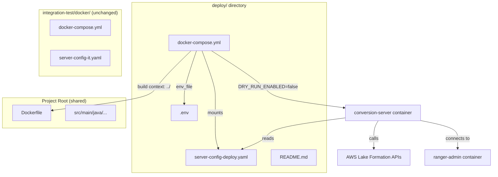

# Design Document: Production Deployment

## Overview

This design introduces a `deploy/` directory at the project root containing a self-contained Docker Compose stack for production/demo deployments of the Ranger-to-Lake Formation Conversion Server. The deployment reuses the existing multi-stage `Dockerfile` and server code but configures the container to call real AWS Lake Formation APIs instead of using dry-run mode.

The key principle is **full isolation**: the `deploy/` directory has its own `docker-compose.yml`, `server-config-deploy.yaml`, `.env`, and `README.md`. Nothing under `integration-test/docker/` is modified.

### Design Rationale

- **Reuse over duplication**: The same `Dockerfile` builds the image for both IT and production. Only the runtime configuration differs (env vars, mounted config YAML).
- **Secrets via `.env`**: All sensitive values (AWS credentials, account IDs, passwords) live in `deploy/.env`, which is git-ignored. The docker-compose file references these via `${VAR}` interpolation, so the YAML files themselves contain no secrets.
- **Environment variable substitution in YAML**: The `server-config-deploy.yaml` uses literal `${VAR}` placeholders. Docker Compose's `environment` section passes the `.env` values into the container, and the `ServerConfigLoader` / `ConfigLoader` already reads the YAML as-is — the placeholders are resolved by the shell/Docker Compose before the YAML is mounted or by the entrypoint. However, since YAML config is mounted as a file (not interpolated by Compose), the deploy config will use concrete placeholder strings that the operator replaces, or we use Docker Compose environment variable pass-through so the `ConversionServerMain` receives real values via env vars where supported. For fields not overridable by env vars (like `awsConfig`, `principalMapping`), the config YAML will contain descriptive placeholders that the operator fills in before launching.

**Chosen approach**: The `deploy/.env` file holds all variable values. The `docker-compose.yml` passes them as container environment variables. The `server-config-deploy.yaml` uses hardcoded references to the Docker network hostname for Ranger Admin and contains placeholder values for AWS-specific fields that the operator customizes directly in the YAML (guided by comments) or that are overridden by environment variables where the code supports it. Since `awsConfig` fields are read from the YAML by `ConfigLoader` and not from env vars, the operator must edit `server-config-deploy.yaml` with their real AWS values — or we provide a simple entrypoint wrapper. For simplicity and transparency, the design uses direct YAML editing guided by the `.env` file as a reference and the README as documentation.

**Revised approach after reviewing `ConfigLoader`**: The `ConfigLoader` reads YAML fields directly — it does not perform `${VAR}` substitution. Therefore `server-config-deploy.yaml` must contain actual values, not shell-style placeholders. The `.env` file serves Docker Compose for container-level env vars (`DRY_RUN_ENABLED`, `AWS_ACCESS_KEY_ID`, `AWS_SECRET_ACCESS_KEY`, `AWS_REGION` for SDK credential chain) and for the `RANGER_ADMIN_PASSWORD`. The `server-config-deploy.yaml` will ship with example/placeholder values that the operator edits before first launch. The README will clearly document this two-step configuration process.

## Architecture

### Service Topology

The `deploy/docker-compose.yml` defines four services on a shared bridge network, mirroring the IT stack's Ranger infrastructure but with production-oriented Conversion Server configuration:

| Service | Image | Purpose |
|---------|-------|---------|
| `ranger-db` | `apache/ranger-db:2.4.0` | PostgreSQL backing store for Ranger Admin |
| `ranger-solr` | `apache/ranger-solr:2.4.0` | Solr audit store for Ranger Admin |
| `ranger-admin` | `apache/ranger:2.4.0` | Ranger Admin REST API |
| `conversion-server` | Built from root `Dockerfile` | Syncs Ranger policies → Lake Formation (real API mode) |

## Components and Interfaces

### 1. `deploy/docker-compose.yml`

Defines the full deployment stack. Key differences from `integration-test/docker/docker-compose.yml`:

| Aspect | IT Compose | Deploy Compose |
|--------|-----------|----------------|
| `DRY_RUN_ENABLED` | `"true"` | `"false"` |
| `DRY_RUN_OUTPUT_DIR` | Set | Not set |
| Config mount | `server-config-it.yaml` | `server-config-deploy.yaml` |
| Env file | `integration-test/docker/.env` (if any) | `deploy/.env` |
| AWS credentials | Not needed (dry-run) | Passed via env vars for SDK default credential chain |
| Build context | `../..` (from `integration-test/docker/`) | `..` (from `deploy/`) |
| Dry-run volume | `./dry-run-output` mounted | Not present |

The build context is `..` (project root) since `deploy/` is one level deep. The Dockerfile path is `../Dockerfile` relative to `deploy/`, or equivalently `context: ..` with `dockerfile: Dockerfile`.

### 2. `deploy/server-config-deploy.yaml`

A production-oriented YAML configuration file. Structure mirrors `conf/server-config.yaml` but with:
- `rangerConfig.rangerAdminUrl` set to `http://ranger-admin:6080` (Docker network hostname)
- `rangerConfig.password` set to a placeholder the operator replaces (or reads from env)
- `awsConfig` section with placeholder values for `region`, `catalogId`, `roleArn`
- `principalMapping` with example placeholder entries
- `policyRefreshIntervalMs: 30000` (production cadence)
- `maxLfRetries: 5`, `lfRetryBackoffMs: 2000` (production retry settings)
- `server.logLevel: INFO`, `server.shutdownTimeoutSeconds: 30`

### 3. `deploy/.env`

Contains environment variables consumed by `docker-compose.yml`:
- `AWS_REGION` — passed to container for SDK default credential chain
- `AWS_ACCESS_KEY_ID` / `AWS_SECRET_ACCESS_KEY` — AWS credentials (or use IAM role)
- `AWS_ACCOUNT_ID` — for reference in config editing
- `AWS_ROLE_ARN` — IAM role ARN for Lake Formation operations
- `RANGER_ADMIN_PASSWORD` — Ranger Admin password
- Principal mapping placeholders (documented for reference when editing YAML)

### 4. `deploy/README.md`

Operator-facing documentation covering:
- Purpose and relationship to IT setup
- Configuration steps (edit `.env`, edit `server-config-deploy.yaml`)
- Build and launch commands (`docker compose up --build`)
- Verification steps (health checks, logs)
- Troubleshooting guide

### 5. `.gitignore` update

Add `deploy/.env` entry to prevent credential leaks.

## Data Models

No new data models are introduced. The deployment reuses existing configuration models:

- **`SyncConfig`** — loaded by `ConfigLoader` from `server-config-deploy.yaml`. Contains `rangerConfig`, `awsConfig`, `principalMapping`, sync interval, and retry settings.
- **`ServerConfig`** — loaded by `ServerConfigLoader` from the `server` section of the YAML. Contains `shutdownTimeoutSeconds`, `logLevel`, `metricsNamespace`.
- **`ReverseSyncConfig`** — optionally present in the YAML `reverseSync` section. Not enabled by default in the deploy config.

The `ConversionServerMain` checks `System.getenv("DRY_RUN_ENABLED")` at startup. When this is `"false"` or absent, it instantiates the real `LakeFormationClient` with AWS SDK credentials resolved from the default credential chain (which picks up `AWS_ACCESS_KEY_ID`/`AWS_SECRET_ACCESS_KEY` env vars passed by Docker Compose).

## Error Handling

| Scenario | Handling |
|----------|----------|
| `.env` file missing or incomplete | Docker Compose fails at startup with unresolved variable errors. README documents required variables. |
| `server-config-deploy.yaml` has invalid/placeholder values | `ConfigValidator` returns errors, `ConversionServerMain` exits with code 1 and prints errors to stderr. |
| AWS credentials invalid or expired | AWS SDK throws authentication errors. `LakeFormationClient` retry logic does not retry auth failures. Dead-letter log captures failed operations. |
| Ranger Admin not reachable | `LakeFormationPlugin.init()` retries connection. Health check on `ranger-admin` service ensures it's ready before `conversion-server` starts (via `depends_on: condition: service_healthy`). |
| Lake Formation API throttling | AWS SDK v2 built-in retry policy handles throttling. `LakeFormationClient` additionally retries `ConcurrentModificationException` with exponential backoff up to `maxLfRetries`. |
| Container crashes | Docker Compose does not auto-restart by default. README documents adding `restart: unless-stopped` if desired. |

## Testing Strategy

Since this feature creates only deployment configuration files (Docker Compose YAML, server config YAML, `.env` template, README, `.gitignore` update) and introduces no new application code or logic, property-based testing is not applicable. There are no pure functions, parsers, serializers, or data transformations to validate with PBT.

**Why PBT does not apply**: All deliverables are static configuration files and documentation. The correctness of these files is verified by:
1. Structural review — ensuring the YAML is valid and fields match expected schema
2. Integration testing — launching the stack and verifying the server starts and connects
3. Manual verification — confirming the README is accurate and complete

### Recommended Testing Approach

- **Manual smoke test**: Run `docker compose up --build` from `deploy/` and verify:
  - All four services start and pass health checks
  - `conversion-server` logs show "Starting Conversion Server" with `DRY_RUN_ENABLED` absent/false
  - Server connects to Ranger Admin at `http://ranger-admin:6080`
  - With valid AWS credentials, the server performs a sync cycle without errors
- **Isolation verification**: Confirm that files under `integration-test/docker/` are byte-identical before and after creating the `deploy/` directory
- **Gitignore verification**: Confirm `git status` does not show `deploy/.env` as untracked after adding credentials
- **YAML validation**: Use a YAML linter to verify `docker-compose.yml` and `server-config-deploy.yaml` are syntactically valid
