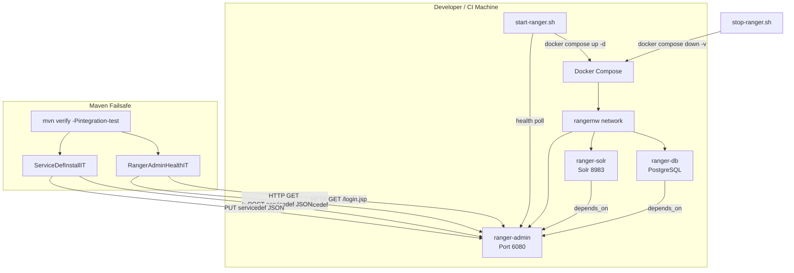

# Design Document: Ranger Integration Test Infrastructure

## Overview

This design describes the integration test infrastructure for the Ranger Lake Formation Sync Plugin. The infrastructure provisions a complete Apache Ranger stack (Ranger Admin, Solr, PostgreSQL) using Docker Compose, automates its lifecycle via shell scripts, integrates with Maven's failsafe plugin for test execution, and provides alternative deployment options (EKS Fargate, EC2) for shared environments.

The primary goal is to enable developers to run end-to-end integration tests against a real Ranger Admin instance — verifying health endpoints, service definition installation, and REST API interactions — without requiring a pre-existing Ranger deployment.

### Design Decisions

1. **Docker Compose as primary strategy**: Docker Compose with pre-built Docker Hub images (`apache/ranger`, `apache/ranger-solr`, `apache/ranger-db`) is the recommended approach. It offers the simplest setup, zero image build time, works identically in local and CI environments, and requires only Docker as a prerequisite. Testcontainers was considered but rejected because the Ranger stack requires multi-container orchestration with a custom network and specific startup ordering that is more naturally expressed in a Compose file.

2. **Separate source set for integration tests**: Integration tests live in `src/integration-test/java` (not `src/test/java`) to enforce a clean separation. Unit tests run via `maven-surefire-plugin` on every build; integration tests run via `maven-failsafe-plugin` only when the `integration-test` profile is active.

3. **Shell scripts for lifecycle management**: Bash scripts (`start-ranger.sh`, `stop-ranger.sh`) wrap Docker Compose commands and add health-check polling with configurable timeout. This keeps the Maven POM simple and makes the scripts reusable from CI pipelines and developer terminals alike.

4. **Plain `java.net.HttpURLConnection` for integration tests**: Integration tests use `HttpURLConnection` (already used by `ServiceDefinitionInstaller`) rather than adding a new HTTP client dependency. This keeps the test classpath minimal and avoids version conflicts.

## Architecture



### Component Interaction Flow

1. `start-ranger.sh` runs `docker compose up -d` to start the Ranger stack.
2. The script polls `http://localhost:6080/login.jsp` every N seconds until HTTP 200 or timeout.
3. Maven failsafe plugin runs integration tests that hit the live Ranger Admin REST API.
4. `stop-ranger.sh` runs `docker compose down -v --remove-orphans` to tear down everything.

## Components and Interfaces

### 1. Docker Compose File (`integration-test/docker/docker-compose.yml`)

Defines three services on a shared `rangernw` bridge network:

| Service | Image | Ports | Health Check | Depends On |
|---------|-------|-------|-------------|------------|
| `ranger-db` | `apache/ranger-db:${RANGER_VERSION:-2.4.0}` | 5432 (internal) | `pg_isready -U rangeradmin` | — |
| `ranger-solr` | `apache/ranger-solr:${RANGER_VERSION:-2.4.0}` | 8983:8983 | HTTP GET `http://localhost:8983/solr/admin/cores?action=STATUS` | — |
| `ranger-admin` | `apache/ranger:${RANGER_VERSION:-2.4.0}` | 6080:6080 | HTTP GET `http://localhost:6080/login.jsp` | `ranger-db`, `ranger-solr` |

Environment variables for `ranger-db`:
- `POSTGRES_PASSWORD`: password for the postgres superuser
- `RANGER_DB_USER`: `rangeradmin`
- `RANGER_DB_PASSWORD`: `rangerR0cks!`

### 2. Startup Script (`integration-test/scripts/start-ranger.sh`)

**Interface:**
```bash
./start-ranger.sh [--timeout <seconds>] [--interval <seconds>] [--compose-file <path>]
```

**Behavior:**
- Defaults: timeout=120s, interval=5s, compose-file=`../docker/docker-compose.yml`
- Runs `docker compose -f <file> up -d`
- Polls `http://localhost:6080/login.jsp` via `curl -sf`
- On success: prints `Ranger Admin is ready at http://localhost:6080`, exits 0
- On timeout: prints error, dumps `docker compose logs`, exits 1

### 3. Teardown Script (`integration-test/scripts/stop-ranger.sh`)

**Interface:**
```bash
./stop-ranger.sh [--compose-file <path>]
```

**Behavior:**
- Runs `docker compose -f <file> down -v --remove-orphans`
- Always exits 0 (idempotent teardown)

### 4. Maven Integration Test Profile

Added to `pom.xml` as a `<profile>` with id `integration-test`:

- `build-helper-maven-plugin`: adds `src/integration-test/java` as test source and `src/integration-test/resources` as test resource
- `maven-failsafe-plugin`: runs `*IT.java` classes, passes `-Dranger.admin.url=http://localhost:6080`
- `maven-compiler-plugin`: compiles integration test sources with Java 8

### 5. RangerAdminHealthIT

```java
// src/integration-test/java/org/apache/ranger/lakeformation/it/RangerAdminHealthIT.java
public class RangerAdminHealthIT {
    // Reads ranger.admin.url from system property
    // testLoginPageReachable(): GET /login.jsp → assert 200
    // testServiceDefApiReachable(): GET /service/public/v2/api/servicedef → assert 200
}
```

### 6. ServiceDefInstallIT

```java
// src/integration-test/java/org/apache/ranger/lakeformation/it/ServiceDefInstallIT.java
public class ServiceDefInstallIT {
    // Reads ranger.admin.url from system property
    // Loads ranger-servicedef-lakeformation.json from classpath
    // testCreateServiceDef(): POST to /service/public/v2/api/servicedef → assert 200, body contains "lakeformation"
    // testUpdateServiceDef(): PUT to /service/public/v2/api/servicedef/{id} → assert 200
    // testErrorHandling(): verifies descriptive error on bad request
}
```

### 7. CI Pipeline (`.github/workflows/integration-tests.yml`)

```yaml
jobs:
  integration-test:
    runs-on: ubuntu-latest
    steps:
      - uses: actions/checkout@v4
      - uses: actions/setup-java@v4
        with: { distribution: temurin, java-version: 8 }
      - run: mvn clean package -DskipTests
      - run: ./integration-test/scripts/start-ranger.sh
      - run: mvn verify -Pintegration-test
      - run: ./integration-test/scripts/stop-ranger.sh
        if: always()
```

### 8. EKS Fargate Manifests (`integration-test/k8s/`)

Kubernetes resources in namespace `ranger-integration`:
- `namespace.yml`: creates `ranger-integration` namespace
- `ranger-db.yml`: Deployment + Service for PostgreSQL
- `ranger-solr.yml`: Deployment + Service for Solr
- `ranger-admin.yml`: Deployment + Service (LoadBalancer, port 6080) with liveness/readiness probes
- `configmap.yml`: shared configuration (DB credentials, version tag)

### 9. EC2 Deployment (`integration-test/ec2/`)

- `setup-ec2.sh`: installs Docker + Docker Compose on Amazon Linux 2 / Ubuntu
- `deploy-to-ec2.sh`: SCPs compose file and scripts, SSHs to start the stack
- `README.md`: documents instance type (t3.medium minimum), security group rules (6080, 8983), data persistence caveats

## Data Models

### Docker Compose Environment Variables

| Variable | Default | Description |
|----------|---------|-------------|
| `RANGER_VERSION` | `2.4.0` | Image tag for all three Ranger containers |
| `POSTGRES_PASSWORD` | `rangerR0cks!` | PostgreSQL superuser password |
| `RANGER_DB_USER` | `rangeradmin` | Ranger database user |
| `RANGER_DB_PASSWORD` | `rangerR0cks!` | Ranger database password |

### Integration Test System Properties

| Property | Default | Description |
|----------|---------|-------------|
| `ranger.admin.url` | `http://localhost:6080` | Base URL for Ranger Admin REST API |

### Service Definition JSON Schema (existing)

The `ranger-servicedef-lakeformation.json` file is already defined in `conf/` and contains:
- `name`: `"lakeformation"`
- `resources`: database, table, column, datalocation
- `accessTypes`: select, insert, delete, describe, alter, drop, create_database, create_table, data_location_access
- `configs`: aws.region, aws.catalog.id, aws.access.key, aws.secret.key, aws.role.arn

### Health Check Endpoints

| Endpoint | Method | Expected Status | Purpose |
|----------|--------|----------------|---------|
| `/login.jsp` | GET | 200 | Ranger Admin UI readiness |
| `/service/public/v2/api/servicedef` | GET | 200 | REST API readiness |
| `/service/public/v2/api/servicedef` | POST | 200 | Service definition creation |
| `/service/public/v2/api/servicedef/{id}` | PUT | 200 | Service definition update |

### Deployment Strategy Comparison Matrix

| Dimension | Docker Compose | EKS Fargate | EC2 | Testcontainers |
|-----------|---------------|-------------|-----|----------------|
| Setup Complexity | Low — single YAML file | High — EKS cluster, Fargate profile, kubectl | Medium — EC2 provisioning, Docker install | Medium — Java API, multi-container orchestration |
| CI/CD Compatibility | High — Docker available in most CI runners | Medium — requires AWS credentials and EKS access | Medium — requires EC2 instance management | High — runs in any JVM with Docker |
| Cost | Free (local Docker) | $$$ (EKS control plane + Fargate compute) | $$ (EC2 instance hours) | Free (local Docker) |
| Startup Time | ~60-90s (image pull + Ranger init) | ~3-5 min (pod scheduling + init) | ~2-3 min (instance + Docker + init) | ~60-90s (same as Compose) |
| Teardown Reliability | High — `docker compose down -v` | Medium — pod termination can hang | Medium — instance termination is reliable but slow | High — JVM shutdown hooks |
| Local Dev Experience | Excellent — familiar tooling | Poor — requires AWS access | Poor — requires SSH | Good — programmatic but less transparent |
| **Recommendation** | **Primary** | Secondary (shared envs) | Secondary (persistent envs) | Not recommended |


## Correctness Properties

*A property is a characteristic or behavior that should hold true across all valid executions of a system — essentially, a formal statement about what the system should do. Properties serve as the bridge between human-readable specifications and machine-verifiable correctness guarantees.*

Most requirements in this feature are infrastructure/configuration artifacts (Docker Compose files, shell scripts, Maven profiles, Kubernetes manifests, CI workflows). These are best validated by structural example tests that verify the artifacts contain the expected content. Only two requirements produce testable Java code with behavior that generalizes across inputs.

### Property 1: Health check error messages include the attempted URL

*For any* valid URL string used as the Ranger Admin base URL, when `RangerAdminHealthIT` fails to connect, the resulting error message should contain the attempted URL so that developers can diagnose connectivity issues.

**Validates: Requirements 5.4**

### Property 2: Service definition install error messages include HTTP status code and response body

*For any* HTTP error status code (4xx or 5xx) and any non-empty response body returned by the Ranger Admin REST API, when `ServiceDefInstallIT` encounters the error, the resulting error message should contain both the numeric status code and the response body text.

**Validates: Requirements 6.5**

## Error Handling

### Docker Compose Startup Failures

- If any container fails to start, `start-ranger.sh` will hit the health-check timeout, dump all container logs via `docker compose logs`, and exit with code 1.
- The script uses `set -e` for early exit on unexpected errors, but the health-check polling loop is explicitly handled to allow retries.

### Health Check Timeout

- Default timeout is 120 seconds (configurable via `--timeout`). Ranger Admin typically takes 60-90 seconds to initialize on first start due to database schema creation.
- On timeout, the script outputs logs from all three containers to aid debugging.

### Integration Test Failures

- `RangerAdminHealthIT` catches `IOException` on connection failure and wraps it in an `AssertionError` with the attempted URL and original exception message.
- `ServiceDefInstallIT` reads the HTTP error response body and includes it in the assertion failure message alongside the status code.
- If the service definition already exists (HTTP 409 or similar), the test falls back to a PUT update rather than failing.

### Teardown Idempotency

- `stop-ranger.sh` uses `docker compose down -v --remove-orphans` which is idempotent — it succeeds even if containers are already stopped or don't exist.
- The script explicitly exits with code 0 regardless of Docker Compose exit code to prevent CI pipeline failures during cleanup.

### CI Docker Availability

- The GitHub Actions workflow checks for Docker availability before running integration tests. If Docker is not available, the integration test steps are skipped with a warning log.

## Testing Strategy

### Unit Tests

Unit tests (in `src/test/java`) continue to run via `maven-surefire-plugin` on every build. No changes to existing unit tests are required.

For the new integration test infrastructure, unit-testable components are minimal since most artifacts are configuration files and shell scripts. The following unit tests are appropriate:

- **Docker Compose YAML validation**: Parse `docker-compose.yml` and verify it contains the expected services, network, ports, health checks, and image tags. (Example-based)
- **Maven POM profile validation**: Parse `pom.xml` and verify the `integration-test` profile contains the expected plugin configurations. (Example-based)
- **Error message formatting**: Verify that health check and service definition install error messages contain the expected diagnostic information. (Property-based)

### Property-Based Tests

Property-based tests use **jqwik** (already a project dependency, version 1.7.4) with a minimum of 100 iterations per property.

Each property test must be tagged with a comment referencing the design property:

```java
// Feature: ranger-integration-test-infra, Property 1: Health check error messages include the attempted URL
@Property(tries = 100)
void healthCheckErrorContainsUrl(@ForAll @From("validUrls") String url) { ... }

// Feature: ranger-integration-test-infra, Property 2: Service definition install error messages include HTTP status code and response body
@Property(tries = 100)
void serviceDefErrorContainsStatusAndBody(
    @ForAll @IntRange(min = 400, max = 599) int statusCode,
    @ForAll @StringLength(min = 1, max = 500) String responseBody) { ... }
```

### Integration Tests

Integration tests (in `src/integration-test/java`) run via `maven-failsafe-plugin` only when the `integration-test` profile is active. They require a running Ranger stack.

| Test Class | What It Verifies | Req |
|-----------|-----------------|-----|
| `RangerAdminHealthIT` | Login page returns 200, servicedef API returns 200 | 5.2, 5.3 |
| `ServiceDefInstallIT` | POST creates servicedef, PUT updates it, error responses are descriptive | 6.2, 6.3, 6.4, 6.5 |

### Test Execution Summary

| Test Type | Tool | Trigger | Location |
|-----------|------|---------|----------|
| Unit tests | maven-surefire-plugin | `mvn test` | `src/test/java` |
| Property tests | jqwik via maven-surefire-plugin | `mvn test` | `src/test/java` |
| Integration tests | maven-failsafe-plugin | `mvn verify -Pintegration-test` | `src/integration-test/java` |
