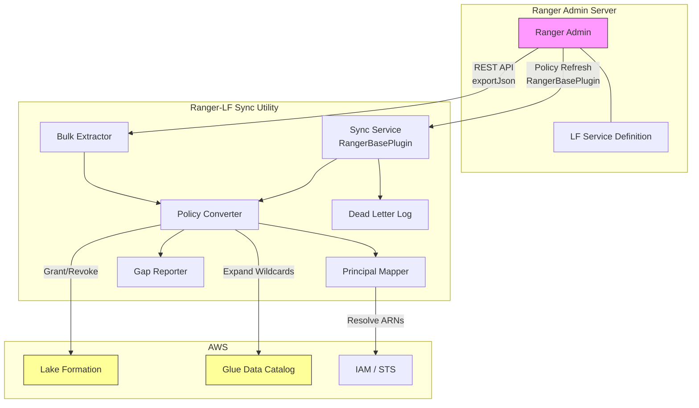

# Design Document: Ranger-LakeFormation Sync Utility

## Overview

This utility bridges Apache Ranger's policy-based access control to AWS Lake Formation's grant/revoke permission model. It operates in three modes:

1. **Bulk Export & Convert**: One-shot extraction of all Ranger policies via REST API, conversion to Lake Formation permissions, and batch application.
2. **Real-Time Sync**: A RangerPlugin that receives policy updates from Ranger Admin and incrementally applies changes to Lake Formation.
3. **Service Definition Installation**: A custom "lakeformation" service type registered in Ranger Admin, enabling policy authoring for Lake Formation resources through the Ranger UI.

The project targets Java 8 and uses Maven for dependency management and building (org.apache.ranger and AWS SDK artifacts). The deployable artifact is a set of JARs installable into Ranger Admin's plugin directory.

### Key Design Decisions

- **Incremental diff over full replacement**: The Sync_Service computes deltas between policy snapshots rather than revoking all and re-granting. This minimizes Lake Formation API calls and avoids transient permission gaps.
- **Partial conversion with gap reporting**: Rather than failing on unsupported features, the converter extracts what it can and produces a structured gap report. This lets teams migrate incrementally.
- **Wildcard expansion against Glue Catalog**: Since Lake Formation doesn't support wildcard grants, wildcards are expanded at conversion time by querying the Glue Data Catalog for matching resources.
- **Atomic per-policy application**: Permission changes for a single Ranger policy are applied as a unit. If any operation in the batch fails after retries, the entire policy's changes are rolled back and logged to a dead-letter log.

## Architecture



### Component Interaction Flow

**Bulk Export Mode:**
1. Bulk_Extractor calls Ranger Admin REST API (`/service/plugins/policies/exportJson`)
2. Policies are deserialized into `RangerPolicy` objects
3. Each policy is passed to Policy_Converter
4. Policy_Converter uses Principal_Mapper to resolve IAM ARNs
5. Policy_Converter queries Glue Data Catalog to expand wildcards
6. Supported portions become `LFPermissionOperation` (grant/revoke) objects
7. Unsupported portions are recorded in Gap_Reporter
8. LF permissions are applied via AWS Lake Formation API

**Real-Time Sync Mode:**
1. Sync_Service extends `RangerBasePlugin`, registers with Ranger Admin
2. RangerBasePlugin periodically fetches updated policies in background
3. Sync_Service computes diff between previous and current policy snapshots
4. Delta operations are passed to Policy_Converter
5. Resulting LF operations are applied with retry/backoff logic
6. Failed operations after retry exhaustion go to Dead_Letter_Log

## Components and Interfaces

### 1. BulkExtractor

Responsible for pulling all policies from Ranger Admin via REST.

```java
public class BulkExtractor {

    /**
     * Extract all policies from Ranger Admin.
     * @param config Ranger connection configuration
     * @return collection of RangerPolicy objects
     * @throws ExtractionException on unrecoverable errors
     */
    public List<RangerPolicy> extractAll(RangerConnectionConfig config)
        throws ExtractionException;

    /**
     * Extract policies filtered by service name.
     * @param config Ranger connection configuration
     * @param serviceNames service names to filter by
     * @return filtered collection of RangerPolicy objects
     */
    public List<RangerPolicy> extractByService(
        RangerConnectionConfig config,
        Set<String> serviceNames
    ) throws ExtractionException;
}
```

### 2. PolicyConverter

Transforms Ranger policies into Lake Formation operations. This is the core mapping engine.

```java
public class PolicyConverter {

    /**
     * Convert a single Ranger policy into LF permission operations.
     * Unsupported features are recorded in the GapReporter.
     * @param policy the Ranger policy to convert
     * @param principalMapper maps Ranger principals to IAM ARNs
     * @param catalogResolver resolves wildcards against Glue Catalog
     * @param gapReporter collects unsupported feature entries
     * @return list of LF permission operations (grants/revokes)
     */
    public List<LFPermissionOperation> convert(
        RangerPolicy policy,
        PrincipalMapper principalMapper,
        CatalogResolver catalogResolver,
        GapReporter gapReporter
    );

    /**
     * Convert a batch of Ranger policies.
     */
    public ConversionResult convertBatch(
        List<RangerPolicy> policies,
        PrincipalMapper principalMapper,
        CatalogResolver catalogResolver,
        GapReporter gapReporter
    );
}
```

### 3. SyncService (RangerPlugin)

Extends RangerBasePlugin to receive policy updates and apply them to Lake Formation.

```java
public class LakeFormationPlugin extends RangerBasePlugin {

    public LakeFormationPlugin() {
        super("lakeformation", "lakeformation");
    }

    /**
     * Called when policies are refreshed from Ranger Admin.
     * Computes diff and applies incremental changes.
     */
    @Override
    public void setPolicies(RangerPolicies policies) {
        // Compute diff against previous snapshot
        // Convert delta to LF operations
        // Apply with retry logic
    }
}

public class SyncService {

    /**
     * Start the sync service. Initializes the plugin and begins
     * receiving policy updates.
     */
    public void start(SyncConfig config);

    /**
     * Stop the sync service gracefully.
     */
    public void stop();
}
```

### 4. PrincipalMapper

Maps Ranger users/groups/roles to AWS IAM principal ARNs.

```java
public class PrincipalMapper {

    /**
     * Load principal mappings from configuration.
     */
    public static PrincipalMapper fromConfig(PrincipalMappingConfig config);

    /**
     * Resolve a Ranger user to an IAM principal ARN.
     * @return Optional.empty() if no mapping exists
     */
    public Optional<String> resolveUser(String rangerUser);

    /**
     * Resolve a Ranger group to an IAM principal ARN.
     */
    public Optional<String> resolveGroup(String rangerGroup);

    /**
     * Resolve a Ranger role to an IAM principal ARN.
     */
    public Optional<String> resolveRole(String rangerRole);
}
```

### 5. GapReporter

Collects and reports unsupported policy features.

```java
public class GapReporter {

    /**
     * Record an unsupported feature encountered during conversion.
     */
    public void recordGap(GapEntry entry);

    /**
     * Get the complete gap report.
     */
    public GapReport getReport();

    /**
     * Serialize the gap report to JSON.
     */
    public String toJson();

    /**
     * Deserialize a gap report from JSON.
     */
    public static GapReport fromJson(String json);
}
```

### 6. CatalogResolver

Queries Glue Data Catalog to expand wildcards and validate resources.

```java
public class CatalogResolver {

    /**
     * Expand a wildcard database pattern to matching database names.
     */
    public List<String> expandDatabases(String pattern);

    /**
     * Expand a wildcard table pattern within a database.
     */
    public List<String> expandTables(String database, String pattern);

    /**
     * Expand a wildcard column pattern within a table.
     */
    public List<String> expandColumns(
        String database, String table, String pattern
    );
}
```

### 7. LakeFormationClient

Wrapper around the AWS Lake Formation SDK that handles grant/revoke operations with retry logic.

```java
public class LakeFormationClient {

    /**
     * Grant permissions on a Lake Formation resource.
     */
    public void grantPermission(LFPermissionOperation op)
        throws LakeFormationException;

    /**
     * Revoke permissions on a Lake Formation resource.
     */
    public void revokePermission(LFPermissionOperation op)
        throws LakeFormationException;

    /**
     * Apply a batch of operations atomically per policy.
     * If any operation fails after retries, all operations
     * for that policy are rolled back.
     */
    public BatchResult applyBatch(
        List<LFPermissionOperation> operations,
        RetryConfig retryConfig
    );
}
```

### 8. ServiceDefinitionInstaller

Registers the custom LF service definition with Ranger Admin.

```java
public class ServiceDefinitionInstaller {

    /**
     * Register via REST API POST to /service/plugins/definitions.
     */
    public void installViaRest(
        RangerConnectionConfig config,
        String serviceDefinitionJson
    );

    /**
     * Install by copying the service definition file to the
     * Ranger Admin plugin directory.
     */
    public void installViaFile(
        Path rangerAdminHome,
        String serviceDefinitionJson
    );
}
```

### 9. LakeFormationResourceLookupService

Extends RangerBaseService for resource browsing in Ranger Admin UI.

```java
public class LakeFormationResourceLookupService extends RangerBaseService {

    @Override
    public Map<String, Object> validateConfig()
        throws Exception;

    @Override
    public List<String> lookupResource(
        ResourceLookupContext context
    ) throws Exception;
}
```

## Data Models

### RangerPolicy (from Apache Ranger SDK)

The utility consumes the existing `org.apache.ranger.plugin.model.RangerPolicy` class from the Ranger SDK. Key fields used:

| Field | Type | Description |
|-------|------|-------------|
| id | Long | Unique policy identifier |
| name | String | Policy name |
| service | String | Service name this policy belongs to |
| resources | Map<String, RangerPolicyResource> | Resource definitions (database, table, column) |
| policyItems | List<RangerPolicyItem> | Allow policy items |
| denyPolicyItems | List<RangerPolicyItem> | Deny policy items (unsupported in LF) |
| allowExceptions | List<RangerPolicyItem> | Allow exception items |
| denyExceptions | List<RangerPolicyItem> | Deny exception items (unsupported in LF) |
| dataMaskPolicyItems | List<RangerDataMaskPolicyItem> | Data masking items (unsupported in LF) |
| rowFilterPolicyItems | List<RangerRowFilterPolicyItem> | Row filter items |
| validitySchedules | List<RangerValiditySchedule> | Time-bound schedules (unsupported in LF) |
| conditions | List<RangerPolicyCondition> | Custom conditions (unsupported in LF) |
| policyType | Integer | 0=Access, 1=Datamask, 2=RowFilter |
| isDenyAllElse | Boolean | Deny-all-else flag |
| zoneName | String | Security zone (unsupported in LF) |

### LFPermissionOperation

Represents a single grant or revoke operation to be applied to Lake Formation.

```java
public class LFPermissionOperation {
    public enum OperationType { GRANT, REVOKE }

    private OperationType operationType;
    private String sourcePolicyId;       // Ranger policy ID for traceability
    private String principalArn;         // IAM principal ARN
    private LFResource resource;         // Target resource
    private Set<LFPermission> permissions; // Permissions to grant/revoke
    private boolean grantable;           // WITH GRANT OPTION equivalent
}

public class LFResource {
    private String catalogId;
    private String databaseName;
    private String tableName;            // null for database-level
    private Set<String> columnNames;     // null/empty for table-level
    private String rowFilterExpression;  // null if no row filter
}

public enum LFPermission {
    SELECT, INSERT, DELETE, DESCRIBE, ALTER, DROP,
    CREATE_DATABASE, CREATE_TABLE, DATA_LOCATION_ACCESS
}
```

### GapEntry and GapReport

```java
public class GapEntry {
    public enum GapType {
        DATA_MASKING, TAG_BASED_POLICY, DENY_POLICY,
        DENY_EXCEPTION, VALIDITY_SCHEDULE, CUSTOM_CONDITION,
        SECURITY_ZONE, DELEGATED_ADMIN, WILDCARD_PATTERN
    }

    private String policyId;
    private String policyName;
    private GapType gapType;
    private String resourcePath;
    private String details;              // Human-readable description
    private String recommendation;       // Suggested compensating control
}

public class GapReport {
    private List<GapEntry> entries;
    private Map<GapType, Integer> summary; // Count per gap type
    private String generatedAt;           // ISO-8601 timestamp
}
```

### Configuration Models

```java
public class RangerConnectionConfig {
    private String rangerAdminUrl;
    private String username;
    private String password;             // Or Kerberos keytab path
    private String kerberosKeytab;
    private String kerberosPrincipal;
    private int maxRetries;              // Default: 3
    private long retryBackoffMs;         // Default: 1000
}

public class AwsConfig {
    private String region;
    private String catalogId;
    private String accessKey;            // Optional if using IAM role
    private String secretKey;            // Optional if using IAM role
    private String roleArn;             // For STS AssumeRole
}

public class PrincipalMappingConfig {
    private Map<String, String> userMappings;   // rangerUser -> IAM ARN
    private Map<String, String> groupMappings;  // rangerGroup -> IAM ARN
    private Map<String, String> roleMappings;   // rangerRole -> IAM ARN
}

public class SyncConfig {
    private RangerConnectionConfig rangerConfig;
    private AwsConfig awsConfig;
    private PrincipalMappingConfig principalMapping;
    private long policyRefreshIntervalMs;  // Default: 30000
    private int maxLfRetries;              // Default: 5
    private long lfRetryBackoffMs;         // Default: 2000
    private String deadLetterLogPath;
}
```

### Ranger Access Type to LF Permission Mapping

| Ranger Access Type | LF Permission | Notes |
|-------------------|---------------|-------|
| select | SELECT | Direct mapping |
| update | INSERT | Ranger "update" maps to LF "INSERT" for data modification |
| create | CREATE_TABLE | Context-dependent: table-level creation |
| drop | DROP | Direct mapping |
| alter | ALTER | Direct mapping |
| read | SELECT | Alias for select in some Ranger service defs |
| write | INSERT | Alias for update in some Ranger service defs |
| all | SELECT, INSERT, DELETE, ALTER, DROP, DESCRIBE | Expanded to all applicable LF permissions |

### Service Definition JSON Structure

The custom Lake Formation service definition follows the Ranger service definition schema:

```json
{
    "name": "lakeformation",
    "displayName": "AWS Lake Formation",
    "implClass": "org.apache.ranger.services.lakeformation.LakeFormationResourceLookupService",
    "label": "Lake Formation",
    "description": "AWS Lake Formation Permission Management",
    "resources": [
        {
            "itemId": 1,
            "name": "database",
            "type": "string",
            "level": 10,
            "mandatory": true,
            "lookupSupported": true,
            "recursiveSupported": false,
            "label": "Database"
        },
        {
            "itemId": 2,
            "name": "table",
            "type": "string",
            "level": 20,
            "mandatory": true,
            "lookupSupported": true,
            "recursiveSupported": false,
            "parent": "database",
            "label": "Table"
        },
        {
            "itemId": 3,
            "name": "column",
            "type": "string",
            "level": 30,
            "mandatory": false,
            "lookupSupported": true,
            "recursiveSupported": false,
            "parent": "table",
            "label": "Column"
        }
    ],
    "accessTypes": [
        {"itemId": 1, "name": "select", "label": "Select"},
        {"itemId": 2, "name": "insert", "label": "Insert"},
        {"itemId": 3, "name": "delete", "label": "Delete"},
        {"itemId": 4, "name": "describe", "label": "Describe"},
        {"itemId": 5, "name": "alter", "label": "Alter"},
        {"itemId": 6, "name": "drop", "label": "Drop"},
        {"itemId": 7, "name": "create_database", "label": "Create Database"},
        {"itemId": 8, "name": "create_table", "label": "Create Table"},
        {"itemId": 9, "name": "data_location_access", "label": "Data Location Access"}
    ],
    "configs": [
        {"itemId": 1, "name": "aws.region", "type": "string", "mandatory": true, "label": "AWS Region"},
        {"itemId": 2, "name": "aws.catalog.id", "type": "string", "mandatory": true, "label": "Glue Catalog ID"},
        {"itemId": 3, "name": "aws.access.key", "type": "string", "mandatory": false, "label": "AWS Access Key"},
        {"itemId": 4, "name": "aws.secret.key", "type": "password", "mandatory": false, "label": "AWS Secret Key"},
        {"itemId": 5, "name": "aws.role.arn", "type": "string", "mandatory": false, "label": "IAM Role ARN"}
    ]
}
```

## Correctness Properties

*A property is a characteristic or behavior that should hold true across all valid executions of a system — essentially, a formal statement about what the system should do. Properties serve as the bridge between human-readable specifications and machine-verifiable correctness guarantees.*

### Property 1: Service name filtering preserves only matching policies

*For any* set of Ranger policies and any set of service name filters, the Bulk_Extractor's filtered result should contain exactly those policies whose service field is in the filter set, and no others.

**Validates: Requirements 1.2**

### Property 2: Policy structure round-trip through JSON

*For any* valid RangerPolicy object, serializing it to JSON and deserializing it back should produce an equivalent object with all fields preserved (resources, policy items, deny items, row filters, data masks, validity schedules, conditions).

**Validates: Requirements 1.3**

### Property 3: Retry count matches configuration

*For any* configured maximum retry count N and a persistently failing endpoint, the Bulk_Extractor (or Sync_Service) should make exactly N+1 total attempts (1 initial + N retries) before reporting failure.

**Validates: Requirements 1.5, 8.2**

### Property 4: Extraction log counts match actual policy counts

*For any* set of extracted policies, the logged count per service type should equal the actual count of policies grouped by their service field.

**Validates: Requirements 1.6**

### Property 5: Access type mapping correctness

*For any* valid resource-based Ranger policy with known access types (select, update, create, drop, alter, read, write, all), the Policy_Converter should produce LF_Permission operations containing exactly the corresponding Lake Formation permissions as defined in the access type mapping table.

**Validates: Requirements 2.1**

### Property 6: Row filter conversion preserves filter expressions

*For any* Ranger policy containing row-level filter policy items, the Policy_Converter should produce LF_Data_Filter definitions where each filter expression corresponds to the original Ranger row filter expression.

**Validates: Requirements 2.2**

### Property 7: Principal mapping resolution

*For any* principal type (user, group, or role), any Ranger principal name, and any principal mapping configuration that contains a mapping for that name, the Policy_Converter should produce LF_Permission operations with the IAM ARN specified in the mapping.

**Validates: Requirements 2.3, 6.1, 6.2**

### Property 8: Unsupported feature detection and gap reporting

*For any* Ranger policy containing one or more unsupported features (data masking, tag-based policy, deny items, deny-exceptions, validity schedules, custom conditions, security zones, delegated admin), the Policy_Converter should: (a) produce LF operations only for the supported portions, (b) produce a GapEntry for each unsupported feature with the correct GapType, policy ID, and descriptive details.

**Validates: Requirements 2.4, 2.5, 3.1, 3.2, 3.3, 3.4, 3.5, 3.6, 3.7**

### Property 9: Conversion determinism

*For any* Ranger policy, converting it twice with the same PrincipalMapper, CatalogResolver, and GapReporter should produce identical lists of LF_Permission operations.

**Validates: Requirements 2.6**

### Property 10: Wildcard expansion completeness

*For any* wildcard resource pattern and any set of Glue Data Catalog resources, the CatalogResolver's expansion should return exactly the set of resources that match the pattern, and the Policy_Converter should produce one LF_Permission entry per matched resource.

**Validates: Requirements 2.7**

### Property 11: Gap report JSON round-trip

*For any* valid GapReport object, serializing to JSON and deserializing back should produce an equivalent GapReport with identical entries and summary counts.

**Validates: Requirements 3.8, 3.9**

### Property 12: Gap report summary accuracy

*For any* GapReport, the summary count for each GapType should equal the number of GapEntry objects in the entries list with that GapType.

**Validates: Requirements 3.8**

### Property 13: Policy diff correctness

*For any* two policy snapshots (old and new), the Sync_Service's computed diff should produce: (a) GRANT operations for permissions present in new but not in old, (b) REVOKE operations for permissions present in old but not in new, and (c) no operations for permissions unchanged between snapshots.

**Validates: Requirements 4.3**

### Property 14: Audit log completeness

*For any* set of LF_Permission operations applied by the Sync_Service, the audit log should contain one entry per operation with the policy ID, resource path, principal ARN, and permission type.

**Validates: Requirements 4.6**

### Property 15: Unmapped principal skipping

*For any* Ranger policy containing principals with no configured mapping, the Policy_Converter should produce no LF_Permission operations for those principals and should log a warning for each unmapped principal.

**Validates: Requirements 6.3**

### Property 16: Principal mapping round-trip

*For any* valid PrincipalMappingConfig, serializing to JSON (or properties format) and deserializing back should produce an equivalent configuration.

**Validates: Requirements 6.5**

### Property 17: Malformed policy resilience

*For any* batch of Ranger policies containing some malformed entries (missing required fields, unrecognized resource types), the Policy_Converter should skip malformed policies, produce results for all valid policies, and log errors for each skipped policy.

**Validates: Requirements 8.1**

### Property 18: Atomic per-policy application

*For any* batch of LF_Permission operations grouped by source policy, if any operation for a given policy fails, all operations for that policy should be rolled back (none applied), while operations for other policies should be unaffected.

**Validates: Requirements 8.3**

### Property 19: Dead-letter log completeness

*For any* LF_Permission operation that fails after exhausting all retries, the dead-letter log should contain an entry with the policy ID, operation details, and error message.

**Validates: Requirements 8.4**

### Property 20: Error log structure

*For any* error logged by any component, the log entry should contain a timestamp, component name, severity level, and context fields (policy ID, resource path, or principal as applicable).

**Validates: Requirements 8.5**

### Property 21: Environment variable override

*For any* configuration key that has both a file-based value and an environment variable value, the loaded configuration should use the environment variable value.

**Validates: Requirements 9.2**

### Property 22: Configuration validation completeness

*For any* configuration with N missing required parameters, the validator should report exactly N missing parameter errors with descriptive messages.

**Validates: Requirements 9.3**

### Property 23: Sensitive value masking in logs

*For any* configuration containing sensitive fields (passwords, secret keys), the log output should not contain the raw sensitive values; they should be masked.

**Validates: Requirements 9.4**

### Property 24: Resource lookup returns matching catalog entries

*For any* Glue Data Catalog state and any ResourceLookupContext specifying a resource type (database, table, or column) and optional prefix, the LakeFormationResourceLookupService should return exactly the catalog entries matching the lookup criteria.

**Validates: Requirements 5.6**

## Error Handling

### Error Categories

| Category | Source | Handling Strategy |
|----------|--------|-------------------|
| Authentication Failure | Ranger Admin REST API (401/403) | Log error with HTTP status, do not retry, report to caller |
| Network Timeout | Ranger Admin or AWS APIs | Retry with exponential backoff (configurable max retries) |
| Rate Limiting | AWS Lake Formation API (throttling) | Backoff and retry, respect Retry-After headers |
| Concurrent Modification | AWS Lake Formation API | Retry with exponential backoff |
| Malformed Policy | Ranger policy JSON | Log error, skip policy, continue batch |
| Unmapped Principal | Principal mapping configuration | Log warning, skip permission entry |
| Unsupported Feature | Ranger policy features not in LF | Record in Gap Report, convert supported portions |
| Catalog Resolution Failure | Glue Data Catalog API | Log error, skip wildcard expansion for that resource |
| Configuration Error | Missing/invalid config parameters | Fail fast at startup with descriptive messages |

### Retry Configuration

```java
public class RetryConfig {
    private int maxRetries = 3;
    private long initialBackoffMs = 1000;
    private double backoffMultiplier = 2.0;
    private long maxBackoffMs = 30000;
}
```

Retry logic applies to:
- Ranger Admin REST API calls (Bulk_Extractor)
- Lake Formation grant/revoke API calls (LakeFormationClient)
- Glue Data Catalog API calls (CatalogResolver)

### Dead-Letter Log

Failed operations that exhaust retries are written to a dead-letter log file (JSON lines format):

```json
{
    "timestamp": "2024-01-15T10:30:00Z",
    "policyId": "42",
    "operation": "GRANT",
    "resource": {"database": "analytics", "table": "events"},
    "principal": "arn:aws:iam::123456789012:role/DataAnalyst",
    "permissions": ["SELECT"],
    "error": "ConcurrentModificationException: Resource was modified by another request",
    "retryCount": 5
}
```

### Atomic Per-Policy Rollback

When applying a batch of LF operations for a single Ranger policy:
1. Collect all grant/revoke operations for the policy
2. Apply operations sequentially
3. If any operation fails after retries:
   - Reverse all previously applied operations for this policy
   - Log the rollback
   - Write to dead-letter log
4. Move to next policy regardless of previous policy's outcome

## Testing Strategy

### Testing Framework

- **Unit Testing**: JUnit 5 (Jupiter) for standard unit tests
- **Property-Based Testing**: jqwik (https://jqwik.net/) — a mature property-based testing library for Java that integrates with JUnit 5
- **Mocking**: Mockito for mocking AWS SDK clients and Ranger Admin REST calls

### Property-Based Testing Configuration

Each property test should:
- Run a minimum of 100 iterations
- Use jqwik's `@Property` annotation with `tries = 100` (or higher)
- Reference the design property in a comment tag
- Tag format: `// Feature: ranger-lakeformation-sync, Property N: <property title>`

### Test Categories

**Property Tests** (using jqwik):
- Policy conversion correctness (Properties 5, 6, 7, 8, 9, 10)
- Round-trip serialization (Properties 2, 11, 16)
- Diff computation (Property 13)
- Gap report accuracy (Property 12)
- Configuration handling (Properties 21, 22, 23)
- Filtering and lookup (Properties 1, 24)
- Error resilience (Properties 3, 15, 17, 18, 19, 20)
- Audit completeness (Property 14)

**Unit Tests** (using JUnit 5):
- Specific conversion examples (known Ranger policy → expected LF operations)
- Authentication error handling (Req 1.4)
- ConcurrentModificationException retry (Req 4.4)
- Rate limit retry (Req 4.5)
- Connectivity loss resilience (Req 4.7)
- Service definition JSON structure validation (Req 5.1, 5.2, 5.3)
- Configuration loading from file (Req 9.1)
- Principal mapping file loading (Req 6.4)

**Integration Tests** (manual or CI environment):
- End-to-end bulk export from a test Ranger Admin instance
- Service definition registration via REST
- Plugin registration and policy refresh cycle
- Lake Formation permission application against a test catalog

### Generators for Property Tests

Key jqwik generators needed:

- `RangerPolicyArbitrary`: Generates random valid RangerPolicy objects with varying combinations of policy items, resources, access types, and unsupported features
- `PrincipalMappingArbitrary`: Generates random principal mapping configurations
- `GapReportArbitrary`: Generates random GapReport objects with varying entry types
- `PolicySnapshotPairArbitrary`: Generates pairs of policy snapshots for diff testing
- `ConfigArbitrary`: Generates configuration objects with varying completeness (some missing required fields)
- `WildcardPatternArbitrary`: Generates wildcard patterns and matching catalog resource sets
