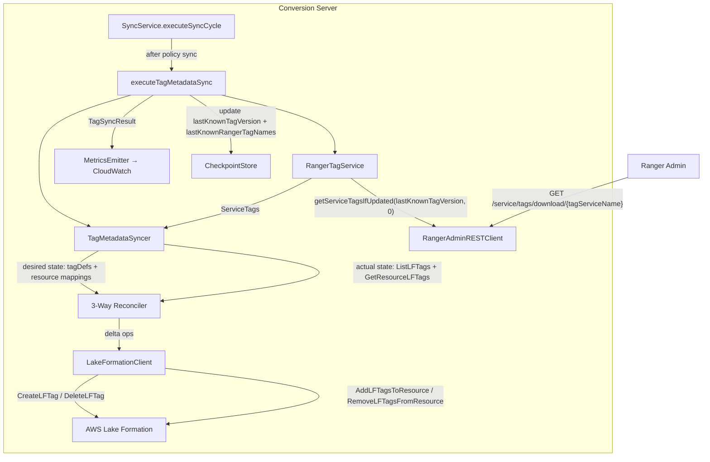

# Design Document: Tag Metadata Sync

## Overview

This feature pulls Ranger tag definitions and resource-tag mappings from Ranger Admin via `RangerAdminRESTClient.getServiceTagsIfUpdated()` and reconciles them into AWS Lake Formation using `CreateLFTag`, `DeleteLFTag`, `AddLFTagsToResource`, and `RemoveLFTagsFromResource`. A 3-way diff (Ranger desired vs. LF actual) drives the delta, avoiding blind creates and protecting externally managed LF-Tags.

This is Phase 1 of tag support. The tag-to-resource mapping produced here is a prerequisite for Phase 2 (tag policy sync with hybrid TBAC/named-resource grants), which needs `getResourcesForTag()` to expand tag-based permits into concrete resources when deny semantics require named-resource grants instead of TBAC.

### Key Design Decisions

1. **`RangerAdminRESTClient` over `RangerBasePlugin`**: The BasePlugin push model gives tag *policies* but NOT tag-to-resource mappings. `getServiceTagsIfUpdated()` returns both in one call. Since the pipeline already polls on a schedule, the push model adds no value and its `PolicyRefresher` backoff behavior is a known source of integration test instability. The REST client is already on the classpath (`ranger-plugins-common-2.4.0.jar`), requires no new Maven dependencies, and supports incremental delta downloads.

2. **Boolean tag mapping convention**: Ranger tag name → LF-Tag key with value `"true"`. This is the simplest mapping with no Atlas hierarchy to flatten. Phase 2 Cedar entity IDs use `DataCatalog::LFTag::"PII=true"` format. An explicit convention avoids ambiguity when Phase 2 needs to reconstruct the entity ID from the tag key.

3. **3-way reconciliation, not blind create**: Tags may exist in LF from other sources. The syncer reads LF actual state before applying any changes. It tracks `lastKnownRangerTagNames` in the checkpoint to identify which tags it owns, never touching keys it didn't create.

4. **Fail-safe on incomplete actual state**: If the LF `GetResourceLFTags` call fails, the reconciliation aborts entirely rather than applying partial deletes. A partial delete based on incomplete actual state could remove tags the syncer didn't create.

5. **Tag sync after policy sync in the same cycle**: Tag metadata changes less frequently than policies, but running it in the same cycle keeps the execution model simple — one `executeSyncCycle()` call handles everything. Independent `tagSyncIntervalMs` allows the operator to run tag sync less frequently than policy sync if desired.

## Architecture



## Components and Interfaces

### RangerTagService (new)

```java
package com.amazonaws.policyconverters.ranger.service;

import org.apache.ranger.admin.client.RangerAdminRESTClient;
import org.apache.ranger.plugin.util.ServiceTags;

/**
 * Retrieves Ranger tag definitions and resource-tag mappings via
 * RangerAdminRESTClient. Supports incremental fetches via lastKnownTagVersion.
 * Falls back to last known good state on retrieval failure.
 */
public class RangerTagService {

    private final RangerAdminRESTClient adminClient;
    private final String tagServiceName;

    private volatile ServiceTags lastKnownTags;     // null until first successful fetch
    private volatile long lastKnownTagVersion = 0L;
    private volatile long lastActivationTime = 0L;

    public RangerTagService(String tagServiceName, RangerConnectionConfig rangerConfig);

    /**
     * Retrieve latest tags. Uses incremental fetch if lastKnownTagVersion > 0.
     * On failure, returns lastKnownTags (may be null on first call after fresh start).
     */
    public ServiceTags getLatestTags();

    /** Current lastKnownTagVersion for checkpoint persistence. */
    public long getLastKnownTagVersion();

    /**
     * Build tag-name → Set<LFResource> map from current ServiceTags.
     * Used by Phase 2 named-resource fallback to expand tag grants to concrete resources.
     */
    public Map<String, Set<LFResource>> getResourcesForTag();
}
```

`RangerAdminRESTClient` initialization pattern:
```java
RangerAdminRESTClient client = new RangerAdminRESTClient();
// appId identifies this plugin instance to Ranger Admin
client.init(tagServiceName, "ranger-lf-sync", "", new org.apache.hadoop.conf.Configuration());
```
The `RangerConnectionConfig` username/password/kerberosKeytab fields are passed via Hadoop `Configuration` properties that `RangerAdminRESTClient` reads (`ranger.admin.url`, `ranger.plugin.*.policy.rest.url`, etc.) — the same mechanism used by `RangerBasePlugin` internally.

### TagMetadataSyncer (new)

```java
package com.amazonaws.policyconverters.lakeformation;

import org.apache.ranger.plugin.util.ServiceTags;

/**
 * Reconciles Ranger tag definitions and resource-tag mappings into
 * LF-Tags and LF resource tag attachments via 3-way diff.
 */
public class TagMetadataSyncer {

    private final LakeFormationClient lfClient;
    private final String catalogId;

    public TagMetadataSyncer(LakeFormationClient lfClient, String catalogId);

    /**
     * Execute one reconciliation cycle.
     *
     * @param desired        ServiceTags from RangerTagService (desired state)
     * @param lfManagedTags  Set of tag names last known to be managed by this pipeline
     *                       (from checkpoint — prevents touching externally created tags)
     * @return TagSyncResult with operation counts and any failures
     */
    public TagSyncResult sync(ServiceTags desired, Set<String> lfManagedTags);
}
```

**sync() algorithm:**

```
1. Build desiredTagNames from ServiceTags.tagDefinitions values (Set<String> of tag names)
2. Fetch actualTagNames via lakeformation:ListLFTags (Set<String> of existing LF-Tag keys)

3. Tag definition diff:
   toCreate = desiredTagNames - actualTagNames
   toDelete = (lfManagedTags ∩ actualTagNames) - desiredTagNames  // only delete what we own

4. For each name in toCreate: CreateLFTag(key=name, values=["true"])
   For each name in toDelete (if no resource attachments): DeleteLFTag(key=name)

5. Build desiredAttachments: Map<LFResource, Set<String>> from serviceResources + resourceToTagIds
6. Build actualAttachments: Map<LFResource, Set<String>> via GetResourceLFTags per resource
   (if GetResourceLFTags fails → abort cycle, return TagSyncResult.failure())

7. Attachment diff:
   For each (resource, tagSet) in desiredAttachments:
     toAdd = tagSet - actualAttachments.getOrEmpty(resource)
     if toAdd non-empty: AddLFTagsToResource(resource, toAdd)
   For each (resource, tagSet) in actualAttachments:
     lfManagedActual = tagSet ∩ lfManagedTags
     toRemove = lfManagedActual - desiredAttachments.getOrEmpty(resource)
     if toRemove non-empty: RemoveLFTagsFromResource(resource, toRemove)

8. Return TagSyncResult(tagsCreated, tagsDeleted, attachmentsAdded, attachmentsRemoved, failed)
```

### TagSyncConfig (new)

```java
package com.amazonaws.policyconverters.config;

public class TagSyncConfig {
    private final boolean enabled;          // default false
    private final String tagServiceName;    // required when enabled=true
    private final long tagSyncIntervalMs;   // 0 = use policyRefreshIntervalMs
}
```

YAML:
```yaml
tagSync:
  enabled: false
  tagServiceName: "tagservice"   # Ranger tag service instance name
  tagSyncIntervalMs: 0           # optional; 0 or absent = same as policyRefreshIntervalMs
```

### TagSyncResult (new)

```java
package com.amazonaws.policyconverters.model;

public class TagSyncResult {
    private final boolean success;
    private final long durationMs;
    private final int tagsCreated;
    private final int tagsDeleted;
    private final int attachmentsAdded;
    private final int attachmentsRemoved;
    private final int failed;
    private final String errorMessage;  // null on full success

    public static TagSyncResult success(long durationMs, int tagsCreated, int tagsDeleted,
                                        int attachmentsAdded, int attachmentsRemoved, int failed);
    public static TagSyncResult failure(long durationMs, Exception error);
}
```

### SyncConfig extension

```java
// Add to SyncConfig:
@JsonProperty("tagSync")
private final TagSyncConfig tagSync;  // default: new TagSyncConfig(false, null, 0)
```

### SyncCheckpoint extension

```java
// Add to SyncCheckpoint:
@JsonProperty("lastKnownTagVersion")
private final Long lastKnownTagVersion;  // null = no tag version persisted (first run)

@JsonProperty("lastKnownRangerTagNames")
private final Set<String> lastKnownRangerTagNames;  // empty set if not yet populated
```

### LakeFormationClient extension

New methods added (using AWS SDK v2 `LakeFormationClient`):

```java
// Tag definition management
void createLFTag(String tagKey, List<String> tagValues);
void deleteLFTag(String tagKey);
List<String> listLFTagKeys(String catalogId);

// Resource tag attachment management
Map<String, List<String>> getResourceLFTags(LFResource resource, String catalogId);
void addLFTagsToResource(LFResource resource, Map<String, String> tagKeyValues, String catalogId);
void removeLFTagsFromResource(LFResource resource, List<String> tagKeys, String catalogId);
```

Each method uses existing retry logic patterns (same `RetryConfig` as grant/revoke operations).

### SyncService extension

```java
// New method in SyncService:
public TagSyncResult executeTagMetadataSync() {
    if (!syncConfig.getTagSync().isEnabled()) return null;

    // Rate limiting: only run if tagSyncIntervalMs has elapsed
    long now = System.currentTimeMillis();
    long interval = resolveTagSyncInterval();
    if (now - lastTagSyncMs < interval) {
        LOG.debug("Tag sync interval not yet elapsed, skipping");
        return null;
    }

    long start = now;
    ServiceTags tags = rangerTagService.getLatestTags();
    if (tags == null) {
        LOG.error("RangerTagService returned null; skipping tag sync cycle");
        return TagSyncResult.failure(System.currentTimeMillis() - start,
            new IllegalStateException("No tag data available"));
    }

    Set<String> lfManagedTags = checkpoint.getLastKnownRangerTagNames();
    TagSyncResult result = tagMetadataSyncer.sync(tags, lfManagedTags);

    // Update checkpoint with new version and managed tag names
    if (result.isSuccess() || result.getFailed() < totalOps) {
        Set<String> newManagedTags = buildTagNames(tags);
        checkpointStore.saveTagState(rangerTagService.getLastKnownTagVersion(), newManagedTags);
    }

    lastTagSyncMs = System.currentTimeMillis();
    return result;
}

// Called from executeSyncCycle() after policy sync:
TagSyncResult tagResult = executeTagMetadataSync();
if (tagResult != null) {
    metricsEmitter.recordTagSync(tagResult);
    logTagSyncResult(tagResult);
}
```

### MetricsEmitter extension

```java
public void recordTagSync(TagSyncResult result) {
    // Emit TagSyncSuccess or TagSyncFailure (count=1)
    // Emit TagSyncDuration (ms)
    // Emit TagsCreated, TagsDeleted, TagAttachmentsAdded, TagAttachmentsRemoved (counts)
    // Emit TagSyncPartialFailure if success=true but failed > 0
    // All with ServiceName=conversion-server dimension
}
```

## Data Models

### ServiceTags → Desired State Derivation

```java
// From ServiceTags:
Set<String> desiredTagNames = tags.getTagDefinitions().values().stream()
    .map(RangerTagDef::getName)
    .collect(toSet());

// Build resource → tag names map:
Map<Long, List<Long>> resourceToTagIds = tags.getResourceToTagIds();
Map<Long, RangerTag> tagInstances = tags.getTags();
Map<Long, RangerTagDef> tagDefs = tags.getTagDefinitions();

for (RangerServiceResource resource : tags.getServiceResources()) {
    Long resourceId = resource.getId();
    List<Long> tagIds = resourceToTagIds.getOrDefault(resourceId, emptyList());
    Set<String> tagNamesForResource = tagIds.stream()
        .map(tagInstances::get)
        .filter(Objects::nonNull)
        .map(tag -> tagDefs.get(findDefIdForType(tag.getType(), tagDefs)))
        .filter(Objects::nonNull)
        .map(RangerTagDef::getName)
        .collect(toSet());
    desiredAttachments.put(mapToLFResource(resource), tagNamesForResource);
}
```

### RangerServiceResource → LFResource Mapping

`RangerServiceResource.resourceElements` is `Map<String, RangerPolicyResource>` — the same structure as `RangerPolicy.resources`. The existing `RangerToCedarConverter` resource-level detection logic (`determineResourceLevel()`) and the `ArnParser` / `SourcePolicyAdapter.buildEntityRef()` path can be reused here. For tag attachment purposes, we only need `LFResource` (database/table/column) — not the Cedar entity ID — so we use the `LFResource` builder directly.

Resource type keys:
- `"database"` → `LFResource(catalogId, databaseName, null, null)`
- `"table"` → `LFResource(catalogId, databaseName, tableName, null)`
- `"column"` → `LFResource(catalogId, databaseName, tableName, [columnName])`

### LF Tag API Resource Shapes

LF `AddLFTagsToResource` expects a `Resource` (same SDK type as grant/revoke):
- Database: `Resource.builder().database(DatabaseResource).build()`
- Table: `Resource.builder().table(TableResource).build()`
- Table+columns: `Resource.builder().tableWithColumns(TableWithColumnsResource).build()`

The existing `LakeFormationClient.buildResource(LFResource)` method already constructs this SDK `Resource` type — reuse it directly in the new tag attachment methods.

## Correctness Properties

### Property 1: Reconciliation idempotency

*For any* `ServiceTags` desired state and any `ServiceTags` actual LF state that already equals the desired state, calling `TagMetadataSyncer.sync()` should produce a `TagSyncResult` with `tagsCreated=0`, `tagsDeleted=0`, `attachmentsAdded=0`, `attachmentsRemoved=0`.

**Validates: Requirements 3.1, 3.2, 4.3, 4.4**

### Property 2: No-touch invariant for externally managed tags

*For any* LF-Tag key that is not in `lfManagedTags`, calling `TagMetadataSyncer.sync()` with any desired state should never call `DeleteLFTag` or `RemoveLFTagsFromResource` for that key.

**Validates: Requirements 3.4, 4.5**

### Property 3: Desired superset → only creates

*For any* desired state that is a strict superset of actual LF state (all actual tags/attachments exist in desired, plus additional ones), `TagMetadataSyncer.sync()` should produce only create/attach operations and zero delete/detach operations.

**Validates: Requirements 3.1, 4.3**

### Property 4: Actual superset → only deletes (owned tags only)

*For any* actual LF state that is a strict superset of desired state where all extra actual tags are in `lfManagedTags`, `TagMetadataSyncer.sync()` should produce only delete/detach operations and zero create/attach operations.

**Validates: Requirements 3.2, 4.4**

### Property 5: Tag version incremental correctness

*For any* `ServiceTags` response with `tagVersion=N` and `isDelta=true`, after applying the delta to in-memory state, calling `getServiceTagsIfUpdated(N, ...)` on the next cycle should return either empty/no-change data or a new delta with version > N, never re-applying already-processed changes.

**Validates: Requirements 5.1, 5.6**

### Property 6: Checkpoint round-trip consistency

*For any* `SyncCheckpoint` containing `lastKnownTagVersion` and `lastKnownRangerTagNames`, serializing to JSON and deserializing should produce an equivalent checkpoint with the same tag version and managed tag names set.

**Validates: Requirements 5.2, 5.3, 5.4, 5.5**

### Property 7: Failure isolation — actual-state fetch failure aborts cleanly

*For any* failure in `GetResourceLFTags`, `TagMetadataSyncer.sync()` should return `TagSyncResult.failure()` and make zero calls to `CreateLFTag`, `DeleteLFTag`, `AddLFTagsToResource`, or `RemoveLFTagsFromResource`.

**Validates: Requirements 8.2**

### Property 8: Tag rename produces delete-then-create

*For any* pair (oldName, newName) where oldName is in `lfManagedTags` and absent from desired state, and newName is absent from actual state and present in desired state, `TagMetadataSyncer.sync()` should call `DeleteLFTag(oldName)` and `CreateLFTag(newName)`.

**Validates: Requirements 3.3**

## Error Handling

| Scenario | Behavior |
|----------|----------|
| `getServiceTagsIfUpdated()` throws | Log ERROR, return last known `ServiceTags`, skip reconciliation for this cycle |
| `ListLFTags` fails | Log ERROR, abort entire reconciliation, return `TagSyncResult.failure()` |
| `GetResourceLFTags` fails for any resource | Log ERROR, abort entire reconciliation, return `TagSyncResult.failure()` |
| `CreateLFTag` throws `AlreadyExistsException` | Log INFO, record as non-failure, continue |
| `CreateLFTag` throws other exception | Log ERROR, record in `failed` count, continue with next tag |
| `DeleteLFTag` throws `EntityNotFoundException` | Log INFO, record as non-failure, continue |
| `DeleteLFTag` for tag with remaining attachments | Skip deletion, log INFO ("tag still has attachments, deferring deletion"), continue |
| `AddLFTagsToResource` fails | Log ERROR, record in `failed` count, continue with next attachment |
| `RemoveLFTagsFromResource` fails | Log ERROR, record in `failed` count, continue with next attachment |
| `tagSync.enabled=false` | `executeTagMetadataSync()` returns null immediately; no RangerTagService initialized |
| Tag sync interval not elapsed | Return null immediately, log DEBUG |

## Testing Strategy

### Unit Tests (JUnit 5)

- **`RangerTagServiceTest`**: mock `RangerAdminRESTClient`; test first-call uses version 0; test delta merge; test REPLACE op replaces state; test exception returns last known state; test version update after success; test `getResourcesForTag()` produces correct mapping
- **`TagMetadataSyncsTest`**: mock `LakeFormationClient`; test each reconciliation case (create, delete, attach, detach, no-op, rename); test abort on `GetResourceLFTags` failure; test no-touch invariant; test partial failure continues
- **`SyncServiceTagIntegrationTest`**: test `executeTagMetadataSync()` disabled path; test interval skipping; test checkpoint update after sync; test null return when `getLatestTags()` returns null
- **`TagSyncConfigValidatorTest`**: test missing `tagServiceName` → error; test negative interval → error; test enabled=false requires no `tagServiceName`

### Property Tests (jqwik, 100+ iterations)

Each property in the correctness section maps to one `@Property` test class:

| Property | Test Class |
|----------|-----------|
| 1: Idempotency | `TagReconciliationIdempotencyPropertyTest` |
| 2: No-touch invariant | `NoTouchInvariantPropertyTest` |
| 3: Desired superset → creates only | `DesiredSupersetPropertyTest` |
| 4: Actual superset → deletes only | `ActualSupersetPropertyTest` |
| 5: Tag version incremental | `TagVersionIncrementalPropertyTest` |
| 6: Checkpoint round-trip | `TagCheckpointRoundTripPropertyTest` |
| 7: Failure isolation | `FailureIsolationPropertyTest` |
| 8: Rename produces delete+create | `TagRenamePropertyTest` |

Tag format: `// Feature: tag-metadata-sync, Property N: <property title>`

Key generators:
- `Arbitrary<ServiceTags>` — random tag definitions, tag instances, service resources, join table
- `Arbitrary<Set<String>>` — random sets of tag names (for `lfManagedTags`)
- `Arbitrary<LFResource>` — random database/table/column resources

### Integration Test (dry-run)

The existing containerized integration test stack (Docker Compose with Ranger Admin) does not currently have a tag service configured. The integration test for tag metadata sync is deferred until the tag service can be configured in the test environment. A `TODO` comment in `ContainerizedPipelineIT` marks this gap.
