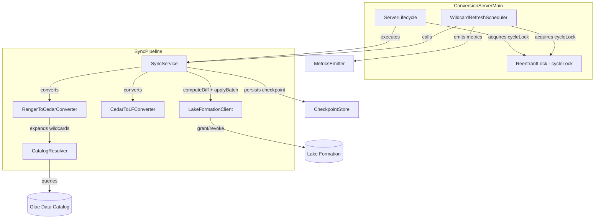

# Design Document: Wildcard Pattern Refresh

## Overview

The wildcard pattern refresh feature adds a periodic background task that re-evaluates glob wildcard patterns (`table_*`, `db_?`) in active Ranger policies against the current AWS Glue Data Catalog. When new resources appear (or old ones disappear) that match existing glob patterns, the system computes a delta and applies the necessary grant/revoke operations to Lake Formation.

Today, wildcard expansion happens only at policy-conversion time. If a new table `events_2024` is created in Glue and an existing Ranger policy grants access to `events_*`, the new table won't receive permissions until Ranger pushes a policy update. This feature closes that gap by periodically re-scanning the catalog.

The bare `*` wildcard (ALL tables) is already handled by Lake Formation's `TableWildcard` and is explicitly excluded from this feature.

### Key Design Decisions

1. **Reuse existing pipeline**: The refresh cycle re-runs the same `RangerToCedarConverter` → `CedarToLFConverter` → `computeDiff` → `applyBatch` pipeline used by normal sync cycles. No new diff or application logic is needed.
2. **Mutual exclusion via ReentrantLock**: A shared lock in `ServerLifecycle` ensures sync cycles and refresh cycles never run concurrently, avoiding inconsistent `previousOperations` state.
3. **ScheduledExecutorService for scheduling**: A single-thread `ScheduledExecutorService` fires refresh cycles at the configured interval, decoupled from the sync loop's `Thread.sleep` cadence.
4. **Configuration in `SyncConfig`**: The `wildcardRefreshIntervalSeconds` property lives in the top-level YAML (alongside `policyRefreshIntervalMs`) since it controls sync behavior, not server process behavior.

## Architecture



### Flow: Wildcard Refresh Cycle

1. `WildcardRefreshScheduler` fires at the configured interval.
2. It acquires `cycleLock`. If a sync cycle holds the lock, the refresh blocks until it completes (and vice versa).
3. It calls `SyncService.executeWildcardRefresh()`, which:
   a. Filters `lastKnownPolicies` to those containing glob patterns.
   b. Re-runs `RangerToCedarConverter.convert()` on the filtered policies (CatalogResolver queries current Glue state).
   c. Merges the re-expanded operations with the non-glob operations from `previousOperations`.
   d. Calls `computeDiff(previousOperations, mergedOperations)`.
   e. If delta is non-empty, calls `lakeFormationClient.applyBatch(delta)`.
   f. Updates `previousOperations` and persists checkpoint.
4. `WildcardRefreshScheduler` emits CloudWatch metrics for the cycle.
5. Lock is released.

## Components and Interfaces

### New Components

#### `WildcardRefreshScheduler`

Manages the `ScheduledExecutorService` that periodically triggers wildcard refresh cycles.

```java
package com.amazonaws.policyconverters.app;

public class WildcardRefreshScheduler {

    private final SyncService syncService;
    private final MetricsEmitter metricsEmitter;
    private final ReentrantLock cycleLock;
    private final ScheduledExecutorService scheduler;

    public WildcardRefreshScheduler(
            SyncService syncService,
            MetricsEmitter metricsEmitter,
            ReentrantLock cycleLock);

    /** Start periodic refresh at the given interval. No-op if intervalSeconds <= 0. */
    public void start(int intervalSeconds);

    /** Shut down the scheduler, waiting up to timeoutSeconds for in-flight cycle. */
    public boolean shutdown(int timeoutSeconds);
}
```

#### `GlobPatternDetector`

Pure utility class that determines whether a resource value is a glob pattern (contains `*` or `?`) but is not the bare `*` wildcard.

```java
package com.amazonaws.policyconverters.ranger;

public final class GlobPatternDetector {

    /** Returns true if the value contains * or ? but is not exactly "*". */
    public static boolean isGlobPattern(String value);

    /** Returns true if the policy has at least one glob pattern in its resources. */
    public static boolean hasGlobPatterns(RangerPolicy policy);

    /** Filter a list of policies to only those containing glob patterns. */
    public static List<RangerPolicy> filterGlobPolicies(List<RangerPolicy> policies);
}
```

### Modified Components

#### `SyncService` — new method

```java
/**
 * Execute a wildcard refresh cycle: re-expand glob-containing policies
 * against the current Glue catalog, compute diff, and apply delta.
 *
 * @return WildcardRefreshResult with counts of grants, revocations, and policies evaluated
 */
public WildcardRefreshResult executeWildcardRefresh();
```

The method:
1. Calls `GlobPatternDetector.filterGlobPolicies(lastKnownPolicies)` to get glob policies.
2. Re-converts them through `rangerToCedarConverter.convert(globPolicies)`.
3. Converts the Cedar result to LF operations via `cedarToLFConverter.convert()`.
4. Builds a merged operation set: non-glob operations from `previousOperations` + newly expanded glob operations.
5. Calls `computeDiff(previousOperations, mergedOperations)`.
6. Applies delta via `lakeFormationClient.applyBatch()`.
7. Updates `previousOperations` and persists checkpoint.

#### `ServerLifecycle` — add lock coordination

```java
// New field
private final ReentrantLock cycleLock;

// executeCycle() wraps its body in cycleLock.lock()/unlock()
```

The existing `executeCycle()` method acquires `cycleLock` before running the sync cycle and releases it in a `finally` block. This ensures mutual exclusion with `WildcardRefreshScheduler`.

#### `SyncConfig` — new field

```java
private final int wildcardRefreshIntervalSeconds;

public int getWildcardRefreshIntervalSeconds();
```

Defaults to `0` (disabled) when absent from YAML.

#### `ConfigValidator` — new validation

Adds validation: if `wildcardRefreshIntervalSeconds < 0`, add error `"Invalid parameter: wildcardRefreshIntervalSeconds must be >= 0"`.

#### `ConversionServerMain` — wire new components

In `startServer()`:
1. Read `wildcardRefreshIntervalSeconds` from `SyncConfig`.
2. Create a `ReentrantLock` and pass it to both `ServerLifecycle` and `WildcardRefreshScheduler`.
3. If interval > 0, log at INFO and start the scheduler.
4. Register scheduler shutdown in the SIGTERM hook.

#### `MetricsEmitter` — new method

```java
/**
 * Record metrics for a wildcard refresh cycle.
 */
public void recordWildcardRefresh(WildcardRefreshResult result);
```

Emits: `WildcardRefreshSuccess`/`WildcardRefreshFailure`, `WildcardRefreshDuration`, `WildcardRefreshDeltaOperations`.

### New Data Model

#### `WildcardRefreshResult`

```java
package com.amazonaws.policyconverters.model;

public class WildcardRefreshResult {
    private final boolean success;
    private final long durationMs;
    private final int policiesEvaluated;
    private final int newGrants;
    private final int revocations;
    private final int unchanged;
    private final Exception error; // null on success

    public static WildcardRefreshResult success(
            long durationMs, int policiesEvaluated,
            int newGrants, int revocations, int unchanged);

    public static WildcardRefreshResult failure(long durationMs, Exception error);
}
```

## Data Models

### Configuration Schema Addition

```yaml
# In server-config.yaml, top-level alongside policyRefreshIntervalMs:
wildcardRefreshIntervalSeconds: 300  # 5 minutes, 0 or absent = disabled
```

The value is parsed into `SyncConfig.wildcardRefreshIntervalSeconds` (int, default 0).

### State Management

The wildcard refresh shares state with the normal sync cycle through `SyncService`:

| State Field | Type | Owner | Shared By |
|---|---|---|---|
| `previousOperations` | `List<LFPermissionOperation>` | SyncService | Sync cycle, Refresh cycle |
| `lastKnownPolicies` | `List<RangerPolicy>` | SyncService | Sync cycle (writes), Refresh cycle (reads) |
| `lastCedarPolicyText` | `String` | SyncService | Sync cycle, Refresh cycle |

Both cycles update `previousOperations` and `lastCedarPolicyText` after completion. The `cycleLock` in `ServerLifecycle` ensures these updates are never concurrent.

### Merged Operation Set Construction

During a wildcard refresh, the merged operation set is built as:

```
mergedOps = nonGlobOps(previousOperations) ∪ reExpandedGlobOps
```

Where `nonGlobOps` are operations from `previousOperations` whose source policy ID does not belong to a glob-containing policy. This ensures that non-glob permissions are preserved while glob permissions are refreshed.

## Correctness Properties

*A property is a characteristic or behavior that should hold true across all valid executions of a system — essentially, a formal statement about what the system should do. Properties serve as the bridge between human-readable specifications and machine-verifiable correctness guarantees.*

### Property 1: Configuration validation classifies all integers correctly

*For any* integer value provided as `wildcardRefreshIntervalSeconds`, the configuration system SHALL: accept and store positive values as-is, treat zero as disabled, and reject negative values with a validation error.

**Validates: Requirements 1.1, 1.3, 1.5**

### Property 2: Glob pattern detection is correct for all resource strings

*For any* resource value string, `GlobPatternDetector.isGlobPattern()` SHALL return `true` if and only if the string contains `*` or `?` and is not exactly the bare `*` string.

**Validates: Requirements 2.1**

### Property 3: Wildcard policy filter returns exactly glob-containing policies

*For any* list of Ranger policies, `GlobPatternDetector.filterGlobPolicies()` SHALL return exactly those policies that have at least one resource value where `isGlobPattern()` returns `true`, and no others.

**Validates: Requirements 2.2**

### Property 4: Diff computation correctly partitions operations into grants, revocations, and unchanged

*For any* two sets of LF permission operations (previous and current), `computeDiff` SHALL produce: new grants = operations in current but not in previous, revocations = operations in previous but not in current, unchanged count = size of intersection. The union of new grants, revocations, and unchanged SHALL equal the union of both input sets.

**Validates: Requirements 3.2**

## Error Handling

### CatalogResolver Failure (Req 5.1)

If `CatalogResolver` throws during a wildcard refresh, `SyncService.executeWildcardRefresh()` catches the exception, logs at ERROR level, and returns `WildcardRefreshResult.failure()`. The `previousOperations` snapshot is not modified. The scheduler continues to fire at the next interval.

### Partial LakeFormation Failures (Req 5.2)

The existing `LakeFormationClient.applyBatch()` already handles partial failures by logging failed entries to `DeadLetterLogger`. The wildcard refresh reuses this mechanism. `previousOperations` is still updated to the re-expanded state (matching normal sync behavior) so that the next cycle doesn't re-attempt the same grants.

### Unexpected Exceptions (Req 5.3)

`WildcardRefreshScheduler` wraps each cycle invocation in a try-catch. Any exception is logged at ERROR level and the scheduler continues. The `ScheduledExecutorService` is configured with `scheduleAtFixedRate` wrapped in a safe runnable to prevent task cancellation on exception.

### Ranger Admin Connectivity Loss (Req 5.4)

The wildcard refresh reads from `lastKnownPolicies`, which is the last successfully received policy set. If Ranger Admin is unreachable, `lastKnownPolicies` retains its previous value, so refresh cycles continue operating on the last known state.

### Lock Contention

If a refresh cycle is waiting on `cycleLock` and the server receives SIGTERM, the shutdown hook calls `scheduler.shutdown()` which interrupts the waiting thread. The scheduler's `awaitTermination` respects the configured timeout.

## Testing Strategy

### Property-Based Tests (jqwik)

Each correctness property is implemented as a jqwik property test with a minimum of 100 iterations.

- **Property 1**: Generate random integers (positive, zero, negative). Parse into `SyncConfig`, verify classification.
  - Tag: `Feature: wildcard-pattern-refresh, Property 1: Configuration validation classifies all integers correctly`
- **Property 2**: Generate random strings (with/without `*`/`?`, bare `*`, empty, unicode). Verify `isGlobPattern()` result.
  - Tag: `Feature: wildcard-pattern-refresh, Property 2: Glob pattern detection is correct for all resource strings`
- **Property 3**: Generate random lists of `RangerPolicy` objects with varying resource patterns. Verify filter output.
  - Tag: `Feature: wildcard-pattern-refresh, Property 3: Wildcard policy filter returns exactly glob-containing policies`
- **Property 4**: Generate random pairs of `List<LFPermissionOperation>`. Verify diff partitioning invariants.
  - Tag: `Feature: wildcard-pattern-refresh, Property 4: Diff computation correctly partitions operations`

### Unit Tests (JUnit 5)

- Config parsing: zero value disables, absent disables, valid positive stores correctly
- Config validation: negative value produces error message
- Startup logging: INFO log emitted with interval value
- No-change scenario: identical re-expansion skips `applyBatch`, logs "no changes"
- CatalogResolver failure: `previousOperations` unchanged, error logged
- Partial LF failure: dead-letter entries written
- Unexpected exception: scheduler continues, next cycle fires
- Connectivity loss: refresh uses `lastKnownPolicies`
- Concurrency: sync defers refresh, refresh defers sync (using `CountDownLatch` coordination in tests)

### Integration Tests

- End-to-end refresh cycle with mocked Glue (returns new tables on second call), verify grants applied
- Checkpoint persistence after refresh, restart and verify baseline restored
- CloudWatch metrics emitted with correct dimensions and values
- Audit log entries emitted for delta operations
